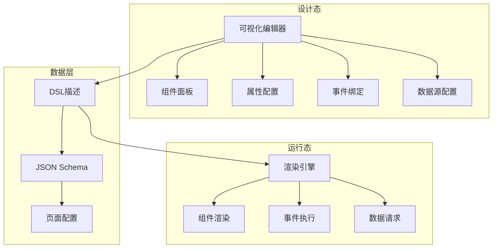

# 低代码平台设计

低代码平台是一种通过可视化界面和少量代码来快速构建应用程序的开发平台，本文介绍组件设计、DSL、渲染引擎和数据源等核心概念。

## 1. 低代码平台架构

### 1.1 整体架构



### 1.2 核心概念

| 概念 | 说明 | 作用 |
|------|------|------|
| DSL | 领域特定语言 | 描述页面结构和行为 |
| 组件 | 可复用的UI单元 | 构建页面的基本元素 |
| 渲染引擎 | 解析DSL并渲染 | 将配置转换为页面 |
| 数据源 | 数据获取和管理 | 为组件提供数据 |

## 2. 组件设计

### 2.1 组件分类

| 类型 | 说明 | 示例 |
|------|------|------|
| 基础组件 | 原生HTML元素封装 | Button, Input, Select |
| 业务组件 | 特定业务场景组件 | 用户选择器, 商品卡片 |
| 布局组件 | 页面布局容器 | Row, Col, Grid |
| 图表组件 | 数据可视化 | LineChart, BarChart |
| 高级组件 | 复杂交互组件 | 富文本编辑器, 表格 |

### 2.2 组件规范

```typescript
// 组件接口定义
interface ComponentMeta {
  type: string;           // 组件类型
  name: string;           // 组件名称
  icon: string;           // 组件图标
  group: string;          // 组件分组
  order: number;          // 排序权重
  
  // 组件属性定义
  props: ComponentProp[];
  
  // 组件事件定义
  events: ComponentEvent[];
  
  // 组件方法定义
  methods: ComponentMethod[];
  
  // 组件样式定义
  styles: ComponentStyle[];
  
  // 组件数据源定义
  dataSources: DataSource[];
}

// 组件属性定义
interface ComponentProp {
  name: string;
  label: string;
  type: 'string' | 'number' | 'boolean' | 'select' | 'color' | 'json';
  default?: any;
  required?: boolean;
  description?: string;
  options?: Array<{ label: string; value: any }>;
  validator?: (value: any) => boolean;
}

// 组件事件定义
interface ComponentEvent {
  name: string;
  label: string;
  description?: string;
  params?: Array<{ name: string; type: string; description: string }>;
}

// 组件方法定义
interface ComponentMethod {
  name: string;
  label: string;
  description?: string;
  params?: Array<{ name: string; type: string; required: boolean }>;
  returnType?: string;
}
```

### 2.3 组件注册

```typescript
// 组件注册器
class ComponentRegistry {
  private components: Map<string, ComponentMeta> = new Map();
  private componentInstances: Map<string, any> = new Map();

  // 注册组件
  register(meta: ComponentMeta, component: any) {
    this.components.set(meta.type, meta);
    this.componentInstances.set(meta.type, component);
  }

  // 批量注册
  registerBatch(components: Array<{ meta: ComponentMeta; component: any }>) {
    components.forEach(({ meta, component }) => {
      this.register(meta, component);
    });
  }

  // 获取组件元信息
  getMeta(type: string): ComponentMeta | undefined {
    return this.components.get(type);
  }

  // 获取组件实例
  getComponent(type: string): any {
    return this.componentInstances.get(type);
  }

  // 获取所有组件
  getAllComponents(): ComponentMeta[] {
    return Array.from(this.components.values());
  }

  // 按分组获取组件
  getComponentsByGroup(group: string): ComponentMeta[] {
    return this.getAllComponents().filter(meta => meta.group === group);
  }
}

// 使用示例
const registry = new ComponentRegistry();

// 注册按钮组件
registry.register(
  {
    type: 'button',
    name: '按钮',
    icon: 'button-icon',
    group: '基础组件',
    order: 1,
    props: [
      {
        name: 'type',
        label: '类型',
        type: 'select',
        default: 'default',
        options: [
          { label: '默认', value: 'default' },
          { label: '主要', value: 'primary' },
          { label: '成功', value: 'success' },
          { label: '警告', value: 'warning' },
          { label: '危险', value: 'danger' },
        ],
      },
      {
        name: 'size',
        label: '尺寸',
        type: 'select',
        default: 'medium',
        options: [
          { label: '小', value: 'small' },
          { label: '中', value: 'medium' },
          { label: '大', value: 'large' },
        ],
      },
      {
        name: 'disabled',
        label: '禁用',
        type: 'boolean',
        default: false,
      },
      {
        name: 'text',
        label: '文本',
        type: 'string',
        default: '按钮',
      },
    ],
    events: [
      {
        name: 'onClick',
        label: '点击事件',
        description: '按钮点击时触发',
      },
    ],
    methods: [
      {
        name: 'focus',
        label: '聚焦',
        description: '使按钮获得焦点',
      },
    ],
    styles: [
      {
        name: 'width',
        label: '宽度',
        type: 'string',
      },
      {
        name: 'height',
        label: '高度',
        type: 'string',
      },
    ],
    dataSources: [],
  },
  ButtonComponent
);
```

### 2.4 自定义组件开发

```jsx
// 自定义用户选择器组件
import React, { useState, useEffect } from 'react';
import { Select, Avatar, Tag } from 'antd';

interface User {
  id: string;
  name: string;
  avatar: string;
  department: string;
}

interface UserSelectorProps {
  value?: string[];
  onChange?: (value: string[]) => void;
  multiple?: boolean;
  placeholder?: string;
  maxCount?: number;
  dataSource?: {
    type: 'api' | 'static';
    api?: string;
    data?: User[];
  };
}

const UserSelector: React.FC<UserSelectorProps> = ({
  value = [],
  onChange,
  multiple = true,
  placeholder = '请选择用户',
  maxCount,
  dataSource,
}) => {
  const [users, setUsers] = useState<User[]>([]);
  const [loading, setLoading] = useState(false);

  useEffect(() => {
    if (dataSource?.type === 'api' && dataSource.api) {
      fetchUsers(dataSource.api);
    } else if (dataSource?.type === 'static' && dataSource.data) {
      setUsers(dataSource.data);
    }
  }, [dataSource]);

  const fetchUsers = async (api: string) => {
    setLoading(true);
    try {
      const response = await fetch(api);
      const data = await response.json();
      setUsers(data);
    } catch (error) {
      console.error('Failed to fetch users:', error);
    } finally {
      setLoading(false);
    }
  };

  const handleChange = (selected: string[]) => {
    onChange?.(selected);
  };

  const tagRender = (props: any) => {
    const user = users.find(u => u.id === props.value);
    return (
      <Tag closable={props.closable} onClose={props.onClose}>
        <Avatar size="small" src={user?.avatar} />
        <span style={{ marginLeft: 8 }}>{user?.name}</span>
      </Tag>
    );
  };

  return (
    <Select
      mode={multiple ? 'multiple' : undefined}
      value={value}
      onChange={handleChange}
      placeholder={placeholder}
      maxTagCount={maxCount}
      loading={loading}
      optionFilterProp="children"
      tagRender={tagRender}
    >
      {users.map(user => (
        <Select.Option key={user.id} value={user.id}>
          <Avatar size="small" src={user.avatar} />
          <span style={{ marginLeft: 8 }}>{user.name}</span>
          <span style={{ marginLeft: 8, color: '#999' }}>{user.department}</span>
        </Select.Option>
      ))}
    </Select>
  );
};

// 组件元信息
UserSelector.meta = {
  type: 'user-selector',
  name: '用户选择器',
  icon: 'user-selector-icon',
  group: '业务组件',
  order: 1,
  props: [
    {
      name: 'multiple',
      label: '多选',
      type: 'boolean',
      default: true,
    },
    {
      name: 'placeholder',
      label: '占位文本',
      type: 'string',
      default: '请选择用户',
    },
    {
      name: 'maxCount',
      label: '最大选择数',
      type: 'number',
    },
  ],
  events: [
    {
      name: 'onChange',
      label: '值变化事件',
    },
  ],
  dataSources: [
    {
      name: 'dataSource',
      label: '数据源',
      type: 'api',
    },
  ],
};

export default UserSelector;
```

## 3. DSL设计

### 3.1 DSL结构

```json
{
  "version": "1.0.0",
  "type": "page",
  "title": "用户管理页面",
  "description": "用户列表和详情页面",
  "components": [
    {
      "id": "page_1",
      "type": "page",
      "props": {
        "title": "用户管理",
        "padding": 24
      },
      "children": [
        {
          "id": "search_1",
          "type": "search-form",
          "props": {
            "fields": [
              {
                "name": "keyword",
                "label": "关键词",
                "type": "input",
                "placeholder": "请输入用户名或手机号"
              },
              {
                "name": "status",
                "label": "状态",
                "type": "select",
                "options": [
                  { "label": "启用", "value": 1 },
                  { "label": "禁用", "value": 0 }
                ]
              }
            ]
          },
          "events": {
            "onSearch": {
              "type": "action",
              "action": "fetchData",
              "params": {
                "dataSource": "userList"
              }
            }
          }
        },
        {
          "id": "table_1",
          "type": "table",
          "props": {
            "columns": [
              {
                "title": "用户名",
                "dataIndex": "username",
                "key": "username"
              },
              {
                "title": "手机号",
                "dataIndex": "phone",
                "key": "phone"
              },
              {
                "title": "状态",
                "dataIndex": "status",
                "key": "status",
                "render": {
                  "type": "tag",
                  "props": {
                    "1": { "color": "green", "text": "启用" },
                    "0": { "color": "red", "text": "禁用" }
                  }
                }
              },
              {
                "title": "操作",
                "key": "action",
                "render": {
                  "type": "button-group",
                  "buttons": [
                    {
                      "text": "编辑",
                      "type": "link",
                      "action": {
                        "type": "modal",
                        "modalId": "user_edit",
                        "params": {
                          "userId": "${record.id}"
                        }
                      }
                    },
                    {
                      "text": "删除",
                      "type": "link",
                      "danger": true,
                      "action": {
                        "type": "confirm",
                        "title": "确定删除该用户吗？",
                        "onConfirm": {
                          "type": "api",
                          "api": "/api/users/${record.id}",
                          "method": "DELETE",
                          "successMessage": "删除成功"
                        }
                      }
                    }
                  ]
                }
              }
            ],
            "pagination": {
              "pageSize": 10,
              "showSizeChanger": true,
              "showTotal": true
            }
          },
          "dataBinding": {
            "dataSource": "userList",
            "dataPath": "data.list",
            "totalPath": "data.total"
          }
        }
      ]
    }
  ],
  "dataSources": {
    "userList": {
      "type": "api",
      "url": "/api/users",
      "method": "GET",
      "params": {
        "page": "${pagination.current}",
        "pageSize": "${pagination.pageSize}",
        "keyword": "${search.keyword}",
        "status": "${search.status}"
      },
      "autoLoad": true
    }
  },
  "modals": {
    "user_edit": {
      "title": "编辑用户",
      "width": 600,
      "components": [
        {
          "id": "form_1",
          "type": "form",
          "props": {
            "fields": [
              {
                "name": "username",
                "label": "用户名",
                "type": "input",
                "required": true
              },
              {
                "name": "phone",
                "label": "手机号",
                "type": "input",
                "required": true
              },
              {
                "name": "status",
                "label": "状态",
                "type": "switch"
              }
            ]
          },
          "dataBinding": {
            "dataSource": "userInfo",
            "dataPath": "data"
          }
        }
      ],
      "dataSources": {
        "userInfo": {
          "type": "api",
          "url": "/api/users/${params.userId}",
          "method": "GET"
        }
      },
      "actions": {
        "onOk": {
          "type": "api",
          "api": "/api/users/${params.userId}",
          "method": "PUT",
          "data": "${form_1.values}",
          "successMessage": "保存成功",
          "refreshDataSources": ["userList"]
        }
      }
    }
  }
}
```

### 3.2 DSL解析器

```typescript
// DSL解析器
class DSLParser {
  private componentRegistry: ComponentRegistry;
  private dataResolver: DataResolver;
  private eventExecutor: EventExecutor;

  constructor(
    componentRegistry: ComponentRegistry,
    dataResolver: DataResolver,
    eventExecutor: EventExecutor
  ) {
    this.componentRegistry = componentRegistry;
    this.dataResolver = dataResolver;
    this.eventExecutor = eventExecutor;
  }

  // 解析DSL
  async parse(dsl: PageDSL): Promise<React.ReactNode> {
    // 初始化数据源
    await this.initDataSources(dsl.dataSources);
    
    // 解析组件树
    return this.parseComponents(dsl.components);
  }

  // 解析组件树
  parseComponents(components: ComponentConfig[]): React.ReactNode {
    return components.map(config => this.parseComponent(config));
  }

  // 解析单个组件
  parseComponent(config: ComponentConfig): React.ReactNode {
    const { id, type, props, children, events, dataBinding, styles } = config;
    
    // 获取组件
    const Component = this.componentRegistry.getComponent(type);
    if (!Component) {
      console.warn(`Component not found: ${type}`);
      return null;
    }

    // 解析属性
    const resolvedProps = this.resolveProps(props, dataBinding);
    
    // 解析事件
    const resolvedEvents = this.resolveEvents(events);
    
    // 解析样式
    const resolvedStyles = this.resolveStyles(styles);

    // 解析子组件
    const resolvedChildren = children ? this.parseComponents(children) : null;

    return React.createElement(
      Component,
      {
        key: id,
        ...resolvedProps,
        ...resolvedEvents,
        style: resolvedStyles,
      },
      resolvedChildren
    );
  }

  // 解析属性
  resolveProps(props: Record<string, any>, dataBinding?: DataBinding): Record<string, any> {
    const resolved = { ...props };
    
    // 解析模板变量
    Object.keys(resolved).forEach(key => {
      if (typeof resolved[key] === 'string') {
        resolved[key] = this.resolveTemplate(resolved[key]);
      }
    });

    // 绑定数据
    if (dataBinding) {
      const data = this.dataResolver.resolve(dataBinding);
      resolved.dataSource = data;
    }

    return resolved;
  }

  // 解析模板字符串
  resolveTemplate(template: string): any {
    const regex = /\$\{([^}]+)\}/g;
    let result = template;
    let match;

    while ((match = regex.exec(template)) !== null) {
      const path = match[1];
      const value = this.dataResolver.getValue(path);
      result = result.replace(match[0], value ?? '');
    }

    // 如果整个字符串都是模板，返回原始值
    if (template.match(/^\$\{[^}]+\}$/)) {
      return this.dataResolver.getValue(template.slice(2, -1));
    }

    return result;
  }

  // 解析事件
  resolveEvents(events: Record<string, EventConfig>): Record<string, Function> {
    const resolved: Record<string, Function> = {};
    
    Object.keys(events).forEach(eventName => {
      const eventConfig = events[eventName];
      resolved[eventName] = (...args: any[]) => {
        return this.eventExecutor.execute(eventConfig, ...args);
      };
    });

    return resolved;
  }

  // 解析样式
  resolveStyles(styles: Record<string, any>): React.CSSProperties {
    const resolved: React.CSSProperties = {};
    
    Object.keys(styles).forEach(key => {
      resolved[key as keyof React.CSSProperties] = this.resolveTemplate(styles[key]);
    });

    return resolved;
  }

  // 初始化数据源
  async initDataSources(dataSources: Record<string, DataSourceConfig>): Promise<void> {
    const promises = Object.entries(dataSources)
      .filter(([, config]) => config.autoLoad)
      .map(([name, config]) => this.dataResolver.load(name, config));
    
    await Promise.all(promises);
  }
}
```

## 4. 渲染引擎

### 4.1 渲染引擎实现

```typescript
// 渲染引擎
class RenderEngine {
  private parser: DSLParser;
  private renderer: Renderer;
  private stateManager: StateManager;
  private lifecycleManager: LifecycleManager;

  constructor(config: RenderEngineConfig) {
    this.parser = new DSLParser(
      config.componentRegistry,
      config.dataResolver,
      config.eventExecutor
    );
    this.renderer = new Renderer();
    this.stateManager = new StateManager();
    this.lifecycleManager = new LifecycleManager();
  }

  // 渲染页面
  async render(dsl: PageDSL, container: HTMLElement): Promise<void> {
    try {
      // 生命周期：初始化前
      await this.lifecycleManager.trigger('beforeInit', dsl);

      // 解析DSL
      const vdom = await this.parser.parse(dsl);

      // 渲染到DOM
      this.renderer.render(vdom, container);

      // 生命周期：初始化后
      await this.lifecycleManager.trigger('afterInit', dsl);

      // 注册事件监听
      this.setupEventListeners(dsl, container);

    } catch (error) {
      console.error('Render error:', error);
      await this.lifecycleManager.trigger('onError', error);
    }
  }

  // 更新页面
  async update(dsl: PageDSL, container: HTMLElement): Promise<void> {
    try {
      // 生命周期：更新前
      await this.lifecycleManager.trigger('beforeUpdate', dsl);

      // 解析DSL
      const vdom = await this.parser.parse(dsl);

      // 更新DOM
      this.renderer.update(vdom, container);

      // 生命周期：更新后
      await this.lifecycleManager.trigger('afterUpdate', dsl);

    } catch (error) {
      console.error('Update error:', error);
      await this.lifecycleManager.trigger('onError', error);
    }
  }

  // 销毁页面
  async destroy(container: HTMLElement): Promise<void> {
    try {
      // 生命周期：销毁前
      await this.lifecycleManager.trigger('beforeDestroy');

      // 清理DOM
      this.renderer.unmount(container);

      // 清理状态
      this.stateManager.clear();

      // 生命周期：销毁后
      await this.lifecycleManager.trigger('afterDestroy');

    } catch (error) {
      console.error('Destroy error:', error);
    }
  }

  // 设置事件监听
  private setupEventListeners(dsl: PageDSL, container: HTMLElement): void {
    // 监听自定义事件
    container.addEventListener('lowcode:event', (event: CustomEvent) => {
      const { type, payload } = event.detail;
      this.handleCustomEvent(type, payload);
    });

    // 监听路由变化
    window.addEventListener('popstate', () => {
      this.lifecycleManager.trigger('onRouteChange', window.location.pathname);
    });
  }

  // 处理自定义事件
  private handleCustomEvent(type: string, payload: any): void {
    switch (type) {
      case 'data:refresh':
        this.refreshData(payload.dataSource);
        break;
      case 'state:update':
        this.stateManager.set(payload.key, payload.value);
        break;
      case 'modal:open':
        this.openModal(payload.modalId, payload.params);
        break;
      case 'modal:close':
        this.closeModal(payload.modalId);
        break;
      default:
        console.warn(`Unknown event type: ${type}`);
    }
  }

  // 刷新数据源
  private async refreshData(dataSource: string): Promise<void> {
    await this.lifecycleManager.trigger('beforeDataRefresh', dataSource);
    // 刷新逻辑...
    await this.lifecycleManager.trigger('afterDataRefresh', dataSource);
  }

  // 打开弹窗
  private async openModal(modalId: string, params: any): Promise<void> {
    // 弹窗打开逻辑...
  }

  // 关闭弹窗
  private async closeModal(modalId: string): Promise<void> {
    // 弹窗关闭逻辑...
  }
}

// 状态管理器
class StateManager {
  private state: Map<string, any> = new Map();
  private listeners: Map<string, Set<Function>> = new Map();

  get(key: string): any {
    return this.state.get(key);
  }

  set(key: string, value: any): void {
    this.state.set(key, value);
    this.notify(key, value);
  }

  subscribe(key: string, listener: Function): () => void {
    if (!this.listeners.has(key)) {
      this.listeners.set(key, new Set());
    }
    this.listeners.get(key)!.add(listener);
    
    return () => {
      this.listeners.get(key)?.delete(listener);
    };
  }

  private notify(key: string, value: any): void {
    this.listeners.get(key)?.forEach(listener => listener(value));
  }

  clear(): void {
    this.state.clear();
    this.listeners.clear();
  }
}

// 生命周期管理器
class LifecycleManager {
  private hooks: Map<string, Set<Function>> = new Map();

  on(event: string, hook: Function): void {
    if (!this.hooks.has(event)) {
      this.hooks.set(event, new Set());
    }
    this.hooks.get(event)!.add(hook);
  }

  async trigger(event: string, ...args: any[]): Promise<void> {
    const hooks = this.hooks.get(event);
    if (hooks) {
      for (const hook of hooks) {
        await hook(...args);
      }
    }
  }
}
```

### 4.2 渲染模式

```typescript
// 渲染模式配置
interface RenderMode {
  type: 'dom' | 'canvas' | 'virtual';
  config: Record<string, any>;
}

// DOM渲染模式
class DOMRenderer {
  render(vdom: React.ReactNode, container: HTMLElement): void {
    ReactDOM.createRoot(container).render(vdom);
  }

  update(vdom: React.ReactNode, container: HTMLElement): void {
    // React会自动diff更新
    ReactDOM.createRoot(container).render(vdom);
  }

  unmount(container: HTMLElement): void {
    ReactDOM.createRoot(container).unmount();
  }
}

// Canvas渲染模式
class CanvasRenderer {
  private canvas: HTMLCanvasElement;
  private ctx: CanvasRenderingContext2D;

  constructor(canvas: HTMLCanvasElement) {
    this.canvas = canvas;
    this.ctx = canvas.getContext('2d')!;
  }

  render(components: ComponentConfig[]): void {
    this.clear();
    components.forEach(component => this.renderComponent(component));
  }

  private renderComponent(component: ComponentConfig): void {
    const { type, props, styles } = component;
    
    switch (type) {
      case 'rect':
        this.renderRect(props, styles);
        break;
      case 'text':
        this.renderText(props, styles);
        break;
      case 'image':
        this.renderImage(props, styles);
        break;
      // 其他组件类型...
    }
  }

  private renderRect(props: any, styles: any): void {
    this.ctx.fillStyle = props.fill || '#000';
    this.ctx.fillRect(props.x, props.y, props.width, props.height);
  }

  private renderText(props: any, styles: any): void {
    this.ctx.font = styles.font || '14px Arial';
    this.ctx.fillStyle = styles.color || '#000';
    this.ctx.fillText(props.text, props.x, props.y);
  }

  private renderImage(props: any, styles: any): void {
    const img = new Image();
    img.onload = () => {
      this.ctx.drawImage(img, props.x, props.y, props.width, props.height);
    };
    img.src = props.src;
  }

  private clear(): void {
    this.ctx.clearRect(0, 0, this.canvas.width, this.canvas.height);
  }
}
```

## 5. 数据源管理

### 5.1 数据源类型

| 类型 | 说明 | 使用场景 |
|------|------|----------|
| API | HTTP请求 | 后端接口 |
| Static | 静态数据 | 固定选项 |
| WebSocket | 实时通信 | 实时数据 |
| GraphQL | GraphQL查询 | 复杂数据查询 |
| Mock | 模拟数据 | 开发测试 |

### 5.2 数据源管理器

```typescript
// 数据源管理器
class DataSourceManager {
  private dataSources: Map<string, DataSource> = new Map();
  private cache: Map<string, any> = new Map();
  private interceptors: DataSourceInterceptor[] = [];

  // 注册数据源
  register(name: string, config: DataSourceConfig): void {
    const dataSource = this.createDataSource(config);
    this.dataSources.set(name, dataSource);
  }

  // 创建数据源
  private createDataSource(config: DataSourceConfig): DataSource {
    switch (config.type) {
      case 'api':
        return new APIDataSource(config);
      case 'static':
        return new StaticDataSource(config);
      case 'websocket':
        return new WebSocketDataSource(config);
      case 'graphql':
        return new GraphQLDataSource(config);
      case 'mock':
        return new MockDataSource(config);
      default:
        throw new Error(`Unknown data source type: ${config.type}`);
    }
  }

  // 加载数据
  async load(name: string, params?: Record<string, any>): Promise<any> {
    const dataSource = this.dataSources.get(name);
    if (!dataSource) {
      throw new Error(`Data source not found: ${name}`);
    }

    // 检查缓存
    const cacheKey = this.getCacheKey(name, params);
    if (this.cache.has(cacheKey)) {
      return this.cache.get(cacheKey);
    }

    // 执行拦截器
    let requestConfig = { ...dataSource.config, params };
    for (const interceptor of this.interceptors) {
      if (interceptor.request) {
        requestConfig = await interceptor.request(requestConfig);
      }
    }

    try {
      // 加载数据
      const data = await dataSource.load(requestConfig);

      // 执行响应拦截器
      let result = data;
      for (const interceptor of this.interceptors) {
        if (interceptor.response) {
          result = await interceptor.response(result);
        }
      }

      // 缓存数据
      if (dataSource.config.cache) {
        this.cache.set(cacheKey, result);
      }

      return result;

    } catch (error) {
      // 执行错误拦截器
      for (const interceptor of this.interceptors) {
        if (interceptor.error) {
          await interceptor.error(error);
        }
      }
      throw error;
    }
  }

  // 添加拦截器
  addInterceptor(interceptor: DataSourceInterceptor): void {
    this.interceptors.push(interceptor);
  }

  // 生成缓存Key
  private getCacheKey(name: string, params?: Record<string, any>): string {
    return `${name}:${JSON.stringify(params || {})}`;
  }

  // 清除缓存
  clearCache(name?: string): void {
    if (name) {
      Array.from(this.cache.keys())
        .filter(key => key.startsWith(name))
        .forEach(key => this.cache.delete(key));
    } else {
      this.cache.clear();
    }
  }
}

// API数据源
class APIDataSource implements DataSource {
  config: DataSourceConfig;

  constructor(config: DataSourceConfig) {
    this.config = config;
  }

  async load(config: DataSourceConfig): Promise<any> {
    const { url, method = 'GET', params, headers, data } = config;

    // 构建请求URL
    const requestUrl = this.buildUrl(url, params);

    // 发起请求
    const response = await fetch(requestUrl, {
      method,
      headers: {
        'Content-Type': 'application/json',
        ...headers,
      },
      body: method !== 'GET' ? JSON.stringify(data) : undefined,
    });

    if (!response.ok) {
      throw new Error(`HTTP ${response.status}: ${response.statusText}`);
    }

    return response.json();
  }

  private buildUrl(url: string, params?: Record<string, any>): string {
    if (!params) return url;

    const searchParams = new URLSearchParams();
    Object.entries(params).forEach(([key, value]) => {
      if (value !== undefined && value !== null) {
        searchParams.append(key, String(value));
      }
    });

    const queryString = searchParams.toString();
    return queryString ? `${url}?${queryString}` : url;
  }
}

// 静态数据源
class StaticDataSource implements DataSource {
  config: DataSourceConfig;

  constructor(config: DataSourceConfig) {
    this.config = config;
  }

  async load(): Promise<any> {
    return this.config.data;
  }
}

// 模拟数据源
class MockDataSource implements DataSource {
  config: DataSourceConfig;

  constructor(config: DataSourceConfig) {
    this.config = config;
  }

  async load(): Promise<any> {
    // 使用Mock.js生成模拟数据
    if (this.config.mockTemplate) {
      return Mock.mock(this.config.mockTemplate);
    }
    return this.config.data;
  }
}
```

### 5.3 数据绑定

```typescript
// 数据绑定器
class DataBinder {
  private dataSources: DataSourceManager;
  private stateManager: StateManager;

  constructor(dataSources: DataSourceManager, stateManager: StateManager) {
    this.dataSources = dataSources;
    this.stateManager = stateManager;
  }

  // 绑定数据源
  async bind(componentId: string, binding: DataBinding): Promise<any> {
    const { dataSource, dataPath, params } = binding;

    // 解析参数
    const resolvedParams = this.resolveParams(params);

    // 加载数据
    const data = await this.dataSources.load(dataSource, resolvedParams);

    // 提取数据路径
    const result = this.extractData(data, dataPath);

    // 存储到状态管理器
    this.stateManager.set(`${componentId}.data`, result);

    return result;
  }

  // 解析参数
  private resolveParams(params?: Record<string, any>): Record<string, any> {
    if (!params) return {};

    const resolved: Record<string, any> = {};
    Object.entries(params).forEach(([key, value]) => {
      if (typeof value === 'string' && value.startsWith('${')) {
        const path = value.slice(2, -1);
        resolved[key] = this.stateManager.get(path);
      } else {
        resolved[key] = value;
      }
    });

    return resolved;
  }

  // 提取数据
  private extractData(data: any, path?: string): any {
    if (!path) return data;

    const paths = path.split('.');
    let result = data;

    for (const p of paths) {
      if (result === null || result === undefined) {
        return undefined;
      }
      result = result[p];
    }

    return result;
  }
}
```

## 6. 最佳实践

### 6.1 组件设计最佳实践
1. **单一职责**：每个组件只负责一个功能
2. **可配置性**：通过属性配置组件行为
3. **可扩展性**：支持自定义扩展和覆盖
4. **类型安全**：使用TypeScript定义类型

### 6.2 DSL设计最佳实践
1. **声明式**：描述"是什么"而不是"怎么做"
2. **可序列化**：DSL可以存储和传输
3. **版本兼容**：支持DSL版本升级
4. **易于调试**：提供调试工具和错误提示

### 6.3 渲染引擎最佳实践
1. **虚拟DOM**：使用虚拟DOM提高性能
2. **增量更新**：只更新变化的部分
3. **错误边界**：捕获渲染错误，提供降级方案
4. **性能监控**：监控渲染性能指标

### 6.4 数据源最佳实践
1. **缓存策略**：合理使用缓存减少请求
2. **错误处理**：统一的错误处理和重试机制
3. **数据转换**：支持数据格式转换
4. **安全控制**：防止SQL注入和XSS攻击

## 7. 常见问题

### Q1: 低代码平台适合哪些场景？
**A**: 
1. 表单密集型应用
2. 管理后台系统
3. 数据展示页面
4. 流程审批系统

### Q2: 如何处理复杂的业务逻辑？
**A**: 
1. 使用自定义组件
2. 支持脚本编写
3. 提供扩展接口
4. 集成第三方服务

### Q3: 如何保证低代码平台的性能？
**A**: 
1. 优化渲染引擎
2. 使用缓存机制
3. 按需加载组件
4. 监控性能指标

## 8. 相关页面

- [前端工程化](前端工程化.md)
- [微前端架构](微前端架构.md)
- [前端监控体系](前端监控体系.md)
- [WebGL与Three.js](WebGL与Three.js.md)

## 9. 参考资料

- [低代码平台技术架构](https://tech.meituan.com/)
- [阿里低代码引擎](https://lowcode-engine.cn/)
- [腾讯低代码平台](https://cloud.tencent.com/product/lcap)
- [OutSystems](https://www.outsystems.com/)
- [Mendix](https://www.mendix.com/)