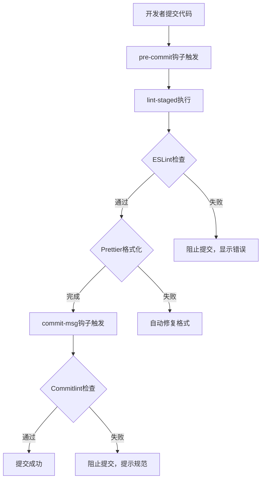

# 前端工程化

前端工程化是通过工具、流程和规范来提升前端开发效率和质量的方法体系。本文介绍Monorepo、构建工具、代码规范和Git Hooks等核心概念。

## 1. Monorepo

### 1.1 什么是Monorepo
Monorepo是一种代码管理方式，将多个项目放在同一个仓库中，共享代码和配置。

### 1.2 Monorepo工具对比

| 工具 | 优点 | 缺点 | 适用场景 |
|------|------|------|----------|
| Lerna | 成熟稳定，社区活跃 | 维护减少，性能一般 | 中小型项目 |
| pnpm workspace | 性能优秀，磁盘占用小 | 配置相对复杂 | 性能要求高的项目 |
| Turborepo | 构建速度快，缓存机制好 | 较新，生态有限 | 大型项目 |
| Nx | 功能全面，插件丰富 | 学习曲线陡峭 | 企业级项目 |

### 1.3 pnpm workspace配置示例

```yaml
# pnpm-workspace.yaml
packages:
  - 'packages/*'
  - 'apps/*'
  - 'tools/*'
```

```json
// package.json
{
  "name": "my-monorepo",
  "private": true,
  "scripts": {
    "dev": "pnpm -r --parallel run dev",
    "build": "pnpm -r run build",
    "lint": "pnpm -r run lint",
    "test": "pnpm -r run test"
  },
  "devDependencies": {
    "typescript": "^5.0.0"
  }
}
```

### 1.4 包之间的依赖管理

```json
// packages/ui/package.json
{
  "name": "@my-monorepo/ui",
  "version": "1.0.0",
  "dependencies": {
    "@my-monorepo/utils": "workspace:*",
    "@my-monorepo/types": "workspace:*"
  }
}
```

## 2. 构建工具

### 2.1 现代构建工具对比

| 工具 | 特点 | 适用场景 |
|------|------|----------|
| Webpack | 功能全面，插件丰富 | 复杂项目，需要高度定制 |
| Vite | 开发速度快，基于ESM | 现代项目，快速开发 |
| esbuild | 极速构建，Go编写 | 构建速度要求高的项目 |
| Turbopack | Rust编写，增量编译 | 超大型项目 |
| Rollup | 库打包，Tree-shaking好 | 库和组件开发 |

### 2.2 Vite配置示例

```typescript
// vite.config.ts
import { defineConfig } from 'vite';
import react from '@vitejs/plugin-react';
import path from 'path';

export default defineConfig({
  plugins: [react()],
  resolve: {
    alias: {
      '@': path.resolve(__dirname, 'src'),
    },
  },
  server: {
    port: 3000,
    proxy: {
      '/api': {
        target: 'http://localhost:8080',
        changeOrigin: true,
      },
    },
  },
  build: {
    outDir: 'dist',
    sourcemap: true,
    rollupOptions: {
      output: {
        manualChunks: {
          vendor: ['react', 'react-dom'],
          utils: ['lodash', 'dayjs'],
        },
      },
    },
  },
});
```

### 2.3 Webpack配置优化

```javascript
// webpack.config.js
const HtmlWebpackPlugin = require('html-webpack-plugin');
const { ModuleFederationPlugin } = require('webpack').container;

module.exports = {
  mode: 'production',
  entry: './src/index.tsx',
  output: {
    filename: '[name].[contenthash].js',
    chunkFilename: '[name].[contenthash].chunk.js',
    clean: true,
  },
  module: {
    rules: [
      {
        test: /\.tsx?$/,
        use: 'ts-loader',
        exclude: /node_modules/,
      },
      {
        test: /\.css$/,
        use: ['style-loader', 'css-loader', 'postcss-loader'],
      },
    ],
  },
  optimization: {
    splitChunks: {
      chunks: 'all',
      cacheGroups: {
        vendor: {
          test: /[\\/]node_modules[\\/]/,
          name: 'vendors',
          chunks: 'all',
        },
      },
    },
  },
  plugins: [
    new HtmlWebpackPlugin({
      template: './public/index.html',
    }),
  ],
};
```

## 3. 代码规范

### 3.1 ESLint配置

```json
// .eslintrc.json
{
  "env": {
    "browser": true,
    "es2021": true,
    "node": true
  },
  "extends": [
    "eslint:recommended",
    "plugin:react/recommended",
    "plugin:react-hooks/recommended",
    "plugin:@typescript-eslint/recommended",
    "prettier"
  ],
  "parser": "@typescript-eslint/parser",
  "parserOptions": {
    "ecmaFeatures": {
      "jsx": true
    },
    "ecmaVersion": "latest",
    "sourceType": "module"
  },
  "plugins": ["react", "react-hooks", "@typescript-eslint"],
  "rules": {
    "react/react-in-jsx-scope": "off",
    "@typescript-eslint/no-unused-vars": "error",
    "@typescript-eslint/explicit-function-return-type": "warn",
    "no-console": "warn",
    "no-debugger": "error"
  }
}
```

### 3.2 Prettier配置

```json
// .prettierrc
{
  "printWidth": 100,
  "tabWidth": 2,
  "useTabs": false,
  "semi": true,
  "singleQuote": true,
  "quoteProps": "as-needed",
  "jsxSingleQuote": false,
  "trailingComma": "es5",
  "bracketSpacing": true,
  "jsxBracketSameLine": false,
  "arrowParens": "always",
  "endOfLine": "lf"
}
```

### 3.3 TypeScript配置

```json
// tsconfig.json
{
  "compilerOptions": {
    "target": "ES2020",
    "lib": ["DOM", "DOM.Iterable", "ESNext"],
    "module": "ESNext",
    "moduleResolution": "node",
    "jsx": "react-jsx",
    "strict": true,
    "esModuleInterop": true,
    "skipLibCheck": true,
    "forceConsistentCasingInFileNames": true,
    "resolveJsonModule": true,
    "isolatedModules": true,
    "noEmit": true,
    "baseUrl": ".",
    "paths": {
      "@/*": ["src/*"]
    }
  },
  "include": ["src"],
  "exclude": ["node_modules", "dist"]
}
```

### 3.4 Stylelint配置

```json
// .stylelintrc.json
{
  "extends": [
    "stylelint-config-standard",
    "stylelint-config-prettier"
  ],
  "rules": {
    "color-no-invalid-hex": true,
    "declaration-colon-space-after": "always",
    "indentation": 2,
    "no-descending-specificity": null
  }
}
```

## 4. Git Hooks

### 4.1 Husky配置

```json
// package.json
{
  "scripts": {
    "prepare": "husky install"
  },
  "devDependencies": {
    "husky": "^8.0.0",
    "lint-staged": "^13.0.0"
  }
}
```

```bash
# 安装husky
npx husky install

# 添加pre-commit钩子
npx husky add .husky/pre-commit "npx lint-staged"

# 添加commit-msg钩子
npx husky add .husky/commit-msg "npx --no -- commitlint --edit $1"
```

### 4.2 lint-staged配置

```json
// .lintstagedrc.json
{
  "*.{js,jsx,ts,tsx}": [
    "eslint --fix",
    "prettier --write"
  ],
  "*.{css,scss,less}": [
    "stylelint --fix",
    "prettier --write"
  ],
  "*.{json,md,yaml,yml}": [
    "prettier --write"
  ]
}
```

### 4.3 Commitlint配置

```json
// commitlint.config.js
module.exports = {
  extends: ['@commitlint/config-conventional'],
  rules: {
    'type-enum': [
      2,
      'always',
      [
        'feat',     // 新功能
        'fix',      // 修复bug
        'docs',     // 文档更新
        'style',    // 代码格式（不影响代码运行的变动）
        'refactor', // 重构（既不是新增功能，也不是修改bug的代码变动）
        'perf',     // 性能优化
        'test',     // 增加测试
        'chore',    // 构建过程或辅助工具的变动
        'revert',   // 回滚
        'ci',       // CI配置
      ],
    ],
    'type-case': [2, 'always', 'lower-case'],
    'type-empty': [2, 'never'],
    'subject-empty': [2, 'never'],
    'subject-full-stop': [2, 'never', '.'],
    'header-max-length': [2, 'always', 72],
  },
};
```

### 4.4 Git Hooks工作流



## 5. 最佳实践

### 5.1 Monorepo最佳实践
1. **统一配置**：将公共配置放在根目录，子包继承
2. **版本管理**：使用changesets或semantic-release管理版本
3. **依赖管理**：使用workspace协议引用内部包
4. **构建缓存**：利用Turborepo的缓存机制避免重复构建

### 5.2 构建工具最佳实践
1. **开发环境**：使用Vite等快速工具提升开发体验
2. **生产构建**：启用代码分割和Tree-shaking
3. **缓存策略**：合理配置缓存提升构建速度
4. **环境变量**：使用.env文件管理不同环境配置

### 5.3 代码规范最佳实践
1. **统一规范**：团队统一使用ESLint+Prettier
2. **渐进式**：逐步引入规则，避免一次性配置过多
3. **自动修复**：配置自动修复减少手动调整
4. **编辑器集成**：配置VSCode等编辑器实时提示

### 5.4 Git Hooks最佳实践
1. **快速反馈**：pre-commit只检查修改的文件
2. **规范提交**：使用commitlint规范提交信息
3. **CI集成**：在CI中重复检查确保代码质量
4. **文档说明**：在README中说明提交规范

## 6. 常见问题

### Q1: Monorepo和Multirepo如何选择？
**A**: 
- Monorepo适合：代码共享频繁、统一版本管理、团队协作紧密
- Multirepo适合：项目独立性强、团队隔离、技术栈差异大

### Q2: 如何处理Monorepo中的循环依赖？
**A**: 
1. 重构代码，提取公共模块
2. 使用依赖注入解耦
3. 合并相关包

### Q3: Git Hooks被绕过怎么办？
**A**: 
1. 在CI中添加相同检查
2. 使用`--no-verify`需团队审批
3. 定期代码审查

## 7. 相关页面

- [微前端架构](微前端架构.md)
- [前端监控体系](前端监控体系.md)
- [低代码平台设计](低代码平台设计.md)
- [WebGL与Three.js](WebGL与Three.js.md)

## 8. 参考资料

- [pnpm官方文档](https://pnpm.io/)
- [Vite官方文档](https://vitejs.dev/)
- [ESLint官方文档](https://eslint.org/)
- [Husky官方文档](https://typicode.github.io/husky/)
- [Commitlint官方文档](https://commitlint.js.org/)