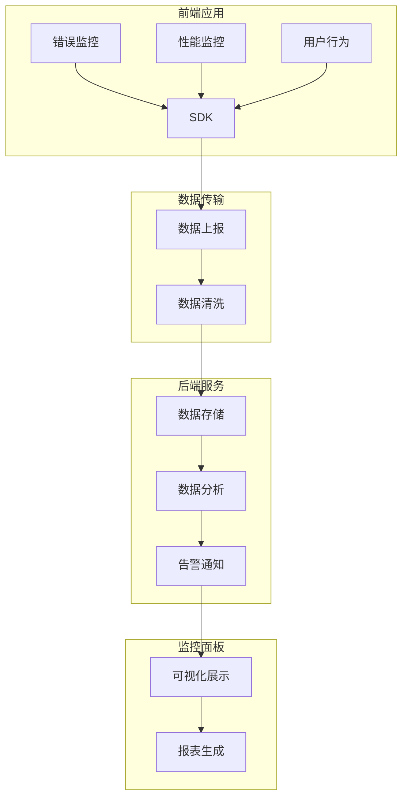

# 前端监控体系

前端监控是保障应用质量和用户体验的重要手段，包括错误监控、性能监控、用户行为追踪和日志上报。

## 1. 监控体系架构

### 1.1 整体架构



## 2. 错误监控

### 2.1 错误捕获类型

| 错误类型 | 捕获方式 | 说明 |
|----------|----------|------|
| JavaScript错误 | window.onerror | 运行时错误 |
| Promise错误 | unhandledrejection | 未处理的Promise拒绝 |
| 资源加载错误 | addEventListener('error') | 图片、脚本等加载失败 |
| 网络请求错误 | XMLHttpRequest/fetch拦截 | API请求失败 |
| 框架错误 | 框架错误边界 | React/Vue等框架错误 |

### 2.2 错误监控SDK实现

```javascript
class ErrorMonitor {
  constructor(config) {
    this.config = {
      appId: config.appId,
      reportUrl: config.reportUrl,
      sampleRate: config.sampleRate || 1,
      maxErrors: config.maxErrors || 10,
    };
    this.errors = [];
    this.init();
  }

  init() {
    this.setupJavaScriptError();
    this.setupPromiseError();
    this.setupResourceError();
    this.setupNetworkError();
  }

  // JavaScript错误捕获
  setupJavaScriptError() {
    window.onerror = (message, source, lineno, colno, error) => {
      this.captureError({
        type: 'javascript',
        message,
        source,
        lineno,
        colno,
        stack: error?.stack,
        timestamp: Date.now(),
      });
    };
  }

  // Promise错误捕获
  setupPromiseError() {
    window.addEventListener('unhandledrejection', (event) => {
      this.captureError({
        type: 'promise',
        message: event.reason?.message || 'Unhandled Promise Rejection',
        stack: event.reason?.stack,
        timestamp: Date.now(),
      });
    });
  }

  // 资源加载错误
  setupResourceError() {
    window.addEventListener('error', (event) => {
      if (event.target && (event.target.src || event.target.href)) {
        this.captureError({
          type: 'resource',
          message: `Resource load failed: ${event.target.src || event.target.href}`,
          tagName: event.target.tagName,
          timestamp: Date.now(),
        });
      }
    }, true);
  }

  // 网络请求错误拦截
  setupNetworkError() {
    const originalFetch = window.fetch;
    window.fetch = async (...args) => {
      try {
        const response = await originalFetch(...args);
        if (!response.ok) {
          this.captureError({
            type: 'network',
            message: `HTTP ${response.status}: ${response.statusText}`,
            url: args[0],
            status: response.status,
            timestamp: Date.now(),
          });
        }
        return response;
      } catch (error) {
        this.captureError({
          type: 'network',
          message: error.message,
          url: args[0],
          timestamp: Date.now(),
        });
        throw error;
      }
    };
  }

  // 捕获错误
  captureError(errorInfo) {
    // 采样率控制
    if (Math.random() > this.config.sampleRate) return;
    
    // 添加通用信息
    errorInfo.appId = this.config.appId;
    errorInfo.url = window.location.href;
    errorInfo.userAgent = navigator.userAgent;
    errorInfo.userId = this.getUserId();
    
    // 错误去重
    const errorKey = this.getErrorKey(errorInfo);
    if (!this.errors.includes(errorKey)) {
      this.errors.push(errorKey);
      this.report(errorInfo);
    }
  }

  // 错误去重
  getErrorKey(error) {
    return `${error.type}_${error.message}_${error.source}_${error.lineno}`;
  }

  // 上报错误
  report(errorInfo) {
    const data = JSON.stringify(errorInfo);
    
    // 使用Beacon API上报
    if (navigator.sendBeacon) {
      navigator.sendBeacon(this.config.reportUrl, data);
    } else {
      // 降级使用Image
      const img = new Image();
      img.src = `${this.config.reportUrl}?data=${encodeURIComponent(data)}`;
    }
  }

  getUserId() {
    // 从cookie或localStorage获取用户ID
    return localStorage.getItem('userId') || 'anonymous';
  }
}

// 使用示例
const monitor = new ErrorMonitor({
  appId: 'my-app',
  reportUrl: 'https://api.example.com/errors',
  sampleRate: 0.8,
});
```

### 2.3 React错误边界

```jsx
class ErrorBoundary extends React.Component {
  constructor(props) {
    super(props);
    this.state = { hasError: false, error: null };
  }

  static getDerivedStateFromError(error) {
    return { hasError: true, error };
  }

  componentDidCatch(error, errorInfo) {
    // 上报错误
    monitor.captureError({
      type: 'react',
      message: error.message,
      stack: error.stack,
      componentStack: errorInfo.componentStack,
      timestamp: Date.now(),
    });
  }

  render() {
    if (this.state.hasError) {
      return (
        <div className="error-fallback">
          <h2>Something went wrong.</h2>
          <button onClick={() => this.setState({ hasError: false })}>
            Try again
          </button>
        </div>
      );
    }
    return this.props.children;
  }
}

// 使用
<ErrorBoundary>
  <App />
</ErrorBoundary>
```

## 3. 性能监控

### 3.1 Web Vitals指标

| 指标 | 说明 | 目标值 |
|------|------|--------|
| LCP | 最大内容绘制 | < 2.5s |
| FID | 首次输入延迟 | < 100ms |
| CLS | 累积布局偏移 | < 0.1 |
| FCP | 首次内容绘制 | < 1.8s |
| TTI | 可交互时间 | < 3.8s |
| TBT | 总阻塞时间 | < 200ms |

### 3.2 性能监控SDK

```javascript
class PerformanceMonitor {
  constructor(config) {
    this.config = config;
    this.metrics = {};
    this.init();
  }

  init() {
    this.observeLCP();
    this.observeFID();
    this.observeCLS();
    this.observeNavigation();
    this.observeResource();
  }

  // LCP监控
  observeLCP() {
    const observer = new PerformanceObserver((list) => {
      const entries = list.getEntries();
      const lastEntry = entries[entries.length - 1];
      this.metrics.lcp = lastEntry.startTime;
      this.reportMetric('LCP', lastEntry.startTime);
    });
    
    observer.observe({ type: 'largest-contentful-paint', buffered: true });
  }

  // FID监控
  observeFID() {
    const observer = new PerformanceObserver((list) => {
      const entries = list.getEntries();
      entries.forEach(entry => {
        this.metrics.fid = entry.processingStart - entry.startTime;
        this.reportMetric('FID', entry.processingStart - entry.startTime);
      });
    });
    
    observer.observe({ type: 'first-input', buffered: true });
  }

  // CLS监控
  observeCLS() {
    let clsValue = 0;
    let clsEntries = [];
    
    const observer = new PerformanceObserver((list) => {
      const entries = list.getEntries();
      entries.forEach(entry => {
        if (!entry.hadRecentInput) {
          clsValue += entry.value;
          clsEntries.push(entry);
        }
      });
      
      this.metrics.cls = clsValue;
      this.reportMetric('CLS', clsValue);
    });
    
    observer.observe({ type: 'layout-shift', buffered: true });
  }

  // 导航计时
  observeNavigation() {
    const navigation = performance.getEntriesByType('navigation')[0];
    if (navigation) {
      this.metrics.ttfb = navigation.responseStart - navigation.requestStart;
      this.metrics.domContentLoaded = navigation.domContentLoadedEventEnd - navigation.startTime;
      this.metrics.load = navigation.loadEventEnd - navigation.startTime;
      
      this.reportMetric('TTFB', this.metrics.ttfb);
      this.reportMetric('DOMContentLoaded', this.metrics.domContentLoaded);
      this.reportMetric('Load', this.metrics.load);
    }
  }

  // 资源加载监控
  observeResource() {
    const observer = new PerformanceObserver((list) => {
      const entries = list.getEntries();
      entries.forEach(entry => {
        if (entry.initiatorType === 'script' || entry.initiatorType === 'link') {
          this.reportMetric('Resource', entry.duration, {
            name: entry.name,
            type: entry.initiatorType,
          });
        }
      });
    });
    
    observer.observe({ type: 'resource', buffered: true });
  }

  // 上报指标
  reportMetric(name, value, extra = {}) {
    const metric = {
      name,
      value,
      appId: this.config.appId,
      url: window.location.href,
      timestamp: Date.now(),
      ...extra,
    };
    
    // 上报到服务器
    this.sendToServer(metric);
  }

  sendToServer(data) {
    if (navigator.sendBeacon) {
      navigator.sendBeacon(this.config.reportUrl, JSON.stringify(data));
    }
  }
}

// 使用示例
const perfMonitor = new PerformanceMonitor({
  appId: 'my-app',
  reportUrl: 'https://api.example.com/performance',
});
```

### 3.3 自定义性能打点

```javascript
class CustomPerformance {
  constructor() {
    this.marks = {};
    this.measures = {};
  }

  // 标记开始时间
  mark(name) {
    this.marks[name] = performance.now();
    performance.mark(`${name}-start`);
  }

  // 标记结束时间并计算耗时
  measure(name) {
    if (!this.marks[name]) return;
    
    const duration = performance.now() - this.marks[name];
    performance.mark(`${name}-end`);
    performance.measure(name, `${name}-start`, `${name}-end`);
    
    this.measures[name] = duration;
    return duration;
  }

  // 监控函数执行时间
  async monitor(name, fn) {
    this.mark(name);
    try {
      const result = await fn();
      const duration = this.measure(name);
      console.log(`${name} took ${duration}ms`);
      return result;
    } catch (error) {
      this.measure(name);
      throw error;
    }
  }

  // 获取所有指标
  getMetrics() {
    return { ...this.measures };
  }
}

// 使用示例
const perf = new CustomPerformance();

// 监控API请求
async function fetchUsers() {
  return perf.monitor('fetchUsers', async () => {
    const response = await fetch('/api/users');
    return response.json();
  });
}

// 监控组件渲染
function monitorRender(componentName, renderFn) {
  perf.mark(componentName);
  const result = renderFn();
  const duration = perf.measure(componentName);
  
  if (duration > 16) { // 超过一帧
    console.warn(`${componentName} render took ${duration}ms`);
  }
  
  return result;
}
```

## 4. 用户行为监控

### 4.1 行为类型

| 行为类型 | 监控内容 | 用途 |
|----------|----------|------|
| 页面访问 | PV、UV、停留时间 | 流量分析 |
| 点击行为 | 按钮、链接点击 | 用户习惯分析 |
| 滚动行为 | 滚动深度、停留区域 | 内容热度分析 |
| 表单交互 | 填写、提交、错误 | 转化率分析 |
| 搜索行为 | 搜索关键词、结果点击 | 搜索优化 |

### 4.2 行为监控SDK

```javascript
class BehaviorMonitor {
  constructor(config) {
    this.config = config;
    this.sessionId = this.generateSessionId();
    this.behaviors = [];
    this.init();
  }

  init() {
    this.trackPageView();
    this.trackClicks();
    this.trackScroll();
    this.trackForm();
    this.trackStayTime();
  }

  // 生成会话ID
  generateSessionId() {
    return `${Date.now()}_${Math.random().toString(36).substr(2, 9)}`;
  }

  // 页面访问监控
  trackPageView() {
    const pageData = {
      type: 'pageview',
      url: window.location.href,
      referrer: document.referrer,
      title: document.title,
      timestamp: Date.now(),
    };
    
    this.recordBehavior(pageData);
    
    // 监听路由变化（SPA应用）
    window.addEventListener('popstate', () => {
      this.recordBehavior({
        ...pageData,
        url: window.location.href,
        timestamp: Date.now(),
      });
    });
  }

  // 点击行为监控
  trackClicks() {
    document.addEventListener('click', (event) => {
      const target = event.target;
      const clickData = {
        type: 'click',
        tagName: target.tagName,
        id: target.id,
        className: target.className,
        text: target.textContent?.slice(0, 50),
        xpath: this.getXPath(target),
        url: window.location.href,
        timestamp: Date.now(),
      };
      
      this.recordBehavior(clickData);
    });
  }

  // 滚动行为监控
  trackScroll() {
    let scrollTimeout;
    let maxScroll = 0;
    
    window.addEventListener('scroll', () => {
      clearTimeout(scrollTimeout);
      
      scrollTimeout = setTimeout(() => {
        const scrollPercentage = Math.round(
          (window.scrollY / (document.documentElement.scrollHeight - window.innerHeight)) * 100
        );
        
        if (scrollPercentage > maxScroll) {
          maxScroll = scrollPercentage;
          
          this.recordBehavior({
            type: 'scroll',
            depth: scrollPercentage,
            url: window.location.href,
            timestamp: Date.now(),
          });
        }
      }, 500);
    });
  }

  // 表单交互监控
  trackForm() {
    document.addEventListener('submit', (event) => {
      const form = event.target;
      const formData = {
        type: 'form_submit',
        formId: form.id,
        formAction: form.action,
        formMethod: form.method,
        url: window.location.href,
        timestamp: Date.now(),
      };
      
      this.recordBehavior(formData);
    });
    
    // 监控表单字段变化
    document.addEventListener('change', (event) => {
      const target = event.target;
      if (target.tagName === 'INPUT' || target.tagName === 'SELECT') {
        this.recordBehavior({
          type: 'form_change',
          fieldName: target.name,
          fieldType: target.type,
          url: window.location.href,
          timestamp: Date.now(),
        });
      }
    });
  }

  // 停留时间监控
  trackStayTime() {
    const startTime = Date.now();
    
    window.addEventListener('beforeunload', () => {
      const stayTime = Date.now() - startTime;
      
      this.recordBehavior({
        type: 'stay_time',
        duration: stayTime,
        url: window.location.href,
        timestamp: Date.now(),
      });
      
      // 上报所有行为数据
      this.flush();
    });
  }

  // 获取元素XPath
  getXPath(element) {
    const parts = [];
    while (element && element.nodeType === Node.ELEMENT_NODE) {
      let index = 0;
      let sibling = element.previousSibling;
      
      while (sibling) {
        if (sibling.nodeType === Node.ELEMENT_NODE && sibling.nodeName === element.nodeName) {
          index++;
        }
        sibling = sibling.previousSibling;
      }
      
      const part = `${element.nodeName.toLowerCase()}[${index + 1}]`;
      parts.unshift(part);
      element = element.parentNode;
    }
    
    return `/${parts.join('/')}`;
  }

  // 记录行为
  recordBehavior(data) {
    data.sessionId = this.sessionId;
    data.userId = this.getUserId();
    this.behaviors.push(data);
    
    // 批量上报
    if (this.behaviors.length >= 10) {
      this.flush();
    }
  }

  // 上报数据
  flush() {
    if (this.behaviors.length === 0) return;
    
    const data = {
      appId: this.config.appId,
      behaviors: [...this.behaviors],
    };
    
    this.behaviors = [];
    
    if (navigator.sendBeacon) {
      navigator.sendBeacon(this.config.reportUrl, JSON.stringify(data));
    }
  }

  getUserId() {
    return localStorage.getItem('userId') || 'anonymous';
  }
}

// 使用示例
const behaviorMonitor = new BehaviorMonitor({
  appId: 'my-app',
  reportUrl: 'https://api.example.com/behaviors',
});
```

## 5. 日志上报

### 5.1 日志级别

| 级别 | 说明 | 使用场景 |
|------|------|----------|
| DEBUG | 调试信息 | 开发环境 |
| INFO | 一般信息 | 业务日志 |
| WARN | 警告信息 | 非关键问题 |
| ERROR | 错误信息 | 错误和异常 |
| FATAL | 致命错误 | 系统崩溃 |

### 5.2 日志收集SDK

```javascript
class Logger {
  constructor(config) {
    this.config = {
      appId: config.appId,
      reportUrl: config.reportUrl,
      level: config.level || 'INFO',
      bufferSize: config.bufferSize || 10,
      flushInterval: config.flushInterval || 5000,
    };
    
    this.buffer = [];
    this.levels = { DEBUG: 0, INFO: 1, WARN: 2, ERROR: 3, FATAL: 4 };
    
    this.startFlushInterval();
  }

  // 检查日志级别
  shouldLog(level) {
    return this.levels[level] >= this.levels[this.config.level];
  }

  // 通用日志方法
  log(level, message, extra = {}) {
    if (!this.shouldLog(level)) return;
    
    const logEntry = {
      level,
      message,
      timestamp: Date.now(),
      url: window.location.href,
      userAgent: navigator.userAgent,
      userId: this.getUserId(),
      sessionId: this.getSessionId(),
      ...extra,
    };
    
    this.buffer.push(logEntry);
    
    if (this.buffer.length >= this.config.bufferSize) {
      this.flush();
    }
    
    // 控制台输出
    this.consoleLog(level, message, extra);
  }

  // 控制台输出
  consoleLog(level, message, extra) {
    const style = this.getConsoleStyle(level);
    console.log(`%c[${level}] ${message}`, style, extra);
  }

  getConsoleStyle(level) {
    const styles = {
      DEBUG: 'color: gray',
      INFO: 'color: blue',
      WARN: 'color: orange',
      ERROR: 'color: red',
      FATAL: 'color: red; font-weight: bold',
    };
    return styles[level] || '';
  }

  // 便捷方法
  debug(message, extra) { this.log('DEBUG', message, extra); }
  info(message, extra) { this.log('INFO', message, extra); }
  warn(message, extra) { this.log('WARN', message, extra); }
  error(message, extra) { this.log('ERROR', message, extra); }
  fatal(message, extra) { this.log('FATAL', message, extra); }

  // 上报日志
  flush() {
    if (this.buffer.length === 0) return;
    
    const logs = [...this.buffer];
    this.buffer = [];
    
    const data = {
      appId: this.config.appId,
      logs,
    };
    
    if (navigator.sendBeacon) {
      navigator.sendBeacon(this.config.reportUrl, JSON.stringify(data));
    }
  }

  // 定时上报
  startFlushInterval() {
    setInterval(() => {
      this.flush();
    }, this.config.flushInterval);
  }

  getUserId() {
    return localStorage.getItem('userId') || 'anonymous';
  }

  getSessionId() {
    let sessionId = sessionStorage.getItem('sessionId');
    if (!sessionId) {
      sessionId = `${Date.now()}_${Math.random().toString(36).substr(2, 9)}`;
      sessionStorage.setItem('sessionId', sessionId);
    }
    return sessionId;
  }
}

// 使用示例
const logger = new Logger({
  appId: 'my-app',
  reportUrl: 'https://api.example.com/logs',
  level: 'INFO',
});

logger.info('User logged in', { userId: '123' });
logger.error('API request failed', { url: '/api/users', status: 500 });
```

## 6. 数据上报优化

### 6.1 上报策略

```javascript
class ReportStrategy {
  constructor() {
    this.queue = [];
    this.isReporting = false;
  }

  // 立即上报（关键错误）
  immediate(data) {
    this.send(data);
  }

  // 延迟上报（一般日志）
  delay(data, timeout = 3000) {
    this.queue.push(data);
    
    if (!this.isReporting) {
      this.isReporting = true;
      setTimeout(() => {
        this.flush();
        this.isReporting = false;
      }, timeout);
    }
  }

  // 批量上报
  batch(data, batchSize = 10) {
    this.queue.push(data);
    
    if (this.queue.length >= batchSize) {
      this.flush();
    }
  }

  // 页面卸载前上报
  beforeUnload(data) {
    this.queue.push(data);
    
    window.addEventListener('beforeunload', () => {
      this.flush();
    });
  }

  flush() {
    if (this.queue.length === 0) return;
    
    const data = [...this.queue];
    this.queue = [];
    
    this.send(data);
  }

  send(data) {
    const blob = new Blob([JSON.stringify(data)], { type: 'application/json' });
    
    if (navigator.sendBeacon) {
      navigator.sendBeacon('https://api.example.com/report', blob);
    } else {
      const xhr = new XMLHttpRequest();
      xhr.open('POST', 'https://api.example.com/report', true);
      xhr.setRequestHeader('Content-Type', 'application/json');
      xhr.send(JSON.stringify(data));
    }
  }
}
```

## 7. 最佳实践

### 7.1 监控策略
1. **分层监控**：基础监控 + 业务监控
2. **采样率控制**：根据流量调整采样率
3. **错误聚合**：相同错误合并上报
4. **优先级划分**：关键错误立即上报

### 7.2 数据处理
1. **数据清洗**：过滤无效和重复数据
2. **数据聚合**：按维度聚合统计数据
3. **实时分析**：关键指标实时计算
4. **历史归档**：定期归档历史数据

### 7.3 告警机制
1. **阈值告警**：超过阈值触发告警
2. **趋势告警**：异常趋势触发告警
3. **智能告警**：基于机器学习的异常检测
4. **分级告警**：不同级别不同通知方式

### 7.4 性能优化
1. **异步上报**：不阻塞主线程
2. **批量上报**：减少网络请求
3. **压缩数据**：减少传输大小
4. **本地缓存**：断网时缓存数据

## 8. 常见问题

### Q1: 监控代码本身会影响性能吗？
**A**: 
1. 使用异步加载和上报
2. 控制监控代码体积
3. 合理设置采样率
4. 避免在关键路径添加监控

### Q2: 如何处理跨域脚本错误？
**A**: 
1. 脚本添加crossorigin属性
2. 服务器配置CORS
3. 使用try-catch捕获

### Q3: 如何保证监控数据的准确性？
**A**: 
1. 多维度数据校验
2. 异常数据过滤
3. 定期校准数据
4. 人工抽样验证

## 9. 相关页面

- [前端工程化](前端工程化.md)
- [微前端架构](微前端架构.md)
- [低代码平台设计](低代码平台设计.md)
- [WebGL与Three.js](WebGL与Three.js.md)

## 10. 参考资料

- [Web Vitals](https://web.dev/vitals/)
- [Sentry官方文档](https://sentry.io/)
- [阿里云前端监控](https://www.aliyun.com/product/arms)
- [腾讯云前端监控](https://cloud.tencent.com/product/rum)