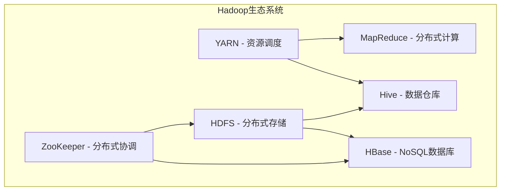

# Hadoop生态系统

## 概述

Hadoop是Apache软件基金会的开源分布式计算框架，旨在处理大规模数据集。其生态系统由多个子项目组成，共同构建了一个完整的**存储-计算-调度-管理**大数据平台。



---

## 一、HDFS（Hadoop Distributed File System）

### 1.1 核心架构

| 组件 | 说明 |
|------|------|
| NameNode | 管理文件系统的命名空间和元数据，记录每个文件的块列表 |
| DataNode | 存储实际的数据块，定时向NameNode发送心跳和块报告 |
| Secondary NameNode | 定期合并fsimage和edits log，辅助NameNode |
| JournalNode | HA架构下用于NameNode的元数据同步 |

### 1.2 HDFS Shell操作

```bash
# 创建目录
hdfs dfs -mkdir -p /user/data/warehouse

# 上传文件
hdfs dfs -put localfile.txt /user/data/warehouse/

# 查看文件内容
hdfs dfs -cat /user/data/warehouse/localfile.txt

# 查看目录
hdfs dfs -ls /user/data/warehouse/

# 删除文件
hdfs dfs -rm -r /user/data/warehouse/old_data

# 设置副本数
hdfs dfs -setrep -w 3 /user/data/warehouse/important_data

# 查看文件大小
hdfs dfs -du -h /user/data/warehouse/

# 合并下载
hdfs dfs -getmerge /user/data/warehouse/logs/ merged_logs.txt
```

### 1.3 Java API操作

```java
import org.apache.hadoop.conf.Configuration;
import org.apache.hadoop.fs.*;

public class HDFSOperate {

    private static FileSystem getFileSystem() throws Exception {
        Configuration conf = new Configuration();
        conf.set("fs.defaultFS", "hdfs://namenode:9000");
        conf.set("dfs.replication", "3");
        // HA配置
        conf.set("dfs.nameservices", "mycluster");
        conf.set("dfs.ha.namenodes.mycluster", "nn1,nn2");
        return FileSystem.get(conf);
    }

    // 上传文件
    public static void uploadFile(String localPath, String hdfsPath) throws Exception {
        FileSystem fs = getFileSystem();
        fs.copyFromLocalFile(new Path(localPath), new Path(hdfsPath));
        fs.close();
    }

    // 读取文件
    public static void readFile(String hdfsPath) throws Exception {
        FileSystem fs = getFileSystem();
        FSDataInputStream in = fs.open(new Path(hdfsPath));
        try (BufferedReader reader = new BufferedReader(new InputStreamReader(in))) {
            String line;
            while ((line = reader.readLine()) != null) {
                System.out.println(line);
            }
        }
        fs.close();
    }

    // 创建目录
    public static boolean mkdir(String path) throws Exception {
        FileSystem fs = getFileSystem();
        boolean result = fs.mkdirs(new Path(path));
        fs.close();
        return result;
    }
}
```

### 1.4 HDFS核心配置（hdfs-site.xml）

```xml
<configuration>
    <!-- 块大小，默认128MB -->
    <property>
        <name>dfs.blocksize</name>
        <value>268435456</value> <!-- 256MB -->
    </property>

    <!-- 副本数 -->
    <property>
        <name>dfs.replication</name>
        <value>3</value>
    </property>

    <!-- NameNode HA -->
    <property>
        <name>dfs.nameservices</name>
        <value>mycluster</value>
    </property>
    <property>
        <name>dfs.ha.namenodes.mycluster</name>
        <value>nn1,nn2</value>
    </property>
    <property>
        <name>dfs.namenode.rpc-address.mycluster.nn1</name>
        <value>namenode1:8020</value>
    </property>
    <property>
        <name>dfs.namenode.rpc-address.mycluster.nn2</name>
        <value>namenode2:8020</value>
    </property>

    <!-- 自动故障转移 -->
    <property>
        <name>dfs.ha.automatic-failover.enabled</name>
        <value>true</value>
    </property>
</configuration>
```

### ✅ HDFS最佳实践

- **小文件问题**：HDFS不适合存储大量小文件（每个小文件约占150B元数据），建议使用 `SequenceFile`、`HAR` 或合并后存储
- **副本策略**：热数据用3副本，冷数据可降至1-2副本
- **块大小**：根据集群规模调整，建议128MB~512MB
- **短路读**：开启 `dfs.client.read.shortcircuit` 提升本地读取性能
- **纠删码**：Hadoop 3.x支持Erasure Coding，在保证可靠性前提下节省约50%存储空间

---

## 二、MapReduce

### 2.1 核心流程

```
Input -> Split -> Map -> Shuffle -> Sort -> Reduce -> Output
```

### 2.2 WordCount示例

```java
import org.apache.hadoop.conf.Configuration;
import org.apache.hadoop.fs.Path;
import org.apache.hadoop.io.*;
import org.apache.hadoop.mapreduce.*;
import java.io.IOException;

public class WordCount {

    public static class TokenizerMapper extends Mapper<Object, Text, Text, IntWritable> {
        private final static IntWritable one = new IntWritable(1);
        private Text word = new Text();

        @Override
        protected void map(Object key, Text value, Context context)
                throws IOException, InterruptedException {
            String[] words = value.toString().split("\\s+");
            for (String w : words) {
                word.set(w.toLowerCase());
                context.write(word, one);
            }
        }
    }

    public static class IntSumReducer extends Reducer<Text, IntWritable, Text, IntWritable> {
        private IntWritable result = new IntWritable();

        @Override
        protected void reduce(Text key, Iterable<IntWritable> values, Context context)
                throws IOException, InterruptedException {
            int sum = 0;
            for (IntWritable val : values) {
                sum += val.get();
            }
            result.set(sum);
            context.write(key, result);
        }
    }

    public static void main(String[] args) throws Exception {
        Configuration conf = new Configuration();
        Job job = Job.getInstance(conf, "word count");
        job.setJarByClass(WordCount.class);
        job.setMapperClass(TokenizerMapper.class);
        job.setCombinerClass(IntSumReducer.class);
        job.setReducerClass(IntSumReducer.class);
        job.setOutputKeyClass(Text.class);
        job.setOutputValueClass(IntWritable.class);
        FileInputFormat.addInputPath(job, new Path(args[0]));
        FileOutputFormat.setOutputPath(job, new Path(args[1]));
        System.exit(job.waitForCompletion(true) ? 0 : 1);
    }
}
```

### 2.3 自定义Partitioner与Comparator

```java
// 自定义分区器：按地区分区
public class RegionPartitioner extends Partitioner<Text, IntWritable> {
    @Override
    public int getPartition(Text key, IntWritable value, int numPartitions) {
        String region = key.toString();
        if (region.startsWith("north")) return 0;
        else if (region.startsWith("south")) return 1;
        else if (region.startsWith("east")) return 2;
        else return 3;
    }
}

// 自定义排序：按值的绝对值排序
public class AbsComparator extends WritableComparator {
    protected AbsComparator() {
        super(IntWritable.class, true);
    }
    @Override
    public int compare(WritableComparable a, WritableComparable b) {
        IntWritable v1 = (IntWritable) a;
        IntWritable v2 = (IntWritable) b;
        return Math.abs(v1.get()) - Math.abs(v2.get());
    }
}
```

### ✅ MapReduce最佳实践

- **Combiner**：减少Shuffle数据量，Combiner逻辑必须满足结合律
- **数据倾斜**：使用自定义Partitioner或对倾斜Key加随机前缀打散
- **小表Join**：使用DistributedCache将小表广播到每个Mapper（Map端Join）
- **压缩**：设置 `mapreduce.map.output.compress=true` 压缩中间结果

---

## 三、YARN（Yet Another Resource Negotiator）

### 3.1 架构

| 角色 | 职责 |
|------|------|
| ResourceManager | 全局资源管理，调度应用 |
| NodeManager | 管理单个节点资源和容器 |
| ApplicationMaster | 管理单个应用的生命周期 |
| Container | 资源隔离单元（CPU、内存） |

### 3.2 YARN调度器

```xml
<!-- capacity-scheduler.xml 容量调度器配置 -->
<configuration>
    <property>
        <name>yarn.scheduler.capacity.root.queues</name>
        <value>production,development,ad-hoc</value>
    </property>
    <property>
        <name>yarn.scheduler.capacity.root.production.capacity</name>
        <value>50</value>
    </property>
    <property>
        <name>yarn.scheduler.capacity.root.production.maximum-capacity</name>
        <value>80</value>
    </property>
    <property>
        <name>yarn.scheduler.capacity.root.development.capacity</name>
        <value>30</value>
    </property>
    <property>
        <name>yarn.scheduler.capacity.root.ad-hoc.capacity</name>
        <value>20</value>
    </property>
</configuration>
```

### 3.3 yarn-site.xml 关键配置

```xml
<configuration>
    <!-- 内存配置 -->
    <property>
        <name>yarn.nodemanager.resource.memory-mb</name>
        <value>16384</value>
    </property>
    <property>
        <name>yarn.scheduler.minimum-allocation-mb</name>
        <value>1024</value>
    </property>
    <property>
        <name>yarn.scheduler.maximum-allocation-mb</name>
        <value>8192</value>
    </property>

    <!-- CPU配置 -->
    <property>
        <name>yarn.nodemanager.resource.cpu-vcores</name>
        <value>16</value>
    </property>

    <!-- 调度器选择 -->
    <property>
        <name>yarn.resourcemanager.scheduler.class</name>
        <value>org.apache.hadoop.yarn.server.resourcemanager.scheduler.capacity.CapacityScheduler</value>
    </property>

    <!-- 日志聚合 -->
    <property>
        <name>yarn.log-aggregation-enable</name>
        <value>true</value>
    </property>
</configuration>
```

### ✅ YARN最佳实践

- 合理设置 `yarn.nodemanager.resource.memory-mb`（通常为物理内存的75%）
- 避免容器内存超限：设置 `yarn.nodemanager.vmem-pmem-ratio` 控制虚拟内存比例
- 使用**Fair Scheduler**或**Capacity Scheduler**按队列隔离资源
- 开启日志聚合方便调试

---

## 四、Hive

### 4.1 内部表与外部表

```sql
-- 创建外部表（推荐用于共享数据）
CREATE EXTERNAL TABLE IF NOT EXISTS user_events (
    user_id      BIGINT,
    event_type   STRING,
    event_time   TIMESTAMP,
    properties   MAP<STRING, STRING>
)
PARTITIONED BY (dt STRING)
ROW FORMAT DELIMITED
    FIELDS TERMINATED BY '\t'
    COLLECTION ITEMS TERMINATED BY ','
    MAP KEYS TERMINATED BY ':'
STORED AS ORC
LOCATION '/warehouse/user_events';

-- 加载分区数据
ALTER TABLE user_events ADD IF NOT EXISTS PARTITION (dt='2026-06-28')
LOCATION '/warehouse/user_events/dt=2026-06-28';

-- 内部表（Hive管理数据生命周期）
CREATE TABLE user_summary (
    user_id     BIGINT,
    total_click BIGINT,
    total_view  BIGINT,
    region      STRING
)
STORED AS ORC
TBLPROPERTIES ('orc.compress'='SNAPPY');
```

### 4.2 数据ETL示例

```sql
-- 使用窗口函数进行数据清洗与聚合
INSERT OVERWRITE TABLE user_summary
SELECT
    user_id,
    SUM(CASE WHEN event_type='click' THEN 1 ELSE 0 END) AS total_click,
    SUM(CASE WHEN event_type='view' THEN 1 ELSE 0 END) AS total_view,
    FIRST_VALUE(region) OVER (PARTITION BY user_id ORDER BY event_time) AS region
FROM user_events
WHERE dt = '2026-06-28'
GROUP BY user_id, event_type, event_time, region;

-- 使用CTE简化复杂查询
WITH active_users AS (
    SELECT user_id, COUNT(*) AS event_count
    FROM user_events
    WHERE dt BETWEEN '2026-06-01' AND '2026-06-28'
    GROUP BY user_id
    HAVING COUNT(*) > 100
)
SELECT region, COUNT(*) AS active_user_count
FROM user_summary us
JOIN active_users au ON us.user_id = au.user_id
GROUP BY region;
```

### 4.3 Hive性能优化

```sql
-- 启用向量化执行
SET hive.vectorized.execution.enabled = true;
SET hive.vectorized.execution.reduce.enabled = true;

-- 启用CBO（基于成本的优化器）
SET hive.cbo.enable = true;
SET hive.compute.query.using.stats = true;

-- Map端Join（小表自动广播）
SET hive.auto.convert.join = true;
SET hive.auto.convert.join.noconditionaltask.size = 100000000;

-- 动态分区
SET hive.exec.dynamic.partition = true;
SET hive.exec.dynamic.partition.mode = nonstrict;

-- 并行执行
SET hive.exec.parallel = true;
SET hive.exec.parallel.thread.number = 16;

-- 使用Tez引擎
SET hive.execution.engine = tez;
```

### ✅ Hive最佳实践

- **优先使用外部表**：避免`DROP TABLE`删除底层数据
- **分区设计**：按日期、地区等维度分区，避免过度分区
- **列式存储**：使用ORC + Snappy压缩
- **数据倾斜处理**：`set hive.groupby.skewindata=true`

---

## 五、HBase

### 5.1 数据模型

| 概念 | 说明 |
|------|------|
| RowKey | 行键，数据排序与快速查找的依据 |
| Column Family | 列族，权限控制和存储的基本单位 |
| Column Qualifier | 列限定符，属于某个列族 |
| Cell | 单元格，由RowKey+CF+CQ+Timestamp唯一定位 |
| Region | 表的水平分片，由RegionServer管理 |

### 5.2 Java API操作

```java
import org.apache.hadoop.hbase.*;
import org.apache.hadoop.hbase.client.*;
import org.apache.hadoop.hbase.util.Bytes;
import java.util.*;

public class HBaseCRUD {

    private static Connection getConnection() throws Exception {
        Configuration config = HBaseConfiguration.create();
        config.set("hbase.zookeeper.quorum", "zk1,zk2,zk3");
        config.set("hbase.zookeeper.property.clientPort", "2181");
        return ConnectionFactory.createConnection(config);
    }

    // 建表
    public static void createTable() throws Exception {
        try (Connection conn = getConnection();
             Admin admin = conn.getAdmin()) {
            TableDescriptorBuilder tableBuilder = TableDescriptorBuilder.newBuilder(
                TableName.valueOf("user_profile"));
            ColumnFamilyDescriptor cf = ColumnFamilyDescriptorBuilder.newBuilder(Bytes.toBytes("info"))
                .setBloomFilterType(BloomType.ROWCOL)
                .setMaxVersions(3)
                .setCompressionType(Compression.Algorithm.SNAPPY)
                .build();
            tableBuilder.setColumnFamily(cf);
            admin.createTable(tableBuilder.build());
        }
    }

    // 批量写入
    public static void batchPut() throws Exception {
        try (Connection conn = getConnection();
             Table table = conn.getTable(TableName.valueOf("user_profile"))) {
            List<Put> puts = new ArrayList<>();
            for (int i = 0; i < 1000; i++) {
                Put put = new Put(Bytes.toBytes("user_" + i));
                put.addColumn(Bytes.toBytes("info"), Bytes.toBytes("name"),
                    Bytes.toBytes("User" + i));
                put.addColumn(Bytes.toBytes("info"), Bytes.toBytes("age"),
                    Bytes.toBytes(20 + i % 30));
                puts.add(put);
            }
            table.put(puts);
        }
    }

    // Scan查询
    public static void scanData() throws Exception {
        try (Connection conn = getConnection();
             Table table = conn.getTable(TableName.valueOf("user_profile"))) {
            Scan scan = new Scan();
            scan.setRowPrefixFilter(Bytes.toBytes("user_1"));  // 前缀过滤
            scan.addFamily(Bytes.toBytes("info"));
            scan.setCaching(1000);  // 缓存1000条
            try (ResultScanner scanner = table.getScanner(scan)) {
                for (Result result : scanner) {
                    String name = Bytes.toString(
                        result.getValue(Bytes.toBytes("info"), Bytes.toBytes("name")));
                    System.out.println("RowKey: " + Bytes.toString(result.getRow()) + ", Name: " + name);
                }
            }
        }
    }
}
```

### 5.3 RowKey设计策略

```
设计原则：
1. 散列性：避免热点Region（避免连续递增的RowKey）
2. 长度控制：建议10~100字节
3. 查询友好：常用查询条件的反转/哈希前缀

常用策略：
┌──────────────────────────────────────────────────┐
│ 策略1: 反转RowKey   userId=12345 -> "54321"       │
│ 策略2: 哈希前缀     md5(userId).subStr(0,4)+userId │
│ 策略3: 加盐         [region_prefix]_userId         │
└──────────────────────────────────────────────────┘
```

### ✅ HBase最佳实践

- **RowKey设计**是HBase性能的核心，务必保证散列性
- **预分区**：建表时预分区避免Region热点
- **列族数量**：建议不超过3个
- **BlockCache**：读密集场景增大 `hfile.block.cache.size`
- **Bulk Load**：大批量导入使用 `bulk load` 避免RegionServer压力

---

## 六、ZooKeeper

### 6.1 核心概念

| 概念 | 说明 |
|------|------|
| ZNode | 数据节点，构成层次树结构 |
| Watcher | 事件监听机制，节点变化时触发回调 |
| Session | 客户端与服务端的会话，心跳维持 |
| Leader Election | Leader选举（Paxos/ZAB协议） |

### 6.2 Java API操作

```java
import org.apache.zookeeper.*;
import java.util.List;
import java.util.concurrent.CountDownLatch;

public class ZKDistributedLock implements Watcher {
    private ZooKeeper zk;
    private static final String LOCK_ROOT = "/locks";
    private String lockPath;
    private final CountDownLatch connectedLatch = new CountDownLatch(1);

    // 分布式锁实现
    public void acquireLock(String lockName) throws Exception {
        // 创建临时顺序节点
        lockPath = zk.create(LOCK_ROOT + "/" + lockName + "_",
            new byte[0], ZooDefs.Ids.OPEN_ACL_UNSAFE,
            CreateMode.EPHEMERAL_SEQUENTIAL);

        // 检查是否获得锁
        while (true) {
            List<String> children = zk.getChildren(LOCK_ROOT, false);
            Collections.sort(children);
            String myNode = lockPath.substring(LOCK_ROOT.length() + 1);

            if (myNode.equals(children.get(0))) {
                System.out.println("获得锁: " + lockPath);
                return; // 获得锁
            }

            // 监听前一个节点
            String prevNode = children.get(Collections.binarySearch(children, myNode) - 1);
            final CountDownLatch latch = new CountDownLatch(1);
            if (zk.exists(LOCK_ROOT + "/" + prevNode, event -> {
                if (event.getType() == Watcher.Event.EventType.NodeDeleted) {
                    latch.countDown();
                }
            }) == null) {
                continue; // 前一个节点已删除，重试
            }
            latch.await();
        }
    }

    public void releaseLock() throws Exception {
        zk.delete(lockPath, -1);
        System.out.println("释放锁: " + lockPath);
    }

    @Override
    public void process(WatchedEvent event) {
        if (event.getState() == Watcher.Event.KeeperState.SyncConnected) {
            connectedLatch.countDown();
        }
    }
}
```

### ✅ ZooKeeper最佳实践

- **集群规模**：建议3/5/7个节点（奇数，满足多数派）
- **Session超时**：根据网络状况设置，通常为30~60秒
- **避免脑裂**：使用Curator框架的高级锁实现
- **监控**：监控 `zk_avg_latency`、`zk_outstanding_requests` 等指标

---

## 常用组件对比

| 组件 | 定位 | 使用场景 |
|------|------|----------|
| HDFS | 分布式文件系统 | 海量文件存储 |
| MapReduce | 批处理计算 | 离线ETL、数据分析 |
| YARN | 资源调度 | 统一资源管理 |
| Hive | 数据仓库 | SQL查询、报表 |
| HBase | NoSQL数据库 | 实时读写、随机访问 |
| ZooKeeper | 分布式协调 | 配置管理、选举、锁 |

## 相关页面

- [[数据中台架构]] - 数据中台架构设计与实现
- [[推荐系统实战]] - 基于Hadoop生态的推荐系统工程实践
- [[自然语言处理]] - NLP技术与大数据处理
