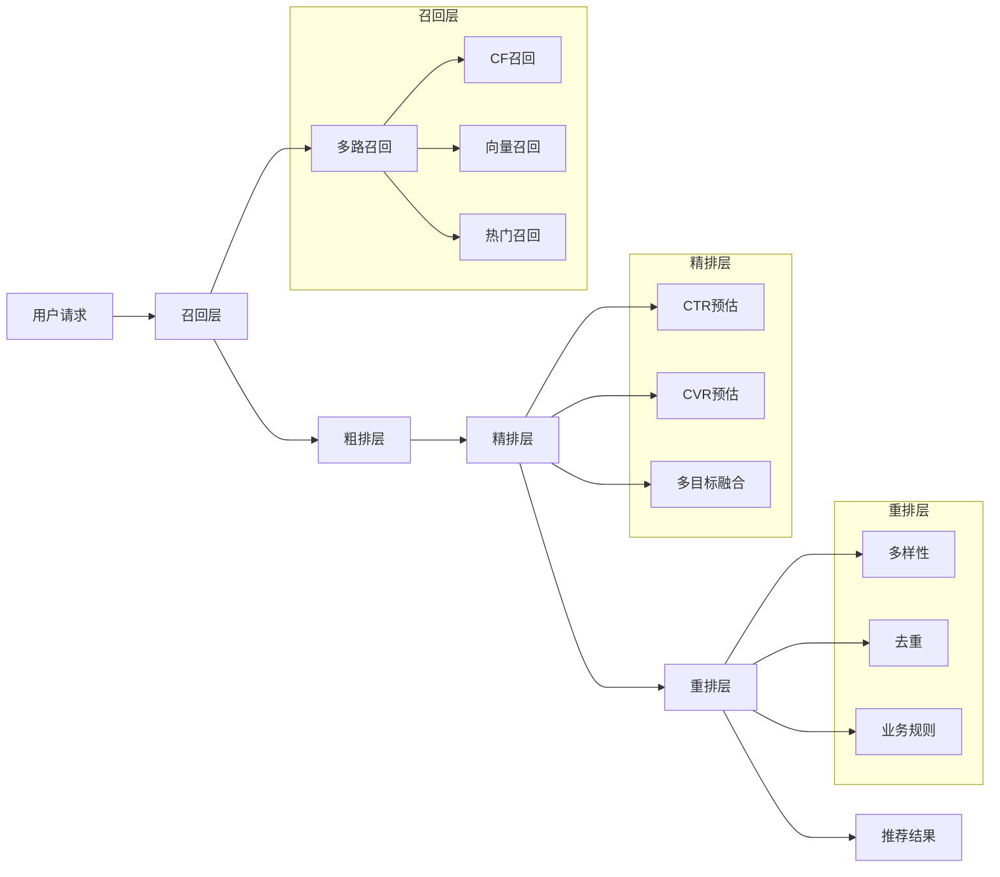

# 推荐系统实战

## 概述

推荐系统的核心目标是**在信息过载的时代，为用户匹配最感兴趣的内容**。一个完整的推荐系统通常包含：召回 → 粗排 → 精排 → 重排 四个阶段。



---

## 一、协同过滤

### 1.1 用户-物品评分矩阵

```
         Item1  Item2  Item3  Item4  Item5
User1      5      3      4      ?      1
User2      4      ?      5      3      ?
User3      1      2      ?      5      4
User4      ?      4      2      1      5
```

### 1.2 基于用户的协同过滤（UserCF）

```python
import numpy as np
from collections import defaultdict
from sklearn.metrics.pairwise import cosine_similarity

class UserCF:
    """基于用户的协同过滤"""

    def __init__(self, k=20):
        self.k = k  # 最近邻数量
        self.user_item_matrix = None
        self.user_similarity = None
        self.user_ids = None
        self.item_ids = None

    def fit(self, interactions):
        """
        interactions: List[(user_id, item_id, rating)]
        """
        # 构建用户-物品矩阵
        users = sorted(set(u for u, _, _ in interactions))
        items = sorted(set(i for _, i, _ in interactions))
        self.user_ids = {u: idx for idx, u in enumerate(users)}
        self.item_ids = {i: idx for idx, i in enumerate(items)}

        matrix = np.zeros((len(users), len(items)))
        for user, item, rating in interactions:
            matrix[self.user_ids[user]][self.item_ids[item]] = rating

        self.user_item_matrix = matrix
        # 计算用户相似度（余弦相似度）
        self.user_similarity = cosine_similarity(matrix)

    def recommend(self, user_id, n=10):
        """为用户推荐Top-N物品"""
        if user_id not in self.user_ids:
            # 冷启动：返回热门物品
            popular = np.argsort(-self.user_item_matrix.sum(axis=0))[:n]
            return [(list(self.item_ids.keys())[i], 0) for i in popular]

        uid = self.user_ids[user_id]
        user_vector = self.user_item_matrix[uid]

        # 找到K个最相似的用户
        similar_users = np.argsort(-self.user_similarity[uid])[1:self.k + 1]

        # 加权预测未交互物品的评分
        predictions = np.zeros(len(self.item_ids))
        for sim_uid in similar_users:
            sim = self.user_similarity[uid][sim_uid]
            predictions += sim * self.user_item_matrix[sim_uid]

        # 排除已交互的物品
        predictions[user_vector > 0] = -np.inf

        # 返回Top-N推荐
        top_items = np.argsort(-predictions)[:n]
        item_keys = list(self.item_ids.keys())
        return [(item_keys[i], predictions[i]) for i in top_items]


# 使用示例
interactions = [
    ('user1', 'item1', 5), ('user1', 'item2', 3), ('user1', 'item3', 4),
    ('user2', 'item1', 4), ('user2', 'item3', 5), ('user2', 'item4', 3),
    ('user3', 'item1', 1), ('user3', 'item2', 2), ('user3', 'item4', 5),
    ('user4', 'item2', 4), ('user4', 'item3', 2), ('user4', 'item5', 5),
]

model = UserCF(k=3)
model.fit(interactions)
recommendations = model.recommend('user1', n=3)
print("推荐结果:", recommendations)
```

### 1.3 基于物品的协同过滤（ItemCF）

```python
class ItemCF:
    """基于物品的协同过滤"""

    def __init__(self, k=20):
        self.k = k
        self.item_similarity = None
        self.user_item_matrix = None

    def fit(self, interactions):
        users = sorted(set(u for u, _, _ in interactions))
        items = sorted(set(i for _, i, _ in interactions))
        user_map = {u: i for i, u in enumerate(users)}
        item_map = {it: i for i, it in enumerate(items)}

        matrix = np.zeros((len(users), len(items)))
        for u, it, r in interactions:
            matrix[user_map[u]][item_map[it]] = r

        self.user_item_matrix = matrix
        self.user_map = user_map
        self.item_map = item_map
        self.item_keys = list(item_map.keys())

        # 物品相似度 = 物品向量（列）的余弦相似度
        self.item_similarity = cosine_similarity(matrix.T)

    def recommend(self, user_id, n=10):
        if user_id not in self.user_map:
            popular = np.argsort(-self.user_item_matrix.sum(axis=0))[:n]
            return [(self.item_keys[i], 0) for i in popular]

        uid = self.user_map[user_id]
        user_ratings = self.user_item_matrix[uid]

        predictions = np.zeros(len(self.item_keys))
        for item_idx in range(len(self.item_keys)):
            if user_ratings[item_idx] > 0:
                continue  # 跳过已交互物品
            # 找到与该物品最相似的K个物品
            sim_items = np.argsort(-self.item_similarity[item_idx])[1:self.k + 1]
            for sim_idx in sim_items:
                if user_ratings[sim_idx] > 0:
                    predictions[item_idx] += (
                        self.item_similarity[item_idx][sim_idx] * user_ratings[sim_idx]
                    )

        top_items = np.argsort(-predictions)[:n]
        return [(self.item_keys[i], predictions[i]) for i in top_items]
```

---

## 二、深度学习推荐模型

### 2.1 DNN推荐模型（Deep Cross Network）

```python
import torch
import torch.nn as nn
import torch.optim as optim

class DeepRecommendationModel(nn.Module):
    """
    基于Embedding + DNN的推荐模型
    输入：用户特征 + 物品特征 + 上下文特征
    输出：CTR/CVR预测概率
    """

    def __init__(self, feature_configs, embedding_dim=32, hidden_units=[256, 128, 64]):
        super().__init__()
        self.feature_configs = feature_configs

        # Embedding层
        self.embeddings = nn.ModuleDict()
        total_embedding_dim = 0
        for feat_name, vocab_size in feature_configs.items():
            self.embeddings[feat_name] = nn.Embedding(vocab_size, embedding_dim)
            total_embedding_dim += embedding_dim

        # 数值特征直接拼接到Embedding后
        self.numeric_dim = 10  # 假设有10个数值特征
        input_dim = total_embedding_dim + self.numeric_dim

        # 深层网络
        layers = []
        prev_dim = input_dim
        for hidden in hidden_units:
            layers.extend([
                nn.Linear(prev_dim, hidden),
                nn.BatchNorm1d(hidden),
                nn.ReLU(),
                nn.Dropout(0.3),
            ])
            prev_dim = hidden
        self.dnn = nn.Sequential(*layers)

        # 输出层
        self.output_layer = nn.Sequential(
            nn.Linear(prev_dim, 1),
            nn.Sigmoid()
        )

    def forward(self, categorical_features, numeric_features):
        """
        categorical_features: dict[str, tensor] - 离散特征
        numeric_features: tensor - 连续特征
        """
        # Embedding lookup
        embedding_list = []
        for feat_name in self.feature_configs:
            emb = self.embeddings[feat_name](categorical_features[feat_name])
            embedding_list.append(emb)

        # 拼接所有特征
        concat = torch.cat(embedding_list + [numeric_features], dim=1)

        # DNN
        output = self.dnn(concat)
        return self.output_layer(output).squeeze(-1)


# 训练代码
def train_model(model, train_loader, epochs=10, lr=0.001):
    optimizer = optim.Adam(model.parameters(), lr=lr)
    criterion = nn.BCELoss()

    model.train()
    for epoch in range(epochs):
        total_loss = 0
        for batch_cat, batch_num, batch_label in train_loader:
            optimizer.zero_grad()
            pred = model(batch_cat, batch_num)
            loss = criterion(pred, batch_label.float())
            loss.backward()
            optimizer.step()
            total_loss += loss.item()
        print(f"Epoch {epoch+1}/{epochs}, Loss: {total_loss/len(train_loader):.4f}")
```

### 2.2 Wide & Deep模型

```python
class WideAndDeep(nn.Module):
    """
    Wide & Deep Learning for Recommender Systems (Google, 2016)
    Wide部分: 记忆能力（特征交叉）
    Deep部分: 泛化能力（Embedding + DNN）
    """

    def __init__(self, num_wide_features, embedding_configs, hidden_units=[128, 64]):
        super().__init__()

        # Wide部分：线性模型
        self.wide = nn.Linear(num_wide_features, 1)

        # Deep部分：Embedding + DNN
        self.embeddings = nn.ModuleDict()
        deep_input_dim = 0
        for name, vocab_size, emb_dim in embedding_configs:
            self.embeddings[name] = nn.Embedding(vocab_size, emb_dim)
            deep_input_dim += emb_dim

        deep_layers = []
        prev = deep_input_dim
        for h in hidden_units:
            deep_layers.append(nn.Linear(prev, h))
            deep_layers.append(nn.ReLU())
            prev = h
        self.deep = nn.Sequential(*deep_layers)

        # 融合层
        self.fusion = nn.Linear(prev + 1, 1)

    def forward(self, wide_features, deep_categorical):
        # Wide
        wide_out = self.wide(wide_features)

        # Deep
        emb_list = []
        for name, _, _ in self.embedding_configs_list:
            emb_list.append(self.embeddings[name](deep_categorical[name]))
        deep_input = torch.cat(emb_list, dim=1)
        deep_out = self.deep(deep_input)

        # 融合
        combined = torch.cat([wide_out, deep_out], dim=1)
        return torch.sigmoid(self.fusion(combined)).squeeze(-1)
```

### 2.3 DIN模型（Deep Interest Network）

```python
class AttentionLayer(nn.Module):
    """DIN中的注意力机制：模拟用户对不同历史物品的关注度"""

    def __init__(self, embedding_dim, hidden_units=[80, 40]):
        super().__init__()
        layers = []
        prev = embedding_dim * 4  # [item, hist, item-hist, item*hist]
        for h in hidden_units:
            layers.append(nn.Linear(prev, h))
            layers.append(nn.ReLU())
            prev = h
        layers.append(nn.Linear(prev, 1))
        self.mlp = nn.Sequential(*layers)

    def forward(self, query_emb, keys_emb, keys_mask):
        """
        query_emb: [B, D] 候选物品embedding
        keys_emb:  [B, L, D] 用户历史物品embedding序列
        keys_mask: [B, L] 序列padding mask
        """
        # 扩展query以匹配序列长度
        query_expanded = query_emb.unsqueeze(1).expand_as(keys_emb)

        # 构建注意力输入: [item, hist, item-hist, item*hist]
        att_input = torch.cat([
            query_expanded,
            keys_emb,
            query_expanded - keys_emb,
            query_expanded * keys_emb
        ], dim=-1)

        att_weight = self.mlp(att_input).squeeze(-1)  # [B, L]
        att_weight = att_weight.masked_fill(keys_mask == 0, -1e9)
        att_weight = torch.softmax(att_weight, dim=1)  # [B, L]

        # 加权求和得到用户兴趣表示
        user_interest = torch.sum(
            keys_emb * att_weight.unsqueeze(-1), dim=1)  # [B, D]
        return user_interest


class DIN(nn.Module):
    """Deep Interest Network (Alibaba, 2018)"""

    def __init__(self, user_feature_configs, item_feature_configs,
                 seq_max_len=50, embedding_dim=32, hidden_units=[128, 64]):
        super().__init__()

        # 物品Embedding（候选物品和历史物品共享Embedding表）
        self.item_embeddings = nn.ModuleDict()
        for name, vocab_size in item_feature_configs.items():
            self.item_embeddings[name] = nn.Embedding(vocab_size, embedding_dim)

        # 用户静态特征Embedding
        self.user_embeddings = nn.ModuleDict()
        for name, vocab_size in user_feature_configs.items():
            self.user_embeddings[name] = nn.Embedding(vocab_size, embedding_dim)

        # 注意力层
        self.attention = AttentionLayer(embedding_dim)

        seq_total_dim = embedding_dim * len(item_feature_configs)
        user_static_dim = embedding_dim * len(user_feature_configs)
        input_dim = seq_total_dim + user_static_dim

        # MLP
        layers = []
        prev = input_dim
        for h in hidden_units:
            layers.extend([nn.Linear(prev, h), nn.ReLU(), nn.Dropout(0.2)])
            prev = h
        self.mlp = nn.Sequential(*layers)
        self.output = nn.Linear(prev, 1)

    def forward(self, user_features, item_features, hist_items, hist_mask):
        # 用户静态特征Embedding
        user_emb = torch.cat([
            self.user_embeddings[name](user_features[name])
            for name in self.user_embeddings
        ], dim=1)

        # 候选物品Embedding
        candidate_emb = torch.cat([
            self.item_embeddings[name](item_features[name])
            for name in self.item_embeddings
        ], dim=1)

        # 历史序列Embedding
        hist_emb = torch.cat([
            self.item_embeddings[name](hist_items[name])
            for name in self.item_embeddings
        ], dim=1)  # [B, L, D*len]

        # 注意力加权
        user_interest = self.attention(candidate_emb, hist_emb, hist_mask)

        # 拼接所有特征
        concat = torch.cat([user_emb, user_interest, candidate_emb], dim=1)
        output = self.mlp(concat)
        return torch.sigmoid(self.output(output)).squeeze(-1)
```

---

## 三、Embedding技术

### 3.1 Word2Vec风格的Item2Vec

```python
from gensim.models import Word2Vec

def train_item2vec(user_sequences, vector_size=64, window=5, min_count=5, epochs=10):
    """
    将用户的行为序列视为"句子"，物品视为"单词"进行训练
    user_sequences: List[List[item_id]]
    """
    model = Word2Vec(
        sentences=user_sequences,
        vector_size=vector_size,
        window=window,
        min_count=min_count,
        workers=4,
        epochs=epochs,
        sg=1,  # Skip-gram
        negative=10,  # 负采样
    )
    return model


# 使用示例
sequences = [
    ['item1', 'item2', 'item3', 'item5'],
    ['item2', 'item3', 'item4', 'item1'],
    ['item1', 'item5', 'item4', 'item3'],
]

model = train_item2vec(sequences)

# 获取物品Embedding
item_embedding = model.wv['item1']

# 找相似物品
similar_items = model.wv.most_similar('item1', topn=5)
print("相似物品:", similar_items)
```

### 3.2 Graph Embedding（基于随机游走）

```python
import networkx as nx
import random
from collections import defaultdict

class DeepWalk:
    """基于随机游走的Graph Embedding"""

    def __init__(self, walk_length=40, num_walks=10, embedding_dim=64):
        self.walk_length = walk_length
        self.num_walks = num_walks
        self.embedding_dim = embedding_dim

    def build_graph(self, edges):
        """构建物品共现图"""
        G = nx.Graph()
        for src, dst, weight in edges:
            if G.has_edge(src, dst):
                G[src][dst]['weight'] += weight
            else:
                G.add_edge(src, dst, weight=weight)
        return G

    def random_walk(self, G, start_node):
        """从起始节点进行随机游走"""
        walk = [start_node]
        for _ in range(self.walk_length - 1):
            cur = walk[-1]
            neighbors = list(G.neighbors(cur))
            if not neighbors:
                break
            # 按边的权重进行加权随机采样
            weights = [G[cur][n]['weight'] for n in neighbors]
            total = sum(weights)
            probs = [w / total for w in weights]
            next_node = random.choices(neighbors, weights=probs)[0]
            walk.append(next_node)
        return walk

    def fit(self, edges):
        G = self.build_graph(edges)
        walks = []
        nodes = list(G.nodes())
        for _ in range(self.num_walks):
            random.shuffle(nodes)
            for node in nodes:
                walks.append(self.random_walk(G, node))

        # 使用Word2Vec训练
        walks_str = [[str(n) for n in walk] for walk in walks]
        model = Word2Vec(
            walks_str, vector_size=self.embedding_dim,
            window=5, min_count=0, sg=1, workers=4, epochs=10
        )
        return model


# 构建物品共现图边
edges = [
    ('item1', 'item2', 3), ('item1', 'item3', 5), ('item2', 'item3', 4),
    ('item3', 'item4', 2), ('item2', 'item5', 1), ('item4', 'item5', 3),
]
deepwalk = DeepWalk(walk_length=20, num_walks=20, embedding_dim=32)
model = deepwalk.fit(edges)
print("Item1 Embedding:", model.wv['item1'])
```

### 3.3 双塔模型（用于向量召回）

```python
class TwoTowerModel(nn.Module):
    """
    双塔召回模型：用户塔和物品塔分别输出Embedding
    线上：用户Embedding实时计算，物品Embedding离线计算后存入向量检索引擎
    """

    def __init__(self, user_feat_dim, item_feat_dim, embedding_dim=64):
        super().__init__()
        # 用户塔
        self.user_tower = nn.Sequential(
            nn.Linear(user_feat_dim, 256),
            nn.ReLU(),
            nn.Linear(256, 128),
            nn.ReLU(),
            nn.Linear(128, embedding_dim),
        )
        # 物品塔
        self.item_tower = nn.Sequential(
            nn.Linear(item_feat_dim, 256),
            nn.ReLU(),
            nn.Linear(256, 128),
            nn.ReLU(),
            nn.Linear(128, embedding_dim),
        )

    def forward(self, user_features, item_features):
        user_emb = self.user_tower(user_features)
        item_emb = self.item_tower(item_features)
        # L2归一化
        user_emb = nn.functional.normalize(user_emb, p=2, dim=1)
        item_emb = nn.functional.normalize(item_emb, p=2, dim=1)
        # 点积计算相似度
        score = torch.sum(user_emb * item_emb, dim=1)
        return score

    def get_user_embedding(self, user_features):
        return nn.functional.normalize(
            self.user_tower(user_features), p=2, dim=1)

    def get_item_embedding(self, item_features):
        return nn.functional.normalize(
            self.item_tower(item_features), p=2, dim=1)
```

### 3.4 向量检索（Faiss）

```python
import faiss
import numpy as np

class VectorRetrievalService:
    """基于Faiss的向量检索服务"""

    def __init__(self, embedding_dim=64, nlist=100):
        self.embedding_dim = embedding_dim
        # 使用IVF + PQ进行近似最近邻搜索
        quantizer = faiss.IndexFlatIP(embedding_dim)  # 内积（配合L2归化 = 余弦相似度）
        self.index = faiss.IndexIVFPQ(
            quantizer, embedding_dim, nlist, 16, 8  # 16个子量化器，每个8 bits
        )
        self.item_ids = []

    def build_index(self, item_embeddings, item_ids):
        """构建索引"""
        embeddings = np.array(item_embeddings, dtype=np.float32)
        faiss.normalize_L2(embeddings)  # L2归一化

        self.index.train(embeddings)
        self.index.add(embeddings)
        self.index.nprobe = 10  # 搜索时探测的聚类数
        self.item_ids = item_ids

    def search(self, query_embedding, top_k=50):
        """向量召回"""
        query = np.array([query_embedding], dtype=np.float32)
        faiss.normalize_L2(query)
        scores, indices = self.index.search(query, top_k)
        return [
            (self.item_ids[idx], float(score))
            for idx, score in zip(indices[0], scores[0])
            if idx >= 0
        ]


# 使用示例
# 1. 离线计算所有物品Embedding
item_embeddings = np.random.randn(100000, 64)  # 模拟10万物品的Embedding
item_ids = [f"item_{i}" for i in range(100000)]

# 2. 构建索引
service = VectorRetrievalService(embedding_dim=64)
service.build_index(item_embeddings, item_ids)

# 3. 在线召回
user_emb = np.random.randn(64)
recommendations = service.search(user_emb, top_k=50)
```

---

## 四、多目标优化

### 4.1 多目标融合策略

```python
class MultiObjectiveFusion:
    """
    多目标融合：CTR(点击率) + CVR(转化率) + 时长 + 收藏等
    """

    @staticmethod
    def weighted_sum(scores_dict, weights_dict):
        """加权融合"""
        result = {}
        for item_id in scores_dict['ctr']:
            fused = sum(
                scores_dict[obj].get(item_id, 0) * weights_dict[obj]
                for obj in weights_dict
            )
            result[item_id] = fused
        return result

    @staticmethod
    def multiplicative(scores_dict, exponents_dict):
        """乘法融合（推荐）"""
        result = {}
        for item_id in scores_dict['ctr']:
            fused = 1.0
            for obj in exponents_dict:
                score = max(scores_dict[obj].get(item_id, 0), 1e-8)
                fused *= score ** exponents_dict[obj]
            result[item_id] = fused
        return result

    @staticmethod
    def pareto_optimal(scores_dict):
        """帕累托最优选择"""
        # 找出所有非支配解
        items = list(scores_dict['ctr'].keys())
        pareto_set = []
        for item in items:
            dominated = False
            for other in items:
                if other == item:
                    continue
                if all(
                    scores_dict[obj].get(other, 0) >= scores_dict[obj].get(item, 0)
                    for obj in scores_dict
                ) and any(
                    scores_dict[obj].get(other, 0) > scores_dict[obj].get(item, 0)
                    for obj in scores_dict
                ):
                    dominated = True
                    break
            if not dominated:
                pareto_set.append(item)
        return pareto_set


# 使用示例
scores = {
    'ctr':  {'item1': 0.8, 'item2': 0.6, 'item3': 0.9},
    'cvr':  {'item1': 0.3, 'item2': 0.5, 'item3': 0.2},
    'stay': {'item1': 30.0, 'item2': 45.0, 'item3': 20.0},
}

weights = {'ctr': 0.5, 'cvr': 0.3, 'stay': 0.2}
exponents = {'ctr': 1.0, 'cvr': 1.0, 'stay': 0.1}

print("加权融合:", MultiObjectiveFusion.weighted_sum(scores, weights))
print("乘法融合:", MultiObjectiveFusion.multiplicative(scores, exponents))
```

### 4.2 MMoE多门控专家网络

```python
class MMoE(nn.Module):
    """
    Multi-gate Mixture-of-Experts (Google, 2018)
    多个专家网络 + 每个任务独立的门控
    """

    def __init__(self, input_dim, num_experts=3, num_tasks=2,
                 expert_hidden=128, task_hidden=64):
        super().__init__()
        self.num_experts = num_experts
        self.num_tasks = num_tasks

        # 专家网络（共享）
        self.experts = nn.ModuleList([
            nn.Sequential(
                nn.Linear(input_dim, expert_hidden),
                nn.ReLU(),
                nn.Linear(expert_hidden, expert_hidden),
                nn.ReLU(),
            ) for _ in range(num_experts)
        ])

        # 每个任务一个门控
        self.gates = nn.ModuleList([
            nn.Linear(input_dim, num_experts) for _ in range(num_tasks)
        ])

        # 每个任务一个Tower
        self.towers = nn.ModuleList([
            nn.Sequential(
                nn.Linear(expert_hidden, task_hidden),
                nn.ReLU(),
                nn.Linear(task_hidden, 1),
            ) for _ in range(num_tasks)
        ])

    def forward(self, x):
        # 专家输出
        expert_outputs = torch.stack(
            [expert(x) for expert in self.experts], dim=1)  # [B, E, H]

        task_outputs = []
        for i in range(self.num_tasks):
            # 门控权重
            gate_weights = torch.softmax(
                self.gates[i](x), dim=1).unsqueeze(-1)  # [B, E, 1]
            # 加权融合专家输出
            fused = torch.sum(expert_outputs * gate_weights, dim=1)  # [B, H]
            # 任务Tower
            output = self.towers[i](fused)
            task_outputs.append(torch.sigmoid(output).squeeze(-1))

        return task_outputs  # [ctr_pred, cvr_pred]
```

---

## 五、AB测试

### 5.1 AB测试框架设计

```python
import hashlib
from dataclasses import dataclass
from typing import Optional

@dataclass
class Experiment:
    experiment_id: str
    name: str
    description: str
    variants: dict  # {"control": 0.5, "treatment_a": 0.3, "treatment_b": 0.2}
    metrics: list   # ["ctr", "cvr", "revenue"]
    status: str = "running"  # draft/running/stopped


class ABTestFramework:
    """AB测试分流框架"""

    def __init__(self):
        self.experiments = {}

    def register_experiment(self, exp: Experiment):
        self.experiments[exp.experiment_id] = exp

    def get_variant(self, experiment_id, user_id):
        """基于用户ID哈希进行确定性分流"""
        exp = self.experiments.get(experiment_id)
        if not exp or exp.status != "running":
            return "control"

        # 使用MurmurHash保证分流稳定性和均匀性
        hash_input = f"{experiment_id}:{user_id}"
        hash_value = int(hashlib.md5(hash_input.encode()).hexdigest(), 16)
        bucket = (hash_value % 10000) / 10000.0  # [0, 1)

        cumulative = 0
        for variant, ratio in exp.variants.items():
            cumulative += ratio
            if bucket < cumulative:
                return variant
        return list(exp.variants.keys())[-1]


# 使用示例
framework = ABTestFramework()
exp = Experiment(
    experiment_id="exp_2026_06_rec",
    name="推荐算法升级实验",
    description="对比DIN模型与基线模型的推荐效果",
    variants={"control": 0.5, "treatment_din": 0.5},
    metrics=["ctr", "cvr", "click_count", "session_duration"]
)
framework.register_experiment(exp)

# 为用户分流
user_id = "user_12345"
variant = framework.get_variant("exp_2026_06_rec", user_id)
print(f"用户 {user_id} 分配到实验组: {variant}")
```

### 5.2 统计显著性检验

```python
import numpy as np
from scipy import stats

class ABTestAnalyzer:
    """AB测试结果分析"""

    @staticmethod
    def analyze_proportion(control_conversions, control_total,
                           treatment_conversions, treatment_total,
                           alpha=0.05):
        """比例指标检验（CTR、CVR等）"""
        ctrl_rate = control_conversions / control_total
        treat_rate = treatment_conversions / treatment_total

        # Z检验
        pooled_rate = (control_conversions + treatment_conversions) / \
                      (control_total + treatment_total)
        se = np.sqrt(pooled_rate * (1 - pooled_rate) *
                     (1/control_total + 1/treatment_total))
        z_score = (treat_rate - ctrl_rate) / se
        p_value = 2 * (1 - stats.norm.cdf(abs(z_score)))

        # 置信区间
        lift = treat_rate - ctrl_rate
        ci_lower = lift - 1.96 * se
        ci_upper = lift + 1.96 * se
        relative_lift = (treat_rate - ctrl_rate) / ctrl_rate * 100

        return {
            'control_rate': f"{ctrl_rate:.4%}",
            'treatment_rate': f"{treat_rate:.4%}",
            'absolute_lift': f"{lift:.4%}",
            'relative_lift': f"{relative_lift:+.2f}%",
            'z_score': round(z_score, 4),
            'p_value': round(p_value, 6),
            'significant': p_value < alpha,
            'ci_95': f"[{ci_lower:.4%}, {ci_upper:.4%}]",
            'conclusion': '显著提升' if (p_value < alpha and lift > 0) else
                          ('显著下降' if (p_value < alpha and lift < 0) else '无显著差异')
        }

    @staticmethod
    def analyze_continuous(control_values, treatment_values, alpha=0.05):
        """连续值指标检验（时长、消费金额等）"""
        # Mann-Whitney U检验（不假设正态分布）
        u_stat, p_value = stats.mannwhitneyu(
            treatment_values, control_values, alternative='two-sided')

        ctrl_mean = np.mean(control_values)
        treat_mean = np.mean(treatment_values)
        relative_lift = (treat_mean - ctrl_mean) / ctrl_mean * 100

        return {
            'control_mean': round(ctrl_mean, 4),
            'treatment_mean': round(treat_mean, 4),
            'relative_lift': f"{relative_lift:+.2f}%",
            'p_value': round(p_value, 6),
            'significant': p_value < alpha,
            'conclusion': '显著' if p_value < alpha else '无显著差异'
        }


# 使用示例：分析CTR提升
result = ABTestAnalyzer.analyze_proportion(
    control_conversions=1200, control_total=50000,
    treatment_conversions=1380, treatment_total=50000
)
print("CTR实验结果:")
for k, v in result.items():
    print(f"  {k}: {v}")
```

### ✅ AB测试最佳实践

| 实践项 | 说明 |
|--------|------|
| 样本量计算 | 实验前计算最小样本量，避免功效不足 |
| 辛普森悖论 | 注意分层分析，避免整体结论与分层矛盾 |
| 指标护栏 | 设置保护性指标（如崩溃率），劣化时自动止损 |
| 互斥/正交实验 | 复杂场景使用正交分层（如Google Overlay） |
| 新奇效应 | 观察7~14天，排除短期波动干扰 |

---

## 工程架构参考

```
推荐系统整体架构：

┌─────────────────────────────────────────────────────────────┐
│                        在线服务层                              │
│  API Gateway → 召回服务 → 排序服务 → 重排服务 → AB分流         │
│  延迟要求: <100ms                                             │
├─────────────────────────────────────────────────────────────┤
│                        近线计算层                              │
│  特征实时计算 → 用户实时画像更新 → 推荐列表更新                  │
│  延迟要求: 秒级                                                │
├─────────────────────────────────────────────────────────────┤
│                        离线训练层                              │
│  数据ETL → 特征工程 → 模型训练 → 模型评估 → 上线               │
│  频率: 日级/小时级                                              │
└─────────────────────────────────────────────────────────────┘
```

## 相关页面

- [[数据中台架构]] - 推荐系统依赖的数据基础设施
- [[自然语言处理]] - 文本内容理解与推荐
- [[Hadoop生态系统]] - 离线特征计算与模型训练平台
