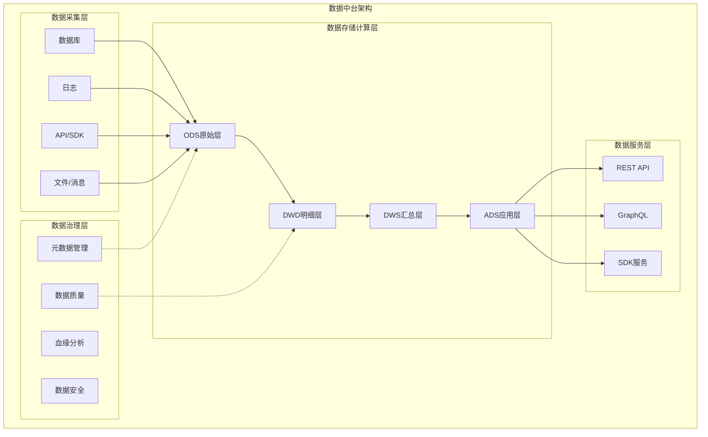

# 数据中台架构

## 概述

数据中台是一套**将数据转化为服务**的企业级架构模式，核心理念是"数据资产化、服务化、复用化"。它不是单一的技术产品，而是一个包含技术、流程、组织的体系。



---

## 一、数据采集

### 1.1 数据采集架构

```
┌──────────────┐     ┌──────────────────┐     ┌─────────────┐
│   数据源      │ --> |   消息队列(Kafka)  │ --> |   计算引擎    │
│ DB/Log/API   |     |   消费者组/分区      |     | Flink/Spark  │
└──────────────┘     └──────────────────┘     └─────────────┘
```

### 1.2 Flume日志采集

```python
# Flume Agent配置示例 (flume-agent.conf)
flume_config = """
# 定义Agent
agent.sources = r1
agent.channels = c1
agent.sinks = k1

# Source: 监控日志目录
agent.sources.r1.type = spooldir
agent.sources.r1.spoolDir = /var/log/app/
agent.sources.r1.fileHeader = true
agent.sources.r1.fileHeaderKey = file
agent.sources.r1.interceptors = i1
agent.sources.r1.interceptors.i1.type = timestamp

# Channel: 内存通道
agent.channels.c1.type = memory
agent.channels.c1.capacity = 10000
agent.channels.c1.transactionCapacity = 1000

# Sink: Kafka
agent.sinks.k1.type = org.apache.flume.sink.kafka.KafkaSink
agent.sinks.k1.kafka.bootstrap.servers = kafka1:9092,kafka2:9092
agent.sinks.k1.kafka.topic = raw_logs
agent.sinks.k1.kafka.flumeBatchSize = 100

# 绑定
agent.sources.r1.channels = c1
agent.sinks.k1.channel = c1
"""
```

### 1.3 Canal实时同步MySQL Binlog

```java
// Canal客户端：监听MySQL变更并推送到Kafka
import com.alibaba.otter.canal.client.*;
import com.alibaba.otter.canal.protocol.message.*;

public class CanalToKafka {

    public static void startCanalClient(String destination, String kafkaTopic) {
        CanalConnector connector = CanalConnectors.newClusterConnector(
            "zk1:2181", destination, "canal", "");

        connector.connect();
        connector.subscribe(".*\\..*");  // 订阅所有库所有表
        connector.rollback();

        while (true) {
            Message message = connector.getWithoutAck(1000);  // 批量获取
            long batchId = message.getId();
            int size = message.getEntries().size();

            if (batchId != -1 && size > 0) {
                for (Entry entry : message.getEntries()) {
                    if (entry.getEntryType() == EntryType.ROWDATA) {
                        RowChange rowChange = RowChange.parseFrom(entry.getStoreValue());
                        for (RowData rowData : rowChange.getRowDatasList()) {
                            // 处理INSERT/UPDATE/DELETE事件
                            EventType eventType = rowChange.getEventType();
                            String tableName = entry.getHeader().getTableName();
                            String jsonData = convertToJson(rowData, eventType);
                            // 发送到Kafka
                            sendToKafka(kafkaTopic, tableName + "|" + jsonData);
                        }
                    }
                }
            }
            connector.ack(batchId);  // 确认消费
        }
    }
}
```

### 1.4 数据采集最佳实践

| 数据源 | 推荐方案 | 实时性 |
|--------|----------|--------|
| MySQL Binlog | Canal/Debezium | 秒级 |
| 应用日志 | Flume/Filebeat -> Kafka | 秒级 |
| API数据 | 定时调度(Sqoop/DataX) | 分钟级~小时级 |
| IoT设备 | MQTT -> Kafka | 毫秒级 |

---

## 二、数据治理

### 2.1 数据分层架构（数仓模型）

```
┌─────────────────────────────────────────────────┐
│  ADS层 (Application Data Store) - 应用数据层      │
│  面向业务场景的汇总指标、报表数据                   │
├─────────────────────────────────────────────────┤
│  DWS层 (Data Warehouse Summary) - 汇总数据层      │
│  按主题域进行轻度/重度汇总                         │
├─────────────────────────────────────────────────┤
│  DWD层 (Data Warehouse Detail) - 明细数据层       │
│  清洗后的标准化明细数据，统一维度建模                │
├─────────────────────────────────────────────────┤
│  ODS层 (Operational Data Store) - 原始数据层      │
│  原样保存源系统数据，增加分区                      │
└─────────────────────────────────────────────────┘
```

### 2.2 维度建模示例

```sql
-- DWD层：用户行为明细表（星型模型）
-- 事实表
CREATE TABLE dwd.dwd_event_log (
    event_id       STRING,
    user_id        BIGINT,
    device_id      STRING,
    event_name     STRING,
    event_time     TIMESTAMP,
    -- 维度外键
    page_id        BIGINT,       -- 页面维度
    item_id        BIGINT,       -- 商品维度
    channel_id     INT,          -- 渠道维度
    geo_id         INT,          -- 地理维度
    -- 度量
    duration_ms    INT,
    properties     MAP<STRING, STRING>
)
PARTITIONED BY (dt STRING)
STORED AS ORC;

-- 维度表：商品维度（SCD2缓慢变化维）
CREATE TABLE dim.dim_item (
    item_id        BIGINT,
    item_name      STRING,
    category_id    BIGINT,
    brand          STRING,
    price          DECIMAL(10,2),
    -- SCD2字段
    start_date     DATE,
    end_date       DATE,
    is_current     BOOLEAN
)
STORED AS ORC;

-- DWS层：用户日活汇总表
CREATE TABLE dws.dws_user_daily (
    user_id        BIGINT,
    dt             STRING,
    session_count  INT,
    page_view      INT,
    click_count    INT,
    order_count    INT,
    order_amount   DECIMAL(12,2),
    stay_duration  INT
)
PARTITIONED BY (dt STRING)
STORED AS ORC;
```

### 2.3 数据质量监控

```python
import pandas as pd
from datetime import datetime, timedelta

class DataQualityMonitor:
    """数据质量监控框架"""

    def __init__(self, table_name, dt):
        self.table_name = table_name
        self.dt = dt
        self.rules = []

    def add_rule(self, name, sql, threshold, operator='>='):
        """添加质量检查规则"""
        self.rules.append({
            'name': name,
            'sql': sql,
            'threshold': threshold,
            'operator': operator
        })

    def run_checks(self, spark):
        """执行所有质量检查"""
        results = []
        for rule in self.rules:
            df = spark.sql(rule['sql'].format(
                table=self.table_name, dt=self.dt))
            actual_value = df.collect()[0][0]

            passed = self._evaluate(actual_value, rule['threshold'], rule['operator'])
            results.append({
                'rule_name': rule['name'],
                'actual': actual_value,
                'threshold': rule['threshold'],
                'passed': passed,
                'checked_at': datetime.now().isoformat()
            })

            if not passed:
                self._alert(rule['name'], actual_value, rule['threshold'])
        return results

    def _evaluate(self, actual, threshold, operator):
        ops = {
            '>=': lambda a, t: a >= t,
            '<=': lambda a, t: a <= t,
            '==': lambda a, t: a == t,
            '!=': lambda a, t: a != t,
        }
        return ops[operator](actual, threshold)

    def _alert(self, rule_name, actual, threshold):
        # 告警通知（钉钉/企微/邮件）
        print(f"⚠️ 数据质量告警: 表={self.table_name}, 规则={rule_name}, "
              f"实际值={actual}, 期望阈值={threshold}")


# 使用示例
monitor = DataQualityMonitor('dwd.dwd_event_log', '2026-06-28')
monitor.add_rule('记录数检查', 
    "SELECT COUNT(*) FROM {table} WHERE dt='{dt}'", 1000000)
monitor.add_rule('空值率检查',
    "SELECT 1 - COUNT(user_id)/COUNT(*) FROM {table} WHERE dt='{dt}'", 0.99)
monitor.add_rule('唯一性检查',
    "SELECT COUNT(*) - COUNT(DISTINCT event_id) FROM {table} WHERE dt='{dt}'", 0)
```

### 2.4 元数据管理与血缘分析

```python
# 基于SQL解析的血缘分析
from sqllineage.runner import LineageRunner

class DataLineageAnalyzer:
    """数据血缘分析"""

    def __init__(self):
        self.lineage_graph = {}

    def analyze_sql(self, sql, table_name=None):
        """解析SQL提取血缘关系"""
        runner = LineageRunner(sql)
        source_tables = runner.source_tables()
        target_tables = runner.target_tables()

        for src in source_tables:
            tgt = target_tables[0] if target_tables else table_name
            if tgt not in self.lineage_graph:
                self.lineage_graph[tgt] = {'upstream': set(), 'downstream': set()}
            self.lineage_graph[tgt]['upstream'].add(str(src))

            if str(src) not in self.lineage_graph:
                self.lineage_graph[str(src)] = {'upstream': set(), 'downstream': set()}
            self.lineage_graph[str(src)]['downstream'].add(tgt)

    def get_upstream(self, table, depth=3):
        """获取上游依赖"""
        result = set()
        if table in self.lineage_graph and depth > 0:
            for upstream in self.lineage_graph[table]['upstream']:
                result.add(upstream)
                result.update(self.get_upstream(upstream, depth - 1))
        return result

    def impact_analysis(self, table):
        """影响分析：修改某表会影响哪些下游"""
        if table in self.lineage_graph:
            return self.lineage_graph[table]['downstream']
        return set()
```

---

## 三、数据服务

### 3.1 服务化架构

```
┌──────────────┐      ┌──────────────────┐      ┌───────────────┐
│  业务应用     | <--> |   数据服务网关      | <--> |   数据查询层     |
│  (推荐/风控)  |      |   (API网关/限流)   |      |  (OLAP/NoSQL)  |
└──────────────┘      └──────────────────┘      └───────────────┘
```

### 3.2 数据API服务（Python FastAPI）

```python
from fastapi import FastAPI, HTTPException, Query
from pydantic import BaseModel
from typing import Optional, List
import asyncpg
import time

app = FastAPI(title="数据中台-数据服务API")

# 连接池
db_pool = None

@app.on_event("startup")
async def startup():
    global db_pool
    db_pool = await asyncpg.create_pool(
        host="starrocks-host",
        port=9030,
        user="data_service",
        password="password",
        database="dws",
        min_size=5,
        max_size=20,
    )

# 数据模型
class UserMetricsResponse(BaseModel):
    user_id: int
    total_orders: int
    total_amount: float
    last_active: str
    segment: str

# 查询接口
@app.get("/api/v1/user/metrics/{user_id}", response_model=UserMetricsResponse)
async def get_user_metrics(user_id: int):
    async with db_pool.acquire() as conn:
        row = await conn.fetchrow("""
            SELECT user_id, total_orders, total_amount, last_active, segment
            FROM dws_user_metrics
            WHERE user_id = $1
        """, user_id)

        if row is None:
            raise HTTPException(status_code=404, detail="用户不存在")

        return UserMetricsResponse(
            user_id=row['user_id'],
            total_orders=row['total_orders'],
            total_amount=float(row['total_amount']),
            last_active=str(row['last_active']),
            segment=row['segment'],
        )

# 批量查询接口（支持游标分页）
@app.get("/api/v1/users/metrics")
async def batch_user_metrics(
    limit: int = Query(default=100, le=1000),
    cursor: Optional[str] = None,
    segment: Optional[str] = None,
):
    async with db_pool.acquire() as conn:
        where_clause = "WHERE 1=1"
        params = []
        if cursor:
            where_clause += f" AND user_id > ${len(params)+1}"
            params.append(int(cursor))
        if segment:
            where_clause += f" AND segment = ${len(params)+1}"
            params.append(segment)

        query = f"""
            SELECT user_id, total_orders, total_amount, last_active, segment
            FROM dws_user_metrics
            {where_clause}
            ORDER BY user_id
            LIMIT ${len(params)+1}
        """
        params.append(limit)

        rows = await conn.fetch(query, *params)
        return {
            "data": [dict(row) for row in rows],
            "next_cursor": str(rows[-1]['user_id']) if len(rows) == limit else None,
        }
```

### 3.3 数据服务最佳实践

| 实践项 | 说明 |
|--------|------|
| 多级缓存 | Redis缓存热点数据，减少下游查询压力 |
| 限流熔断 | 保护数据服务，防止雪崩 |
| 数据脱敏 | 按权限对敏感字段脱敏（手机号、身份证） |
| API版本管理 | `/api/v1/` 保证兼容性 |
| 异步查询 | 大数据量查询使用异步任务+回调通知 |

---

## 四、数据资产

### 4.1 数据资产目录

```python
# 数据资产元信息模型
class DataAsset:
    """数据资产描述模型"""
    asset_id: str                    # 资产唯一标识
    asset_name: str                  # 资产名称
    asset_type: str                  # 类型: table/metric/api/model
    owner: str                       # 负责人
    department: str                  # 所属部门
    description: str                 # 业务描述
    schema: list                     # 字段Schema
    quality_score: float             # 质量评分(0-100)
    usage_count: int                 # 使用次数
    last_updated: str                # 最后更新时间
    tags: list[str]                  # 标签
    sensitivity_level: str           # 敏感等级: public/internal/confidential/secret


# 资产目录管理
class DataCatalogManager:

    def __init__(self, es_client):
        self.es = es_client  # Elasticsearch用于全文检索

    def register_asset(self, asset: DataAsset):
        """注册数据资产到目录"""
        self.es.index(
            index="data_catalog",
            id=asset.asset_id,
            document={
                "asset_name": asset.asset_name,
                "asset_type": asset.asset_type,
                "owner": asset.owner,
                "description": asset.description,
                "schema": asset.schema,
                "tags": asset.tags,
                "quality_score": asset.quality_score,
                "usage_count": asset.usage_count,
                "sensitivity_level": asset.sensitivity_level,
                "registered_at": datetime.now().isoformat(),
            }
        )

    def search_assets(self, keyword, asset_type=None, tag=None, limit=20):
        """全文检索数据资产"""
        query = {
            "size": limit,
            "query": {
                "bool": {
                    "must": [
                        {"multi_match": {
                            "query": keyword,
                            "fields": ["asset_name^3", "description^2", "tags"]
                        }}
                    ],
                    "filter": []
                }
            },
            "sort": [
                {"usage_count": {"order": "desc"}},
                "_score"
            ]
        }
        if asset_type:
            query["query"]["bool"]["filter"].append(
                {"term": {"asset_type": asset_type}})
        if tag:
            query["query"]["bool"]["filter"].append({"term": {"tags": tag}})

        result = self.es.search(index="data_catalog", body=query)
        return [hit["_source"] for hit in result["hits"]["hits"]]
```

### 4.2 数据资产价值评估

```python
# 数据资产ROI评估模型
def calculate_data_value(asset_id, metrics):
    """
    数据资产价值评估维度：
    1. 数据质量得分 (30%)
    2. 数据使用频率 (25%)
    3. 业务覆盖度 (20%)
    4. 数据时效性 (15%)
    5. 数据独占性 (10%)
    """
    weights = {
        'quality': 0.30,
        'usage': 0.25,
        'coverage': 0.20,
        'timeliness': 0.15,
        'uniqueness': 0.10
    }
    score = (
        metrics['quality_score'] * weights['quality'] +
        min(metrics['usage_count'] / 10000, 1) * 100 * weights['usage'] +
        metrics['business_coverage'] * weights['coverage'] +
        metrics['timeliness_score'] * weights['timeliness'] +
        metrics['uniqueness_score'] * weights['uniqueness']
    )
    return round(score, 2)
```

---

## 五、指标体系

### 5.1 指标分层模型

```
┌───────────────────────────────────────────────┐
│              原子指标 (Atomic Metric)            │
│  对业务过程的度量，不可再拆分                      │
│  例: 支付金额、订单数、UV                        │
├───────────────────────────────────────────────┤
│              派生指标 (Derived Metric)           │
│  原子指标 + 维度 + 时间周期                       │
│  例: 近7天各渠道支付金额                         │
├───────────────────────────────────────────────┤
│              复合指标 (Composite Metric)         │
│  多个指标的四则运算                              │
│  例: 转化率 = 支付UV / 访问UV                    │
│  例: ARPU = 总收入 / 活跃用户数                   │
└───────────────────────────────────────────────┘
```

### 5.2 指标定义与管理

```sql
-- 原子指标注册表
CREATE TABLE meta.meta_atomic_metric (
    metric_id       STRING PRIMARY KEY,
    metric_name     STRING NOT NULL,
    metric_code     STRING UNIQUE,
    business_domain STRING,           -- 所属业务域
    metric_type     STRING,           -- sum/count/avg/distinct
    source_table    STRING,
    source_column   STRING,
    description     STRING,
    owner           STRING,
    created_at      TIMESTAMP
);

-- 派生指标注册表
CREATE TABLE meta.meta_derived_metric (
    metric_id       STRING PRIMARY KEY,
    metric_name     STRING,
    metric_code     STRING UNIQUE,
    atomic_metric   STRING,           -- 关联原子指标
    dimensions      ARRAY<STRING>,    -- 分析维度
    time_granularity STRING,          -- day/week/month
    filter_condition STRING,          -- 过滤条件
    calculation_sql STRING,           -- 完整计算SQL
    owner           STRING
);

-- 示例：注册"支付金额"原子指标
INSERT INTO meta.meta_atomic_metric VALUES
('m_001', '支付金额', 'pay_amount', '交易', 'sum',
 'dwd.dwd_trade_pay', 'pay_amount',
 '用户实际支付的订单金额', 'data_team', CURRENT_TIMESTAMP);

-- 示例：注册"近7天各渠道支付金额"派生指标
INSERT INTO meta.meta_derived_metric VALUES
('dm_001', '近7天各渠道支付金额', 'pay_amount_7d_channel',
 'm_001', ARRAY['channel_id'], '7d', NULL,
 'SELECT channel_id, SUM(pay_amount) FROM dwd.dwd_trade_pay
  WHERE dt >= date_sub(current_date, 7)
  GROUP BY channel_id',
 'data_team');
```

### 5.3 指标口径一致性保障

```python
class MetricRegistry:
    """指标注册中心 - 保证口径一致性"""

    def __init__(self):
        self.metrics = {}

    def register(self, metric_code, definition, sql_template, owner, dimensions=None):
        if metric_code in self.metrics:
            raise ValueError(f"指标{metric_code}已存在，禁止重复定义！")
        self.metrics[metric_code] = {
            'code': metric_code,
            'definition': definition,
            'sql': sql_template,
            'owner': owner,
            'dimensions': dimensions or [],
            'version': 1,
            'created_at': datetime.now().isoformat(),
        }

    def get_sql(self, metric_code, **kwargs):
        """获取指标的标准化SQL"""
        if metric_code not in self.metrics:
            raise KeyError(f"未注册的指标: {metric_code}")
        template = self.metrics[metric_code]['sql']
        return template.format(**kwargs)

    def validate_consistency(self, metric_code, user_sql):
        """校验用户SQL与注册SQL的口径是否一致"""
        registered_sql = self.metrics[metric_code]['sql']
        # 简化对比：检查核心聚合函数和表是否一致
        return self._sql_equivalent(registered_sql, user_sql)


# 全局指标注册中心
registry = MetricRegistry()

# 注册核心指标
registry.register(
    metric_code='dau',
    definition='日活跃用户数：当天有>=1次有效会话的去重用户数',
    sql_template='''
        SELECT dt, COUNT(DISTINCT user_id) AS dau
        FROM dwd.dwd_session_log
        WHERE dt = '{dt}' AND session_status = 'valid'
        GROUP BY dt
    ''',
    owner='growth_team',
    dimensions=['channel', 'platform', 'region']
)
```

### ✅ 指标体系最佳实践

- **统一口径**：所有指标必须在指标注册中心统一定义，禁止业务侧自定义口径
- **命名规范**：`业务域_指标名_时间周期_维度`，如 `trade_pay_amount_7d_channel`
- **版本管理**：指标逻辑变更时升级版本号，保留历史版本
- **指标看板**：核心指标配以可视化看板（Grafana/Superset）
- **异常告警**：指标波动超过阈值时自动告警

---

## 技术选型参考

| 能力域 | 开源方案 | 商业方案 |
|--------|----------|----------|
| 数据采集 | Flume/Canal/DataX | 阿里DataWorks |
| 数据计算 | Spark/Flink/Presto | Databricks |
| 数据存储 | HDFS/HBase/ClickHouse | AWS S3/Snowflake |
| 元数据管理 | Apache Atlas/DataHub | Alation/Collibra |
| 数据质量 | Great Expectations/Soda | Informatica DQ |
| 数据服务 | 自研API/GraphQL | Hasura/Apollo |

## 相关页面

- [[Hadoop生态系统]] - 大数据底层基础设施
- [[推荐系统实战]] - 基于数据中台的推荐系统工程
- [[自然语言处理]] - NLP在数据中台中的应用
