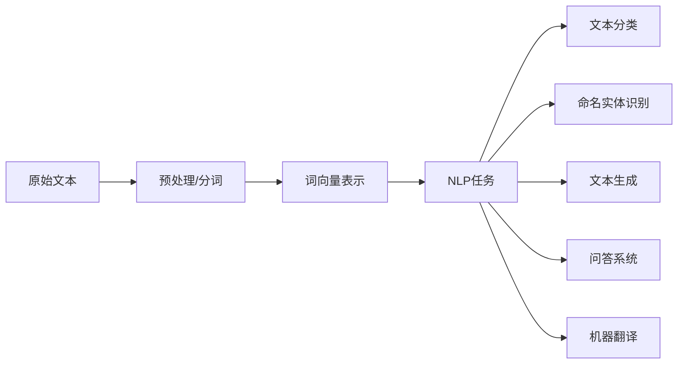

# 自然语言处理

## 概述

自然语言处理（NLP）是AI的重要分支，致力于让计算机理解、解释和生成人类语言。随着深度学习和预训练模型的发展，NLP经历了从规则 → 统计 → 深度学习 → 大模型的演进。



---

## 一、中文分词

### 1.1 常用分词工具对比

| 工具 | 特点 | 适用场景 |
|------|------|----------|
| Jieba | 轻量、快速、支持自定义词典 | 通用中文分词 |
| HanLP | 功能全面、支持多种NLP任务 | 企业级应用 |
| THULAC | 清华大学、精度高 | 学术研究 |
| pkuseg | 北大、领域自适应 | 特定领域 |

### 1.2 Jieba分词

```python
import jieba
import jieba.analyse
import jieba.posseg as pseg

# 基础分词
text = "自然语言处理是人工智能的重要分支"
words = jieba.cut(text, cut_all=False)  # 精确模式
print("精确模式:", "/".join(words))
# 输出: 自然语言/处理/是/人工智能/的/重要/分支

# 全模式
words_all = jieba.cut(text, cut_all=True)
print("全模式:", "/".join(words_all))

# 搜索引擎模式
words_search = jieba.cut_for_search(text)
print("搜索引擎模式:", "/".join(words_search))

# 添加自定义词典
jieba.add_word("自然语言处理")
jieba.add_word("深度学习")
# 加载词典文件
# jieba.load_userdict("custom_dict.txt")

# 带词性标注
words_pos = pseg.cut(text)
for word, flag in words_pos:
    print(f"{word} ({flag})", end="  ")
# 自然语言处理 (nz)  是 (v)  人工智能 (n)  的 (uj)  重要 (a)  分支 (n)

# 关键词提取
keywords = jieba.analyse.extract_tags(
    text, topK=5, withWeight=True,
    allowPOS=('n', 'nz', 'vn', 'v')
)
print("\n关键词:", keywords)
```

### 1.3 自定义词典格式

```
# custom_dict.txt
# 格式: 词语 词频 词性
自然语言处理 100 n
深度学习 200 n
知识图谱 150 n
大语言模型 300 n
Transformer架构 80 nz
```

### 1.4 分词后处理

```python
import re
from collections import Counter

class TextPreprocessor:
    """文本预处理流水线"""

    def __init__(self, user_dict=None, stopwords_file=None):
        if user_dict:
            jieba.load_userdict(user_dict)
        self.stopwords = self._load_stopwords(stopwords_file) if stopwords_file else set()

    def _load_stopwords(self, filepath):
        with open(filepath, 'r', encoding='utf-8') as f:
            return set(line.strip() for line in f)

    def preprocess(self, text):
        # 1. 清洗HTML标签
        text = re.sub(r'<[^>]+>', '', text)
        # 2. 去除特殊字符（保留中文、英文、数字）
        text = re.sub(r'[^\u4e00-\u9fa5a-zA-Z0-9]', ' ', text)
        # 3. 分词
        words = jieba.cut(text)
        # 4. 去停用词 + 转小写
        words = [w.lower().strip() for w in words
                 if w.strip() and w not in self.stopwords and len(w) > 1]
        return words

    def batch_preprocess(self, texts):
        return [self.preprocess(t) for t in texts]
```

---

## 二、词向量

### 2.1 Word2Vec (CBOW / Skip-gram)

```python
from gensim.models import Word2Vec
from gensim.models.word2vec import LineSentence

# 训练Word2Vec模型
def train_word2vec(corpus_file, vector_size=200, window=5,
                   min_count=5, workers=8, epochs=15, sg=1):
    """
    sg=1: Skip-gram (适合小语料，精度高)
    sg=0: CBOW (适合大语料，速度快)
    """
    sentences = LineSentence(corpus_file)  # 每行一个句子，已分词
    model = Word2Vec(
        sentences,
        vector_size=vector_size,
        window=window,
        min_count=min_count,
        workers=workers,
        epochs=epochs,
        sg=sg,
        negative=15,   # 负采样数量
        alpha=0.025,   # 初始学习率
        min_alpha=0.0001,  # 最终学习率
    )
    return model


# 使用示例
model = train_word2vec('corpus_segmented.txt')

# 获取词向量
vector = model.wv['自然语言']  # [200,] 维向量

# 词语相似度
sim = model.wv.similarity('自然语言', '人工智能')

# 最相似词
similar = model.wv.most_similar('深度学习', topn=10)

# 类比推理: king - man + woman = queen
result = model.wv.most_similar(
    positive=['国王', '女人'], negative=['男人'], topn=5
)

# 不匹配词
odd = model.wv.doesnt_match(['苹果', '香蕉', '橙子', '汽车'])

# 保存/加载
model.save('word2vec.model')
model = Word2Vec.load('word2vec.model')

# 导出为通用格式（可被其他工具加载）
model.wv.save_word2vec_format('word2vec.txt', binary=False)
model.wv.save_word2vec_format('word2vec.bin', binary=True)
```

### 2.2 Word2Vec可视化

```python
from sklearn.decomposition import PCA
import matplotlib.pyplot as plt

def visualize_embeddings(model, words, dim=2):
    """使用PCA降维可视化词向量"""
    vectors = [model.wv[w] for w in words if w in model.wv]
    pca = PCA(n_components=dim)
    reduced = pca.fit_transform(vectors)

    plt.figure(figsize=(12, 8))
    for i, word in enumerate(words):
        if word in model.wv:
            plt.scatter(reduced[i, 0], reduced[i, 1])
            plt.annotate(word, (reduced[i, 0], reduced[i, 1]),
                        fontsize=12, fontproperties=font_prop)
    plt.title("Word Embeddings Visualization (PCA)")
    plt.savefig('word2vec_vis.png', dpi=150)
```

### 2.3 BERT（Transformer预训练模型）

```python
from transformers import (
    BertTokenizer, BertModel, BertForSequenceClassification,
    BertForTokenClassification, BertForMaskedLM,
    Trainer, TrainingArguments
)
import torch

# 加载预训练BERT
model_name = "bert-base-chinese"
tokenizer = BertTokenizer.from_pretrained(model_name)
model = BertModel.from_pretrained(model_name)

# 获取BERT词向量
def get_bert_embeddings(texts, model, tokenizer, device='cpu'):
    """获取句子的BERT表示（使用[CLS] token的输出）"""
    model = model.to(device)
    model.eval()
    embeddings = []

    with torch.no_grad():
        for text in texts:
            inputs = tokenizer(
                text, return_tensors='pt',
                max_length=512, truncation=True,
                padding='max_length'
            ).to(device)
            outputs = model(**inputs)
            # 使用[CLS] token的输出作为句子表示
            cls_embedding = outputs.last_hidden_state[:, 0, :]  # [1, 768]
            embeddings.append(cls_embedding.cpu().numpy())

    return np.concatenate(embeddings, axis=0)


# Masked Language Model（完形填空）
def predict_mask(model_name, text):
    """BERT MLM 预测被遮盖的词"""
    fill_mask = pipeline('fill-mask', model=model_name)
    results = fill_mask(text)
    for r in results:
        print(f"{r['token_str']}: {r['score']:.4f}")

# 使用示例
text = "自然语言处理是[MASK]的重要分支。"
predict_mask("bert-base-chinese", text)
```

### 2.4 Sentence-BERT（句子级别Embedding）

```python
from sentence_transformers import SentenceTransformer

class SentenceEmbeddingService:
    """句子级别Embedding服务"""

    def __init__(self, model_name='paraphrase-multilingual-MiniLM-L12-v2'):
        self.model = SentenceTransformer(model_name)

    def encode(self, sentences):
        """编码句子为向量"""
        return self.model.encode(sentences, show_progress_bar=True)

    def semantic_search(self, query, corpus, top_k=5):
        """语义检索"""
        query_emb = self.model.encode([query])
        corpus_emb = self.model.encode(corpus)

        # 余弦相似度
        from sklearn.metrics.pairwise import cosine_similarity
        scores = cosine_similarity(query_emb, corpus_emb)[0]
        top_indices = scores.argsort()[-top_k:][::-1]

        return [(corpus[i], float(scores[i])) for i in top_indices]


# 使用示例
service = SentenceEmbeddingService()
corpus = [
    "如何训练一个BERT模型",
    "深度学习在推荐系统中的应用",
    "自然语言处理入门指南",
    "计算机视觉与图像识别",
    "BERT预训练模型详解"
]
results = service.semantic_search("BERT是怎么训练的", corpus)
print("语义搜索结果:")
for text, score in results:
    print(f"  [{score:.4f}] {text}")
```

---

## 三、文本分类

### 3.1 传统方法（TF-IDF + SVM）

```python
from sklearn.feature_extraction.text import TfidfVectorizer
from sklearn.svm import SVC
from sklearn.pipeline import Pipeline
from sklearn.metrics import classification_report

class TextClassifierTraditional:
    """传统文本分类流水线"""

    def __init__(self):
        self.pipeline = Pipeline([
            ('tfidf', TfidfVectorizer(
                max_features=50000,
                ngram_range=(1, 2),  # 使用unigram + bigram
                min_df=3,
                max_df=0.9,
                sublinear_tf=True,
            )),
            ('clf', SVC(
                kernel='linear',
                C=1.0,
                probability=True,
                class_weight='balanced',
            ))
        ])

    def train(self, texts, labels):
        self.pipeline.fit(texts, labels)

    def predict(self, texts):
        return self.pipeline.predict(texts)

    def predict_proba(self, texts):
        return self.pipeline.predict_proba(texts)


# 使用示例（假设已分词）
texts = ["自然 语言 处理 入门", "深度 学习 模型 训练", ...]
labels = ["AI", "AI", ...]
clf = TextClassifierTraditional()
clf.train(texts, labels)
predictions = clf.predict(["新 的 文本"])
```

### 3.2 基于BERT的文本分类

```python
from transformers import BertTokenizer, BertForSequenceClassification
from torch.utils.data import Dataset, DataLoader
from torch.optim import AdamW
import torch

class TextClassificationDataset(Dataset):
    def __init__(self, texts, labels, tokenizer, max_length=512):
        self.texts = texts
        self.labels = labels
        self.tokenizer = tokenizer
        self.max_length = max_length

    def __len__(self):
        return len(self.texts)

    def __getitem__(self, idx):
        encoding = self.tokenizer(
            self.texts[idx],
            truncation=True,
            padding='max_length',
            max_length=self.max_length,
            return_tensors='pt'
        )
        return {
            'input_ids': encoding['input_ids'].flatten(),
            'attention_mask': encoding['attention_mask'].flatten(),
            'labels': torch.tensor(self.labels[idx], dtype=torch.long)
        }


class BertClassifier:
    """BERT文本分类器"""

    def __init__(self, model_name='bert-base-chinese', num_labels=10):
        self.device = torch.device('cuda' if torch.cuda.is_available() else 'cpu')
        self.tokenizer = BertTokenizer.from_pretrained(model_name)
        self.model = BertForSequenceClassification.from_pretrained(
            model_name, num_labels=num_labels
        ).to(self.device)
        self.num_labels = num_labels

    def train(self, train_texts, train_labels, val_texts=None, val_labels=None,
              epochs=5, batch_size=16, lr=2e-5):
        train_dataset = TextClassificationDataset(
            train_texts, train_labels, self.tokenizer)
        train_loader = DataLoader(train_dataset, batch_size=batch_size, shuffle=True)

        optimizer = AdamW(self.model.parameters(), lr=lr, weight_decay=0.01)
        total_steps = len(train_loader) * epochs

        # 学习率调度器
        from transformers import get_linear_schedule_with_warmup
        scheduler = get_linear_schedule_with_warmup(
            optimizer, num_warmup_steps=int(0.1 * total_steps),
            num_training_steps=total_steps)

        self.model.train()
        for epoch in range(epochs):
            total_loss = 0
            for batch in train_loader:
                batch = {k: v.to(self.device) for k, v in batch.items()}
                outputs = self.model(**batch)
                loss = outputs.loss
                loss.backward()
                torch.nn.utils.clip_grad_norm_(self.model.parameters(), 1.0)
                optimizer.step()
                scheduler.step()
                optimizer.zero_grad()
                total_loss += loss.item()
            avg_loss = total_loss / len(train_loader)
            print(f"Epoch {epoch+1}/{epochs}, Loss: {avg_loss:.4f}")

            if val_texts:
                self.evaluate(val_texts, val_labels)

    @torch.no_grad()
    def predict(self, texts):
        self.model.eval()
        predictions = []
        for text in texts:
            inputs = self.tokenizer(
                text, return_tensors='pt', truncation=True,
                max_length=512, padding=True
            ).to(self.device)
            outputs = self.model(**inputs)
            pred = torch.argmax(outputs.logits, dim=1)
            predictions.append(pred.item())
        return predictions

    def evaluate(self, texts, labels):
        preds = self.predict(texts)
        report = classification_report(labels, preds, output_dict=True)
        print(f"  Validation F1: {report['macro avg']['f1-score']:.4f}")
        return report

    def save(self, path):
        self.model.save_pretrained(path)
        self.tokenizer.save_pretrained(path)
```

---

## 四、命名实体识别（NER）

### 4.1 NER任务概述

```
输入: "张三于2026年6月在北京清华大学发表了关于自然语言处理的演讲"
输出: 
  张三    -> PER (人名)
  2026年6月 -> DATE (日期)
  北京    -> LOC (地名)
  清华大学 -> ORG (机构)
  自然语言处理 -> FIELD (领域)
```

### 4.2 基于BERT的NER

```python
from transformers import (
    BertTokenizerFast, BertForTokenClassification,
    Trainer, TrainingArguments
)
from seqeval.metrics import classification_report as seq_classification_report
import numpy as np

class NERModel:
    """基于BERT的命名实体识别"""

    # BIO标注体系
    LABEL_LIST = [
        'O',              # 非实体
        'B-PER', 'I-PER', # 人名
        'B-ORG', 'I-ORG', # 机构名
        'B-LOC', 'I-LOC', # 地名
        'B-DATE', 'I-DATE', # 日期
        'B-FIELD', 'I-FIELD', # 领域
    ]
    LABEL2ID = {label: i for i, label in enumerate(LABEL_LIST)}
    ID2LABEL = {i: label for i, label in enumerate(LABEL_LIST)}

    def __init__(self, model_name='bert-base-chinese'):
        self.model_name = model_name
        self.tokenizer = BertTokenizerFast.from_pretrained(model_name)
        self.model = BertForTokenClassification.from_pretrained(
            model_name,
            num_labels=len(self.LABEL_LIST),
            id2label=self.ID2LABEL,
            label2id=self.LABEL2ID
        )

    def tokenize_and_align(self, texts, tags_list):
        """对齐Token和标签"""
        tokenized = self.tokenizer(
            texts, truncation=True, padding=True,
            is_split_into_words=True, return_offsets_mapping=True
        )
        all_labels = []
        for i, tags in enumerate(tags_list):
            word_ids = tokenized.word_ids(batch_index=i)
            labels = []
            prev_word = None
            for word_id in word_ids:
                if word_id is None:
                    labels.append(-100)  # 特殊token忽略
                elif word_id != prev_word:
                    labels.append(self.LABEL2ID[tags[word_id]])
                else:
                    labels.append(self.LABEL2ID[tags[word_id]])
                prev_word = word_id
            all_labels.append(labels)
        tokenized['labels'] = all_labels
        tokenized.pop('offset_mapping')
        return tokenized

    def train(self, train_texts, train_tags, epochs=10, batch_size=16, lr=3e-5):
        tokenized = self.tokenize_and_align(train_texts, train_tags)

        class NERDataset(torch.utils.data.Dataset):
            def __init__(self, encodings):
                self.encodings = encodings
            def __len__(self):
                return len(self.encodings['input_ids'])
            def __getitem__(self, idx):
                return {k: torch.tensor(v[idx]) for k, v in self.encodings.items()}

        dataset = NERDataset(tokenized)
        training_args = TrainingArguments(
            output_dir='./ner_results',
            num_train_epochs=epochs,
            per_device_train_batch_size=batch_size,
            learning_rate=lr,
            weight_decay=0.01,
            warmup_ratio=0.1,
            save_strategy='epoch',
            logging_steps=100,
        )
        trainer = Trainer(
            model=self.model,
            args=training_args,
            train_dataset=dataset,
        )
        trainer.train()

    @torch.no_grad()
    def predict(self, text):
        """预测文本中的实体"""
        self.model.eval()
        tokens = list(text)  # 字符级
        inputs = self.tokenizer(
            tokens, is_split_into_words=True,
            return_tensors='pt', truncation=True, max_length=512
        )
        outputs = self.model(**inputs)
        predictions = torch.argmax(outputs.logits, dim=2)

        # 解码实体
        entities = []
        current_entity = None
        for idx, pred_id in enumerate(predictions[0]):
            label = self.ID2LABEL[pred_id.item()]
            if label == 'O':
                if current_entity:
                    entities.append(current_entity)
                    current_entity = None
            elif label.startswith('B-'):
                if current_entity:
                    entities.append(current_entity)
                current_entity = {
                    'text': tokens[idx],
                    'type': label[2:],
                    'start': idx,
                    'end': idx + 1
                }
            elif label.startswith('I-'):
                if current_entity:
                    current_entity['text'] += tokens[idx]
                    current_entity['end'] = idx + 1

        if current_entity:
            entities.append(current_entity)

        return entities


# 使用示例
ner = NERModel()
text = "张三于2026年6月在北京清华大学发表演讲"
entities = ner.predict(text)
for ent in entities:
    print(f"  {ent['text']} -> {ent['type']}")
```

---

## 五、文本生成

### 5.1 GPT风格文本生成

```python
from transformers import (
    AutoTokenizer, AutoModelForCausalLM,
    GPT2LMHeadModel, GPT2Tokenizer,
    TextGenerator
)

class TextGenerationService:
    """文本生成服务"""

    def __init__(self, model_name='uer/gpt2-chinese-cluecorpussmall'):
        self.tokenizer = AutoTokenizer.from_pretrained(model_name)
        self.model = AutoModelForCausalLM.from_pretrained(model_name)
        self.device = torch.device('cuda' if torch.cuda.is_available() else 'cpu')
        self.model = self.model.to(self.device)

    def generate(self, prompt, max_length=200, temperature=0.8,
                 top_k=50, top_p=0.9, num_return_sequences=1):
        """
        参数说明:
        - temperature: 控制随机性，值越低输出越确定
        - top_k: 只从概率最高的K个token中采样
        - top_p: 核采样，从累积概率超过p的最小token集合中采样
        """
        input_ids = self.tokenizer.encode(prompt, return_tensors='pt').to(self.device)

        output = self.model.generate(
            input_ids,
            max_length=max_length,
            temperature=temperature,
            top_k=top_k,
            top_p=top_p,
            do_sample=True,
            num_return_sequences=num_return_sequences,
            no_repeat_ngram_size=3,
            pad_token_id=self.tokenizer.eos_token_id,
        )

        results = []
        for seq in output:
            generated_text = self.tokenizer.decode(
                seq, skip_special_tokens=True)
            results.append(generated_text)
        return results


# 使用示例
generator = TextGenerationService()
results = generator.generate(
    "人工智能的未来发展方向包括",
    max_length=150,
    temperature=0.7,
    top_p=0.9
)
for i, text in enumerate(results):
    print(f"生成 {i+1}: {text}")
```

### 5.2 Seq2Seq文本摘要

```python
from transformers import (
    MT5ForConditionalGeneration, T5Tokenizer
)

class TextSummarizer:
    """基于mT5的文本摘要"""

    def __init__(self, model_name='utrobinmv/t5_summary_en_ru_zh_base_2048'):
        self.tokenizer = T5Tokenizer.from_pretrained(model_name)
        self.model = MT5ForConditionalGeneration.from_pretrained(model_name)
        self.device = torch.device('cuda' if torch.cuda.is_available() else 'cpu')
        self.model = self.model.to(self.device)

    def summarize(self, text, max_length=128, min_length=30):
        prefix = "summary: "
        input_text = prefix + text
        inputs = self.tokenizer(
            input_text, return_tensors='pt',
            max_length=2048, truncation=True
        ).to(self.device)

        summary_ids = self.model.generate(
            inputs['input_ids'],
            attention_mask=inputs['attention_mask'],
            max_length=max_length,
            min_length=min_length,
            num_beams=4,
            length_penalty=2.0,
            early_stopping=True,
        )
        summary = self.tokenizer.decode(
            summary_ids[0], skip_special_tokens=True)
        return summary


# 使用示例
summarizer = TextSummarizer()
article = """
自然语言处理（NLP）是人工智能领域的重要分支...
（此处为长文本）
"""
summary = summarizer.summarize(article)
print("摘要:", summary)
```

### 5.3 Prompt工程

```python
class PromptEngineering:
    """Prompt模板管理"""

    TEMPLATES = {
        'sentiment_analysis': """
请分析以下文本的情感倾向，从【正面、负面、中性】中选择一个，并简要说明理由。

文本：{text}

情感分析：
""",
        'question_answering': """
请根据以下上下文回答问题。如果上下文中没有答案，请回答"无法确定"。

上下文：{context}

问题：{question}

答案：
""",
        'text_completion': """
请续写以下文本，保持风格一致，字数在100字以内。

{text}
""",
        'information_extraction': """
请从以下文本中提取关键信息，格式为JSON。

文本：{text}

提取要求：
- 人名（PER）
- 机构（ORG）
- 地名（LOC）
- 日期（DATE）
- 金额（MONEY）

JSON结果：
""",
    }

    @classmethod
    def format(cls, template_name, **kwargs):
        template = cls.TEMPLATES[template_name]
        return template.format(**kwargs)

    @classmethod
    def few_shot(cls, task_description, examples, query):
        """Few-shot prompt"""
        prompt = f"任务：{task_description}\n\n"
        for inp, out in examples:
            prompt += f"输入：{inp}\n输出：{out}\n\n"
        prompt += f"输入：{query}\n输出："
        return prompt


# 使用示例
prompt = PromptEngineering.format(
    'sentiment_analysis',
    text="这个产品真的太棒了，强烈推荐给大家！"
)

few_shot_prompt = PromptEngineering.few_shot(
    "将中文翻译成英文",
    [("你好世界", "Hello World"), ("自然语言处理", "Natural Language Processing")],
    "人工智能"
)
```

---

## NLP模型对比

| 模型 | 类型 | 参数量 | 适用场景 |
|------|------|--------|----------|
| Word2Vec | 静态词向量 | ~300维 | 词级别相似度、特征表示 |
| ELMo | 上下文词向量 | ~94M | 动态词向量表示 |
| BERT | 编码器预训练 | 110M-340M | 文本分类、NER、问答 |
| GPT-2/3 | 解码器预训练 | 1.5B-175B | 文本生成、对话 |
| T5 | 编解码器 | 220M-11B | 文本到文本任务 |
| RoBERTa | BERT增强 | 125M-355M | 中文NLP任务 |

## ✅ NLP工程最佳实践

- **数据质量**：高质量标注数据比模型选择更重要
- **领域适应**：通用预训练模型 + 领域数据微调
- **推理优化**：使用ONNX Runtime/TensorRT加速BERT推理
- **数据增强**：回译、同义词替换、EDA提升模型鲁棒性
- **部署策略**：小模型在线推理，大模型离线批量处理

## 相关页面

- [[计算机视觉]] - 视觉理解与多模态AI
- [[推荐系统实战]] - NLP在内容推荐中的应用
- [[数据中台架构]] - NLP模型的数据基础设施
