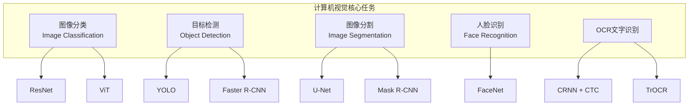

# 计算机视觉

## 概述

计算机视觉（Computer Vision, CV）是使计算机能够从图像和视频中提取信息、理解内容的AI技术。随着深度学习的发展，CV在自动驾驶、医疗影像、安防监控、工业检测等领域广泛应用。



---

## 一、图像分类

### 1.1 经典模型对比

| 模型 | 年份 | 特点 | Top-1准确率 |
|------|------|------|------------|
| AlexNet | 2012 | CNN奠基之作 | 57.1% |
| VGG | 2014 | 统一3x3卷积 | 71.5% |
| ResNet-50 | 2015 | 残差连接 | 76.0% |
| EfficientNet-B7 | 2019 | 复合缩放 | 84.4% |
| ViT-Large | 2020 | Transformer | 88.5% |
| ConvNeXt-XL | 2022 | 现代化CNN | 88.6% |

### 1.2 ResNet图像分类器（PyTorch）

```python
import torch
import torch.nn as nn
import torch.optim as optim
from torch.utils.data import DataLoader
from torchvision import datasets, transforms, models

class ImageClassifier:
    """基于预训练ResNet的图像分类器"""

    def __init__(self, num_classes=10, model_name='resnet50', pretrained=True):
        self.device = torch.device('cuda' if torch.cuda.is_available() else 'cpu')
        self.num_classes = num_classes

        # 加载预训练模型
        if model_name == 'resnet50':
            self.model = models.resnet50(weights='IMAGENET1K_V2' if pretrained else None)
        elif model_name == 'resnet18':
            self.model = models.resnet18(weights='IMAGENET1K_V1' if pretrained else None)
        elif model_name == 'efficientnet_b0':
            self.model = models.efficientnet_b0(weights='IMAGENET1K_V1' if pretrained else None)
        else:
            raise ValueError(f"不支持的模型: {model_name}")

        # 替换分类头
        if hasattr(self.model, 'fc'):
            in_features = self.model.fc.in_features
            self.model.fc = nn.Linear(in_features, num_classes)
        elif hasattr(self.model, 'classifier'):
            in_features = self.model.classifier[1].in_features
            self.model.classifier[1] = nn.Linear(in_features, num_classes)

        self.model = self.model.to(self.device)

    def get_transforms(self, train=True):
        """数据增强与预处理"""
        if train:
            return transforms.Compose([
                transforms.RandomResizedCrop(224, scale=(0.8, 1.0)),
                transforms.RandomHorizontalFlip(p=0.5),
                transforms.RandomRotation(degrees=15),
                transforms.ColorJitter(brightness=0.2, contrast=0.2,
                                       saturation=0.2, hue=0.1),
                transforms.ToTensor(),
                transforms.Normalize(
                    mean=[0.485, 0.456, 0.406],
                    std=[0.229, 0.224, 0.225]
                ),
            ])
        else:
            return transforms.Compose([
                transforms.Resize(256),
                transforms.CenterCrop(224),
                transforms.ToTensor(),
                transforms.Normalize(
                    mean=[0.485, 0.456, 0.406],
                    std=[0.229, 0.224, 0.225]
                ),
            ])

    def train(self, train_dir, val_dir, epochs=30, batch_size=32, lr=1e-4):
        # 数据加载
        train_dataset = datasets.ImageFolder(train_dir,
            transform=self.get_transforms(train=True))
        val_dataset = datasets.ImageFolder(val_dir,
            transform=self.get_transforms(train=False))

        train_loader = DataLoader(train_dataset, batch_size=batch_size,
            shuffle=True, num_workers=4, pin_memory=True)
        val_loader = DataLoader(val_dataset, batch_size=batch_size,
            shuffle=False, num_workers=4, pin_memory=True)

        # 分层学习率：预训练层用小学习率，新分类头用大学习率
        backbone_params = [p for n, p in self.model.named_parameters()
                          if 'fc' not in n and 'classifier' not in n]
        head_params = [p for n, p in self.model.named_parameters()
                      if 'fc' in n or 'classifier' in n]

        optimizer = optim.AdamW([
            {'params': backbone_params, 'lr': lr * 0.1},
            {'params': head_params, 'lr': lr},
        ], weight_decay=0.01)

        scheduler = optim.lr_scheduler.CosineAnnealingLR(optimizer, T_max=epochs)
        criterion = nn.CrossEntropyLoss(label_smoothing=0.1)

        best_acc = 0
        for epoch in range(epochs):
            # 训练
            self.model.train()
            train_loss = 0
            for images, labels in train_loader:
                images, labels = images.to(self.device), labels.to(self.device)
                optimizer.zero_grad()
                outputs = self.model(images)
                loss = criterion(outputs, labels)
                loss.backward()
                torch.nn.utils.clip_grad_norm_(self.model.parameters(), 1.0)
                optimizer.step()
                train_loss += loss.item()
            scheduler.step()

            # 验证
            val_acc = self._evaluate(val_loader)
            avg_loss = train_loss / len(train_loader)
            print(f"Epoch {epoch+1}/{epochs} | Loss: {avg_loss:.4f} | Val Acc: {val_acc:.2%}")

            if val_acc > best_acc:
                best_acc = val_acc
                torch.save(self.model.state_dict(), 'best_model.pth')

        print(f"最佳验证准确率: {best_acc:.2%}")
        return best_acc

    @torch.no_grad()
    def _evaluate(self, loader):
        self.model.eval()
        correct, total = 0, 0
        for images, labels in loader:
            images, labels = images.to(self.device), labels.to(self.device)
            outputs = self.model(images)
            _, predicted = torch.max(outputs, 1)
            total += labels.size(0)
            correct += (predicted == labels).sum().item()
        return correct / total

    @torch.no_grad()
    def predict(self, image_path, class_names=None):
        from PIL import Image
        self.model.eval()
        image = Image.open(image_path).convert('RGB')
        input_tensor = self.get_transforms(train=False)(image).unsqueeze(0).to(self.device)
        outputs = self.model(input_tensor)
        probabilities = torch.softmax(outputs, dim=1)
        confidence, predicted = torch.max(probabilities, 1)

        result = {
            'class_id': predicted.item(),
            'class_name': class_names[predicted.item()] if class_names else str(predicted.item()),
            'confidence': float(confidence.item()),
            'all_probabilities': {
                class_names[i] if class_names else str(i): float(p)
                for i, p in enumerate(probabilities[0])
            }
        }
        return result

    def export_onnx(self, output_path='model.onnx'):
        """导出ONNX格式用于部署"""
        self.model.eval()
        dummy_input = torch.randn(1, 3, 224, 224).to(self.device)
        torch.onnx.export(
            self.model, dummy_input, output_path,
            export_params=True, opset_version=14,
            do_constant_folding=True,
            input_names=['input'],
            output_names=['output'],
            dynamic_axes={'input': {0: 'batch_size'},
                         'output': {0: 'batch_size'}}
        )
        print(f"ONNX模型已导出到 {output_path}")
```

### 1.3 ViT（Vision Transformer）

```python
from transformers import ViTForImageClassification, ViTFeatureExtractor

class ViTClassifier:
    """Vision Transformer 图像分类"""

    def __init__(self, num_classes=10, model_name='google/vit-base-patch16-224'):
        self.feature_extractor = ViTFeatureExtractor.from_pretrained(model_name)
        self.model = ViTForImageClassification.from_pretrained(
            model_name,
            num_labels=num_classes,
            ignore_mismatched_sizes=True
        )
        self.device = torch.device('cuda' if torch.cuda.is_available() else 'cpu')
        self.model = self.model.to(self.device)

    @torch.no_grad()
    def predict(self, image):
        """image: PIL Image"""
        inputs = self.feature_extractor(images=image, return_tensors='pt').to(self.device)
        outputs = self.model(**inputs)
        logits = outputs.logits
        predicted = torch.argmax(logits, dim=-1)
        return predicted.item()
```

---

## 二、目标检测（YOLO）

### 2.1 YOLO模型演进

| 版本 | 年份 | 特点 | mAP(COCO) |
|------|------|------|-----------|
| YOLOv1 | 2016 | 开创端到端检测 | 63.4 |
| YOLOv3 | 2018 | 多尺度预测 | 55.3 |
| YOLOv5 | 2020 | 工程化、易部署 | 67.2 |
| YOLOv8 | 2023 | Anchor-free、高性能 | 53.9 |
| YOLOv10 | 2024 | 无NMS、极致速度 | 54.4 |

### 2.2 YOLOv8目标检测（Ultralytics）

```python
from ultralytics import YOLO
import cv2

class ObjectDetector:
    """基于YOLOv8的目标检测器"""

    def __init__(self, model_path='yolov8n.pt'):
        """
        模型选择:
        - yolov8n.pt: Nano (3.2M params, 37.3 mAP) - 边缘设备
        - yolov8s.pt: Small (11.2M params, 44.9 mAP) - 轻量级
        - yolov8m.pt: Medium (25.9M params, 50.2 mAP) - 平衡
        - yolov8l.pt: Large (43.7M params, 52.9 mAP) - 高精度
        - yolov8x.pt: Extra Large (68.2M params, 53.9 mAP) - 最高精度
        """
        self.model = YOLO(model_path)

    def detect_image(self, image_path, conf_threshold=0.5, iou_threshold=0.45):
        """检测单张图片"""
        results = self.model(
            image_path,
            conf=conf_threshold,
            iou=iou_threshold,
            verbose=False
        )

        detections = []
        for result in results:
            boxes = result.boxes
            for box in boxes:
                detection = {
                    'class_id': int(box.cls[0]),
                    'class_name': self.model.names[int(box.cls[0])],
                    'confidence': float(box.conf[0]),
                    'bbox': box.xyxy[0].tolist(),  # [x1, y1, x2, y2]
                    'bbox_normalized': box.xyxyn[0].tolist(),
                }
                detections.append(detection)
        return detections

    def detect_video(self, video_path, output_path='output.mp4',
                     conf_threshold=0.5):
        """视频流目标检测"""
        cap = cv2.VideoCapture(video_path)
        fps = int(cap.get(cv2.CAP_PROP_FPS))
        width = int(cap.get(cv2.CAP_PROP_FRAME_WIDTH))
        height = int(cap.get(cv2.CAP_PROP_FRAME_HEIGHT))

        fourcc = cv2.VideoWriter_fourcc(*'mp4v')
        out = cv2.VideoWriter(output_path, fourcc, fps, (width, height))

        while cap.isOpened():
            ret, frame = cap.read()
            if not ret:
                break

            results = self.model(frame, conf=conf_threshold, verbose=False)
            annotated_frame = results[0].plot()
            out.write(annotenticated_frame)

        cap.release()
        out.release()

    def detect_realtime(self, camera_id=0, conf_threshold=0.5):
        """实时摄像头检测"""
        cap = cv2.VideoCapture(camera_id)
        while True:
            ret, frame = cap.read()
            if not ret:
                break
            results = self.model(frame, conf=conf_threshold, verbose=False)
            annotated = results[0].plot()
            cv2.imshow('YOLOv8 Detection', annotated)
            if cv2.waitKey(1) & 0xFF == ord('q'):
                break
        cap.release()
        cv2.destroyAllWindows()


# 使用示例
detector = ObjectDetector('yolov8m.pt')
detections = detector.detect_image('test_image.jpg', conf_threshold=0.5)
for det in detections:
    print(f"  {det['class_name']}: {det['confidence']:.2%} at {det['bbox']}")
```

### 2.3 自定义数据集训练YOLO

```python
from ultralytics import YOLO

def train_custom_yolo(data_yaml, epochs=100, imgsz=640, batch_size=16):
    """
    训练自定义YOLO检测模型

    data.yaml 格式:
    ---
    path: /dataset
    train: images/train
    val: images/val
    names:
      0: person
      1: car
      2: bicycle
    ---
    """
    model = YOLO('yolov8m.pt')  # 加载预训练权重

    results = model.train(
        data=data_yaml,
        epochs=epochs,
        imgsz=imgsz,
        batch=batch_size,
        device=0 if torch.cuda.is_available() else 'cpu',

        # 数据增强
        hsv_h=0.015,        # 色调增强
        hsv_s=0.7,          # 饱和度增强
        hsv_v=0.4,          # 明度增强
        degrees=10.0,       # 旋转角度
        translate=0.1,      # 平移比例
        scale=0.5,          # 缩放比例
        fliplr=0.5,         # 水平翻转概率
        mosaic=1.0,         # Mosaic增强
        mixup=0.1,          # MixUp增强

        # 优化器
        optimizer='AdamW',
        lr0=0.001,
        lrf=0.01,           # 最终学习率 = lr0 * lrf
        momentum=0.937,
        weight_decay=0.0005,
        warmup_epochs=3,

        # 保存与日志
        save=True,
        save_period=10,
        project='runs/detect',
        name='custom_train',
        patience=30,         # 早停轮数
    )
    return results


def evaluate_yolo(model_path, data_yaml):
    """评估模型"""
    model = YOLO(model_path)
    metrics = model.val(data=data_yaml)
    print(f"mAP50: {metrics.box.map50:.4f}")
    print(f"mAP50-95: {metrics.box.map:.4f}")
    return metrics


# 导出为不同格式
def export_model(model_path, format='onnx'):
    """导出模型为部署格式"""
    model = YOLO(model_path)
    model.export(format=format)  # onnx/tensorrt/coreml/openvino
```

### 2.4 目标检测评估指标

```python
import numpy as np
from collections import defaultdict

def calculate_map(predictions, ground_truths, iou_threshold=0.5):
    """
    计算mAP (Mean Average Precision)
    predictions: {image_id: [{'bbox': [x1,y1,x2,y2], 'class': int, 'score': float}]}
    ground_truths: {image_id: [{'bbox': [x1,y1,x2,y2], 'class': int}]}
    """
    def compute_iou(box1, box2):
        x1 = max(box1[0], box2[0])
        y1 = max(box1[1], box2[1])
        x2 = min(box1[2], box2[2])
        y2 = min(box1[3], box2[3])
        inter = max(0, x2 - x1) * max(0, y2 - y1)
        area1 = (box1[2] - box1[0]) * (box1[3] - box1[1])
        area2 = (box2[2] - box2[0]) * (box2[3] - box2[1])
        union = area1 + area2 - inter
        return inter / union if union > 0 else 0

    all_classes = set()
    for gts in ground_truths.values():
        for gt in gts:
            all_classes.add(gt['class'])

    aps = []
    for cls in all_classes:
        # 收集该类别的所有预测
        scores = []
        tp_fp = []  # (is_tp, score)

        total_gt = 0
        for img_id in ground_truths:
            gts_cls = [g for g in ground_truths[img_id] if g['class'] == cls]
            total_gt += len(gts_cls)

            if img_id in predictions:
                preds_cls = sorted(
                    [p for p in predictions[img_id] if p['class'] == cls],
                    key=lambda x: -x['score']
                )
                matched = [False] * len(gts_cls)
                for pred in preds_cls:
                    best_iou = 0
                    best_idx = -1
                    for i, gt in enumerate(gts_cls):
                        if matched[i]:
                            continue
                        iou = compute_iou(pred['bbox'], gt['bbox'])
                        if iou > best_iou:
                            best_iou = iou
                            best_idx = i

                    if best_iou >= iou_threshold and best_idx >= 0:
                        tp_fp.append((1, pred['score']))
                        matched[best_idx] = True
                    else:
                        tp_fp.append((0, pred['score']))

        if total_gt == 0:
            continue

        # 计算Precision-Recall
        tp_fp.sort(key=lambda x: -x[1])
        tp_cum = np.cumsum([x[0] for x in tp_fp])
        fp_cum = np.cumsum([1 - x[0] for x in tp_fp])
        recalls = tp_cum / total_gt
        precisions = tp_cum / (tp_cum + fp_cum + 1e-8)

        # 计算AP (使用11点插值)
        ap = 0
        for t in np.arange(0, 1.1, 0.1):
            mask = recalls >= t
            ap += precisions[mask].max() if mask.any() else 0
        ap /= 11
        aps.append(ap)

    mAP = np.mean(aps) if aps else 0
    return {'mAP': mAP, 'per_class_AP': dict(zip(all_classes, aps))}
```

---

## 三、图像分割

### 3.1 语义分割 vs 实例分割

```
语义分割: 逐像素分类，同类物体不区分个体
  输入图像 → [天空][道路][汽车][汽车][行人] ← 不区分两辆车

实例分割: 在语义分割基础上区分不同个体
  输入图像 → [天空][道路][汽车_1][汽车_2][行人_1] ← 区分两辆车
```

### 3.2 U-Net语义分割（医学图像）

```python
import torch
import torch.nn as nn
import torch.nn.functional as F

class DoubleConv(nn.Module):
    """(Conv → BN → ReLU) × 2"""
    def __init__(self, in_ch, out_ch):
        super().__init__()
        self.double_conv = nn.Sequential(
            nn.Conv2d(in_ch, out_ch, 3, padding=1, bias=False),
            nn.BatchNorm2d(out_ch),
            nn.ReLU(inplace=True),
            nn.Conv2d(out_ch, out_ch, 3, padding=1, bias=False),
            nn.BatchNorm2d(out_ch),
            nn.ReLU(inplace=True),
        )

    def forward(self, x):
        return self.double_conv(x)


class UNet(nn.Module):
    """
    U-Net: 用于医学图像分割的经典架构
    Encoder: 逐步下采样提取特征
    Decoder: 逐步上采样恢复分辨率，使用skip connection融合细节
    """

    def __init__(self, in_channels=3, num_classes=1, base_ch=64):
        super().__init__()
        # Encoder
        self.enc1 = DoubleConv(in_channels, base_ch)
        self.enc2 = DoubleConv(base_ch, base_ch * 2)
        self.enc3 = DoubleConv(base_ch * 2, base_ch * 4)
        self.enc4 = DoubleConv(base_ch * 4, base_ch * 8)
        self.bottleneck = DoubleConv(base_ch * 8, base_ch * 16)

        self.pool = nn.MaxPool2d(2)

        # Decoder
        self.upconv4 = nn.ConvTranspose2d(base_ch * 16, base_ch * 8, 2, stride=2)
        self.dec4 = DoubleConv(base_ch * 16, base_ch * 8)

        self.upconv3 = nn.ConvTranspose2d(base_ch * 8, base_ch * 4, 2, stride=2)
        self.dec3 = DoubleConv(base_ch * 8, base_ch * 4)

        self.upconv2 = nn.ConvTranspose2d(base_ch * 4, base_ch * 2, 2, stride=2)
        self.dec2 = DoubleConv(base_ch * 4, base_ch * 2)

        self.upconv1 = nn.ConvTranspose2d(base_ch * 2, base_ch, 2, stride=2)
        self.dec1 = DoubleConv(base_ch * 2, base_ch)

        self.out_conv = nn.Conv2d(base_ch, num_classes, 1)

    def forward(self, x):
        # Encoder
        e1 = self.enc1(x)
        e2 = self.enc2(self.pool(e1))
        e3 = self.enc3(self.pool(e2))
        e4 = self.enc4(self.pool(e3))
        b = self.bottleneck(self.pool(e4))

        # Decoder + Skip connections
        d4 = self.dec4(torch.cat([self.upconv4(b), e4], dim=1))
        d3 = self.dec3(torch.cat([self.upconv3(d4), e3], dim=1))
        d2 = self.dec2(torch.cat([self.upconv2(d3), e2], dim=1))
        d1 = self.dec1(torch.cat([self.upconv1(d2), e1], dim=1))

        return self.out_conv(d1)


# 训练U-Net
def train_unet(model, train_loader, epochs=100, lr=1e-4):
    device = torch.device('cuda' if torch.cuda.is_available() else 'cpu')
    model = model.to(device)
    optimizer = optim.AdamW(model.parameters(), lr=lr, weight_decay=1e-4)
    scheduler = optim.lr_scheduler.ReduceLROnPlateau(optimizer, patience=5, factor=0.5)

    # 损失函数: Dice Loss + BCE Loss
    def dice_loss(pred, target, smooth=1.0):
        pred = torch.sigmoid(pred)
        pred_flat = pred.view(-1)
        target_flat = target.view(-1)
        intersection = (pred_flat * target_flat).sum()
        return 1 - (2 * intersection + smooth) / (pred_flat.sum() + target_flat.sum() + smooth)

    def combined_loss(pred, target):
        bce = F.binary_cross_entropy_with_logits(pred, target)
        dice = dice_loss(pred, target)
        return bce + dice

    for epoch in range(epochs):
        model.train()
        total_loss = 0
        for images, masks in train_loader:
            images, masks = images.to(device), masks.to(device).float()
            optimizer.zero_grad()
            outputs = model(images)
            loss = combined_loss(outputs, masks)
            loss.backward()
            optimizer.step()
            total_loss += loss.item()
        scheduler.step(total_loss / len(train_loader))
        print(f"Epoch {epoch+1}, Loss: {total_loss/len(train_loader):.4f}")
```

### 3.3 Mask R-CNN实例分割

```python
import torchvision
from torchvision.models.detection import maskrcnn_resnet50_fpn
from torchvision.transforms import functional as F

class InstanceSegmenter:
    """基于Mask R-CNN的实例分割"""

    def __init__(self, pretrained=True, num_classes=91, score_threshold=0.5):
        self.device = torch.device('cuda' if torch.cuda.is_available() else 'cpu')
        self.model = maskrcnn_resnet50_fpn(
            weights='DEFAULT' if pretrained else None,
            num_classes=num_classes
        ).to(self.device)
        self.model.eval()
        self.score_threshold = score_threshold

    @torch.no_grad()
    def predict(self, image):
        """image: PIL Image"""
        image_tensor = F.to_tensor(image).to(self.device)
        predictions = self.model([image_tensor])[0]

        results = []
        for i in range(len(predictions['scores'])):
            if predictions['scores'][i] >= self.score_threshold:
                results.append({
                    'bbox': predictions['boxes'][i].cpu().numpy().tolist(),
                    'score': float(predictions['scores'][i]),
                    'class': int(predictions['labels'][i]),
                    'mask': predictions['masks'][i, 0].cpu().numpy(),
                })
        return results

    def visualize(self, image, predictions):
        """可视化分割结果"""
        import matplotlib.pyplot as plt
        import matplotlib.patches as patches

        fig, ax = plt.subplots(1, figsize=(12, 8))
        ax.imshow(image)

        colors = np.random.rand(100, 3)
        for pred in predictions:
            bbox = pred['bbox']
            rect = patches.Rectangle(
                (bbox[0], bbox[1]), bbox[2] - bbox[0], bbox[3] - bbox[1],
                linewidth=2, edgecolor=colors[pred['class']],
                facecolor='none'
            )
            ax.add_patch(rect)
            mask = pred['mask'] > 0.5
            color_mask = np.zeros((*mask.shape, 4))
            color_mask[mask] = [*colors[pred['class']], 0.3]
            ax.imshow(color_mask)
            ax.text(bbox[0], bbox[1] - 5,
                   f"Class {pred['class']}: {pred['score']:.2f}",
                   fontsize=10, color='white',
                   bbox=dict(facecolor=colors[pred['class']], alpha=0.7))
        plt.axis('off')
        plt.savefig('segmentation_result.png', dpi=150)
```

---

## 四、人脸识别

### 4.1 人脸识别流程

```
图像输入 → 人脸检测 → 人脸对齐 → 特征提取 → 特征比对 → 身份识别
              ↑            ↑           ↑          ↑
          MTCNN/      仿射变换     FaceNet/    余弦相似度/
          RetinaFace  (5个关键点)  ArcFace     欧氏距离
```

### 4.2 完整人脸识别系统

```python
import cv2
import numpy as np
from facenet_pytorch import MTCNN, InceptionResnetV1
import torch
from PIL import Image
from typing import List, Tuple
import pickle

class FaceRecognitionSystem:
    """端到端人脸识别系统"""

    def __init__(self, face_db_path='face_db.pkl', similarity_threshold=0.6):
        self.device = torch.device('cuda' if torch.cuda.is_available() else 'cpu')

        # 人脸检测器
        self.detector = MTCNN(
            image_size=160, margin=20,
            min_face_size=40,
            thresholds=[0.6, 0.7, 0.7],
            factor=0.709, post_process=True,
            device=self.device
        )

        # 人脸特征提取器（预训练在VGGFace2上）
        self.feature_extractor = InceptionResnetV1(
            pretrained='vggface2'
        ).to(self.device).eval()

        self.similarity_threshold = similarity_threshold
        self.face_db = self._load_db(face_db_path)
        self.db_path = face_db_path

    def detect_and_align(self, image):
        """人脸检测与对齐"""
        if isinstance(image, str):
            image = Image.open(image).convert('RGB')
        elif isinstance(image, np.ndarray):
            image = Image.fromarray(cv2.cvtColor(image, cv2.COLOR_BGR2RGB))

        # MTCNN自动进行检测+对齐+裁剪
        faces, probs = self.detector(image, return_prob=True)
        if faces is None:
            return [], []

        faces_list = []
        probs_list = []
        for i, (face, prob) in enumerate(zip(faces, probs)):
            if prob > 0.9:
                faces_list.append(face)
                probs_list.append(prob)
        return faces_list, probs_list

    @torch.no_grad()
    def extract_embedding(self, face_tensor):
        """提取人脸特征向量（512维）"""
        if face_tensor.dim() == 3:
            face_tensor = face_tensor.unsqueeze(0)
        face_tensor = face_tensor.to(self.device)
        embedding = self.feature_extractor(face_tensor)
        return embedding.cpu().numpy()

    def register_face(self, name, image):
        """注册人脸到数据库"""
        faces, probs = self.detect_and_align(image)
        if not faces:
            return False, "未检测到人脸"

        # 使用第一张人脸
        embedding = self.extract_embedding(faces[0])
        if name not in self.face_db:
            self.face_db[name] = []
        self.face_db[name].append(embedding[0])
        self._save_db()
        return True, f"已注册 {name} 的人脸特征"

    def recognize(self, image):
        """识别人脸"""
        faces, probs = self.detect_and_align(image)
        if not faces:
            return []

        results = []
        for face in faces:
            embedding = self.extract_embedding(face)

            best_match = None
            best_similarity = -1

            for name, embeddings in self.face_db.items():
                for db_emb in embeddings:
                    # 余弦相似度
                    sim = np.dot(embedding[0], db_emb) / (
                        np.linalg.norm(embedding[0]) * np.linalg.norm(db_emb))
                    if sim > best_similarity:
                        best_similarity = sim
                        best_match = name

            if best_similarity > self.similarity_threshold:
                results.append({
                    'name': best_match,
                    'similarity': float(best_similarity),
                    'confidence': 'high' if best_similarity > 0.8 else 'medium'
                })
            else:
                results.append({
                    'name': 'unknown',
                    'similarity': float(best_similarity),
                    'confidence': 'low'
                })
        return results

    def _load_db(self, path):
        try:
            with open(path, 'rb') as f:
                return pickle.load(f)
        except FileNotFoundError:
            return {}

    def _save_db(self):
        with open(self.db_path, 'wb') as f:
            pickle.dump(self.face_db, f)


# 使用示例
system = FaceRecognitionSystem(similarity_threshold=0.65)

# 注册
system.register_face("张三", "zhang_san_photo.jpg")
system.register_face("李四", "li_si_photo.jpg")

# 识别
results = system.recognize("test_photo.jpg")
for r in results:
    print(f"  {r['name']}: 相似度={r['similarity']:.4f} ({r['confidence']})")
```

### 4.3 ArcFace损失函数（进阶）

```python
class ArcFaceLoss(nn.Module):
    """
    ArcFace: Addictive Angular Margin Loss
    通过角度间隔增强类间差异、减小类内差异
    """

    def __init__(self, in_features, out_features, s=30.0, m=0.50):
        super().__init__()
        self.in_features = in_features
        self.out_features = out_features
        self.s = s  # 缩放因子
        self.m = m  # 角度间隔

        # 权重矩阵
        self.weight = nn.Parameter(
            torch.FloatTensor(out_features, in_features)
        )
        nn.init.xavier_uniform_(self.weight)

    def forward(self, embeddings, labels):
        # L2归一化
        embeddings = F.normalize(embeddings, p=2, dim=1)
        weight = F.normalize(self.weight, p=2, dim=1)

        # cos(θ)
        cos_theta = F.linear(embeddings, weight)
        cos_theta = cos_theta.clamp(-1 + 1e-7, 1 - 1e-7)

        # cos(θ + m) = cos(θ)cos(m) - sin(θ)sin(m)
        sin_theta = torch.sqrt(1 - cos_theta ** 2)
        cos_theta_m = cos_theta * math.cos(self.m) - sin_theta * math.sin(self.m)

        # 对目标类别应用cos(θ + m)
        one_hot = F.one_hot(labels, self.out_features).float()
        logits = one_hot * cos_theta_m + (1 - one_hot) * cos_theta
        logits = self.s * logits  # 缩放

        return F.cross_entropy(logits, labels)
```

---

## 五、OCR文字识别

### 5.1 OCR技术路线

```
┌───────────────────────────────────────────────────────┐
│                  OCR 完整流程                           │
├───────────────────────────────────────────────────────┤
│                                                       │
│  原始图像 → 图像预处理 → 文本检测 → 文本识别 → 后处理   │
│               │            │           │          │    │
│          去噪/校正     DBNet/    CRNN+CTC/   拼写    │
│          二值化        CTPN/     Attention/   纠错    │
│                       EAST      Transformer           │
│                                                       │
└───────────────────────────────────────────────────────┘
```

### 5.2 基于PaddleOCR的端到端OCR

```python
from paddleocr import PaddleOCR
import cv2

class OCRService:
    """基于PaddleOCR的文字识别服务"""

    def __init__(self, lang='ch', use_angle_cls=True):
        self.ocr = PaddleOCR(
            use_angle_cls=use_angle_cls,  # 方向分类
            lang=lang,                     # ch/en/multilingual
            use_gpu=True,
            show_log=False,
            det_model_dir=None,            # 使用默认检测模型
            rec_model_dir=None,            # 使用默认识别模型
        )

    def extract_text(self, image_path):
        """提取图片中的文字"""
        result = self.ocr.ocr(image_path, cls=True)

        extracted_data = []
        full_text = []

        for idx in range(len(result)):
            res = result[idx]
            if res is None:
                continue
            for line in res:
                boxes, (text, confidence) = line
                extracted_data.append({
                    'text': text,
                    'confidence': float(confidence),
                    'bbox': boxes,  # 四个角点坐标
                })
                full_text.append(text)

        return {
            'items': extracted_data,
            'full_text': '\n'.join(full_text),
            'text_count': len(extracted_data),
        }

    def extract_table(self, image_path):
        """表格识别"""
        from paddleocr import PPStructure
        table_engine = PPStructure(
            show_log=False,
            image_dir=image_path,
            use_gpu=True,
        )
        result = table_engine(cv2.imread(image_path))

        tables = []
        for region in result:
            if region['type'] == 'table':
                tables.append({
                    'html': region['res']['html'],
                    'bbox': region['bbox'],
                })
        return tables


# 使用示例
ocr = OCRService(lang='ch')
result = ocr.extract_text('invoice.png')
print("识别到的文本:")
for item in result['items']:
    print(f"  [{item['confidence']:.2%}] {item['text']}")
print("\n完整文本:\n", result['full_text'])
```

### 5.3 CRNN + CTC（经典OCR模型）

```python
import torch
import torch.nn as nn

class CRNN(nn.Module):
    """
    CRNN: CNN + RNN + CTC
    用于场景文字识别（无词典，端到端）
    """

    def __init__(self, num_channels=1, num_classes=1000, rnn_hidden=256):
        super().__init__()

        # CNN特征提取
        self.cnn = nn.Sequential(
            nn.Conv2d(num_channels, 64, 3, 1, 1), nn.ReLU(True),
            nn.MaxPool2d(2, 2),  # [64, H/2, W/2]
            nn.Conv2d(64, 128, 3, 1, 1), nn.ReLU(True),
            nn.MaxPool2d(2, 2),  # [128, H/4, W/4]
            nn.Conv2d(128, 256, 3, 1, 1), nn.BatchNorm2d(256), nn.ReLU(True),
            nn.Conv2d(256, 256, 3, 1, 1), nn.ReLU(True),
            nn.MaxPool2d((2, 1), (2, 1)),  # [256, H/8, W/4]
            nn.Conv2d(256, 512, 3, 1, 1), nn.BatchNorm2d(512), nn.ReLU(True),
            nn.Conv2d(512, 512, 3, 1, 1), nn.ReLU(True),
            nn.MaxPool2d((2, 1), (2, 1)),  # [512, H/16, W/4]
            nn.Conv2d(512, 512, 2, 1, 0), nn.ReLU(True),  # [512, 1, W/4]
        )

        # RNN序列建模 (双向LSTM)
        self.rnn = nn.Sequential(
            nn.LSTM(512, rnn_hidden, bidirectional=True, batch_first=True),
        )
        self.rnn2 = nn.Sequential(
            nn.LSTM(2 * rnn_hidden, rnn_hidden, bidirectional=True, batch_first=True),
        )

        # 全连接层
        self.fc = nn.Linear(2 * rnn_hidden, num_classes)

    def forward(self, x):
        # CNN
        conv = self.cnn(x)  # [B, 512, 1, W']
        b, c, h, w = conv.size()
        assert h == 1, f"Expected height=1 after CNN, got {h}"
        conv = conv.squeeze(2)  # [B, 512, W']
        conv = conv.permute(0, 2, 1)  # [B, W', 512]

        # RNN
        rnn_out, _ = self.rnn(conv)
        rnn_out, _ = self.rnn2(rnn_out)

        # FC
        output = self.fc(rnn_out)  # [B, W', num_classes]
        # CTC要求: [T, B, C]
        output = output.permute(1, 0, 2)
        return output


def ctc_decode(output, charset, blank=0):
    """CTC贪心解码"""
    # output: [T, B, C]
    _, max_indices = output.max(dim=2)  # [T, B]
    max_indices = max_indices.transpose(0, 1)  # [B, T]

    results = []
    for indices in max_indices:
        # 合并重复 + 移除blank
        prev = -1
        decoded = []
        for idx in indices:
            idx = idx.item()
            if idx != prev and idx != blank:
                decoded.append(charset[idx])
            prev = idx
        results.append(''.join(decoded))
    return results


# 训练CRNN
def train_crnn(model, train_loader, charset, epochs=50, lr=1e-3):
    device = torch.device('cuda' if torch.cuda.is_available() else 'cpu')
    model = model.to(device)
    optimizer = optim.Adam(model.parameters(), lr=lr)

    # CTC损失: blank index = 0
    ctc_loss = nn.CTCLoss(blank=0, zero_infinity=True)

    for epoch in range(epochs):
        model.train()
        total_loss = 0
        for images, labels, label_lengths in train_loader:
            images = images.to(device)
            labels = labels.to(device)

            outputs = model(images)  # [T, B, C]
            log_probs = torch.log_softmax(outputs, dim=2)

            # 输入长度 = 序列长度
            batch_size = images.size(0)
            input_lengths = torch.full(
                (batch_size,), outputs.size(0),
                dtype=torch.long, device=device
            )

            loss = ctc_loss(
                log_probs, labels,
                input_lengths, label_lengths
            )
            loss.backward()
            optimizer.step()
            optimizer.zero_grad()
            total_loss += loss.item()

        print(f"Epoch {epoch+1}/{epochs}, Loss: {total_loss/len(train_loader):.4f}")

        # 解码验证
        model.eval()
        with torch.no_grad():
            sample = next(iter(train_loader))
            outputs = model(sample[0].to(device))
            decoded = ctc_decode(outputs, charset)
            print(f"  示例解码: {decoded[0]}")
```

### 5.4 TrOCR（基于Transformer的OCR）

```python
from transformers import TrOCRProcessor, VisionEncoderDecoderModel

class TrOCRService:
    """基于Transformer的OCR (Microsoft TrOCR)"""

    def __init__(self, model_name='microsoft/trocr-base-printed'):
        self.processor = TrOCRProcessor.from_pretrained(model_name)
        self.model = VisionEncoderDecoderModel.from_pretrained(model_name)
        self.device = torch.device('cuda' if torch.cuda.is_available() else 'cpu')
        self.model = self.model.to(self.device)

    @torch.no_grad()
    def recognize(self, image):
        """image: PIL Image (文字区域裁剪后的图片)"""
        pixel_values = self.processor(image, return_tensors='pt').pixel_values
        pixel_values = pixel_values.to(self.device)

        generated_ids = self.model.generate(
            pixel_values,
            max_length=64,
            num_beams=5,
            early_stopping=True,
        )
        text = self.processor.batch_decode(
            generated_ids, skip_special_tokens=True
        )[0]
        return text


# 手写文字识别
class HandwritingOCR:
    def __init__(self):
        self.processor = TrOCRProcessor.from_pretrained(
            'microsoft/trocr-base-handwritten')
        self.model = VisionEncoderDecoderModel.from_pretrained(
            'microsoft/trocr-base-handwritten')

    @torch.no_grad()
    def recognize(self, image):
        pixel_values = self.processor(image, return_tensors='pt').pixel_values
        generated_ids = self.model.generate(pixel_values, max_length=64)
        return self.processor.batch_decode(
            generated_ids, skip_special_tokens=True)[0]
```

---

## CV任务对比与选型

| 任务 | 输入 | 输出 | 典型模型 | 适用场景 |
|------|------|------|----------|----------|
| 图像分类 | 图片 | 类别标签 | ResNet/ViT | 商品分类、场景识别 |
| 目标检测 | 图片 | 框+类别 | YOLO/DETR | 安防监控、自动驾驶 |
| 语义分割 | 图片 | 像素标签 | U-Net/DeepLab | 医学图像、遥感 |
| 实例分割 | 图片 | 掩码+类别 | Mask R-CNN | 精细物体分割 |
| 人脸识别 | 人脸图片 | 身份ID | FaceNet/ArcFace | 门禁、支付 |
| OCR | 文字图片 | 文本内容 | CRNN/TrOCR | 票据、文档数字化 |

## ✅ CV工程最佳实践

- **数据增强**：CutMix、MixUp、Mosaic提升模型泛化能力
- **迁移学习**：优先使用ImageNet预训练权重微调
- **模型压缩**：知识蒸馏、量化(INT8)、剪枝适配边缘设备
- **推理加速**：TensorRT/ONNX Runtime比PyTorch快3-5倍
- **部署架构**：图片上传 → 预处理 → GPU推理 → 后处理 → 返回结果
- **监控**：线上模型需要持续监控推理延迟和准确率漂移

## 相关页面

- [[自然语言处理]] - NLP技术与多模态融合
- [[推荐系统实战]] - CV在视觉推荐中的应用
- [[Hadoop生态系统]] - 大规模图像数据存储与处理
