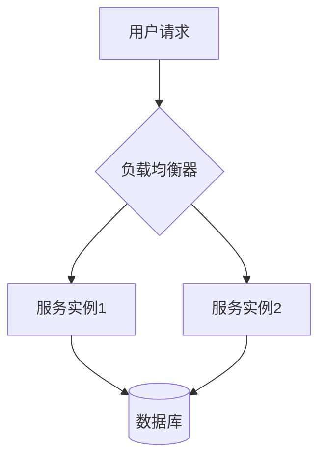

# 技术博客写作

> 本文档系统性地介绍技术博客的 **选题策略**、**结构模板**、**SEO 优化** 和 **写作技巧**，帮助开发者写出高质量的技术文章。

---

## 目录

- [1. 选题策略](#1-选题策略)
- [2. 结构模板](#2-结构模板)
- [3. 写作技巧](#3-写作技巧)
- [4. SEO 优化](#4-seo-优化)
- [5. 发布平台与分发](#5-发布平台与分发)
- [6. 写作工具推荐](#6-写作工具推荐)
- [7. 常见误区](#7-常见误区)
- [相关页面](#相关页面)

---

## 1. 选题策略

### 1.1 选题来源矩阵

| 来源 | 说明 | 示例 |
|------|------|------|
| 踩坑经验 | 解决过的难题 | 「线上 OOM 排查全过程」 |
| 技术对比 | 横向比较 | 「Kafka vs RabbitMQ 选型指南」 |
| 最佳实践 | 经验总结 | 「微服务错误处理的 10 条原则」 |
| 原理解析 | 深入底层 | 「Go GMP 调度器原理详解」 |
| 项目复盘 | 实战总结 | 「从 0 到 1 构建推荐系统」 |
| 新技术 | 前沿追踪 | 「LangChain 实战入门」 |
| 翻译/导读 | 优质外文 | 「DDIA 第三章精读」 |

### 1.2 选题评估框架

对每个候选选题打分（1-5），总分 ≥ 15 值得写：

| 维度 | 权重 | 评估问题 |
|------|------|---------|
| 价值性 | ★★★ | 读者能学到什么？ |
| 时效性 | ★★ | 现在写是否合适？ |
| 独特性 | ★★★ | 是否已有大量同类文章？ |
| 可行性 | ★★ | 我能写好吗？ |
| 搜索量 | ★★ | 是否有人搜索？ |

### 1.3 选题日历模板

```
Q1: 年度技术回顾、新年规划
Q2: 框架/工具年度更新（如 Spring Boot 新版）
Q3: 行业大会总结（WWDC、Google I/O、QCon）
Q4: 年终总结、技术趋势预测
```

---

## 2. 结构模板

### 2.1 模板一：问题解决型（最常用）

```markdown
# [问题/痛点标题]

## 背景介绍
- 遇到了什么问题？
- 为什么这个问题重要？

## 问题分析
- 问题表象
- 根因分析
- 排查过程

## 解决方案
- 方案选型（为什么选这个方案？）
- 实现细节（代码 + 解释）
- 关键决策点

## 效果验证
- 优化前 vs 优化后（数据对比）
- 压测/监控数据

## 总结与思考
- 学到了什么？
- 还有哪些改进空间？
```

### 2.2 模板二：教程型

```markdown
# [技术名称] 入门指南

## 这篇文章适合谁？
- 前置知识要求

## 你将学到什么？
- 学习目标清单

## 环境准备
- 安装步骤
- 项目初始化

## 逐步实现
### Step 1: xxx
### Step 2: xxx
### Step 3: xxx

## 完整代码
- GitHub 链接

## 常见问题
- Q&A 形式

## 下一步学习
- 进阶资源推荐
```

### 2.3 模板三：深度分析型

```markdown
# 深入理解 [技术主题]

## 为什么需要它？
- 痛点驱动

## 核心概念
- 关键术语解释
- 架构图

## 工作原理
- 逐步拆解
- 流程图/时序图

## 源码分析
- 关键代码路径
- 设计模式

## 对比分析
- 与同类技术对比（表格）

## 最佳实践
- Do & Don't

## 总结
- 一句话核心观点
```

### 2.4 模板四：对比评测型

```markdown
# [A] vs [B]：如何选择？

## 快速结论
- TL;DR 结论先行

## 对比维度
| 维度 | A | B |
|------|---|---|
| 性能 | | |
| 生态 | | |
| 学习曲线 | | |
| 社区活跃度 | | |

## 适用场景
- 什么时候选 A？
- 什么时候选 B？

## 迁移成本
- 从 A 迁移到 B 需要注意什么？

## 总结
- 决策树/流程图
```

---

## 3. 写作技巧

### 3.1 标题写作公式

| 公式 | 示例 |
|------|------|
| 数字 + 痛点 | 「5 个让你的 Docker 镜像瘦身 80% 的技巧」 |
| 如何 + 目标 | 「如何设计一个高可用的消息队列」 |
| 深入理解 + 主题 | 「深入理解 Java 虚拟机内存模型」 |
| 从 X 到 Y | 「从单体到微服务：我们的架构演进之路」 |
| 问题 + 解决 | 「线上 CPU 100%？教你 5 分钟定位问题」 |

### 3.2 开头黄金 30 秒

**❌ 差的开头：**
> 今天我们来学习一下 Redis。

**✅ 好的开头：**
> 上周我们的推荐服务在高峰期突然响应变慢，排查后发现 Redis 的一个隐藏特性导致了连接泄漏。这篇文章记录了完整的排查过程和最终的解决方案，希望能帮你避免同样的坑。

### 3.3 代码展示规范

```markdown
<!-- 每段代码都应包含：1. 上下文说明 2. 代码 3. 关键解释 -->

下面的代码展示了如何使用连接池优化数据库访问：

\```python
# 创建连接池，最大连接数为 10
pool = ConnectionPool(
    host='localhost',
    max_connections=10,
    timeout=30  # 超时时间，避免连接泄漏
)
\```

关键点：`max_connections` 防止连接耗尽，`timeout` 防止连接泄漏。
```

### 3.4 图表使用

- **架构图**：用 Mermaid 或 Draw.io
- **流程图**：用 Mermaid `flowchart`
- **时序图**：用 Mermaid `sequenceDiagram`
- **数据对比**：用表格
- **趋势展示**：用折线图



---

## 4. SEO 优化

### 4.1 关键词策略

| 位置 | 关键词使用 | 示例 |
|------|-----------|------|
| 标题（H1） | 核心关键词靠前 | 「Docker 镜像优化：5 个实用技巧」 |
| URL slug | 用英文短横线 | `/docker-image-optimization-tips` |
| Meta Description | 包含关键词，150 字以内 | 「本文介绍了 5 种 Docker 镜像优化方法…」 |
| H2/H3 | 长尾关键词 | 「如何减小 Docker 镜像体积」 |
| 图片 Alt | 描述性文字 | `alt="Docker 多阶段构建流程图"` |
| 正文前 100 字 | 自然出现核心关键词 | — |

### 4.2 关键词调研工具

| 工具 | 用途 | 费用 |
|------|------|------|
| Google Trends | 趋势分析 | 免费 |
| Google Search Console | 自己网站的数据 | 免费 |
| Ahrefs / SEMrush | 关键词难度、搜索量 | 付费 |
| 百度指数 | 中文搜索趋势 | 免费 |
| 5118 | 中文长尾词挖掘 | 部分免费 |

### 4.3 技术 SEO 检查清单

- [ ] 页面加载速度 < 3 秒（Lighthouse 检测）
- [ ] 移动端适配（响应式设计）
- [ ] 结构化数据（JSON-LD）
- [ ] 内部链接（至少 2-3 个相关文章链接）
- [ ] 图片懒加载 + WebP 格式
- [ ] Canonical URL 设置
- [ ] Sitemap.xml 更新
- [ ] robots.txt 配置正确

### 4.4 标题 SEO 模板

```
[核心关键词] + [修饰词] + [数字/年份]
```

**示例：**
- ✅ 「Kubernetes 部署实战指南 2024（完整教程）」
- ✅ 「Python 异步编程：asyncio 完全指南」
- ❌ 「关于 K8s 的一些想法」

---

## 5. 发布平台与分发

### 5.1 平台选择

| 平台 | 受众 | SEO 权重 | 推荐场景 |
|------|------|---------|---------|
| 个人博客 | 全控制 | 中 | 长期积累 |
| 掘金 | 国内开发者 | 高 | 快速传播 |
| 知乎 | 广泛 | 高 | 深度讨论 |
| 微信公众号 | 粉丝 | 低 | 私域流量 |
| Dev.to | 国际 | 高 | 英文内容 |
| Medium | 国际 | 高 | 英文内容 |
| Hashnode | 开发者 | 高 | 技术社区 |

### 5.2 分发策略

```
1. 首发：个人博客（建立原创来源）
2. 24h 后：掘金/知乎（获取流量）
3. 同步：公众号（触达粉丝）
4. 一周后：Dev.to/Medium（国际曝光）
5. 持续：Twitter/LinkedIn 短文引流
```

---

## 6. 写作工具推荐

| 工具 | 用途 | 推荐理由 |
|------|------|---------|
| Obsidian | 写作 + 知识管理 | 双向链接、本地优先 |
| Typora | Markdown 编辑器 | 所见即所得 |
| Grammarly | 英文语法检查 | AI 辅助 |
| Mermaid | 图表绘制 | 代码即图表 |
| Excalidraw | 手绘风格图表 | 简洁美观 |
| Carbon | 代码截图 | 分享美化 |
| Hemingway | 可读性检查 | 简化句子 |

---

## 7. 常见误区

| 误区 | 说明 | 正确做法 |
|------|------|---------|
| 面面俱到 | 试图覆盖所有内容 | 聚焦一个核心主题 |
| 忽略读者水平 | 默认读者什么都懂 | 明确前置知识 |
| 只有代码没解释 | 甩代码不讲解 | 每段代码配文字说明 |
| 标题党 | 标题与内容不符 | 标题准确反映内容 |
| 不更新旧文 | 技术过时没人提醒 | 定期审查更新 |
| 忽视排版 | 大段文字无分段 | 多用小标题、列表、图表 |

---

## 写作质量自查清单

发布前逐项检查：

- [ ] 标题准确且吸引人
- [ ] 开头 3 句话能抓住读者
- [ ] 有明确的文章结构（目录）
- [ ] 代码可运行且有注释
- [ ] 至少有 1 张图表/示意图
- [ ] 有总结或关键要点
- [ ] 检查错别字和语法
- [ ] SEO 元数据已填写
- [ ] 有相关文章推荐
- [ ] 移动端预览正常

---

## 相关页面

- [[API文档最佳实践]] — API 文档编写指南
- [[开源项目文档体系]] — 开源项目文档结构
- [[技术规范文档]] — RFC 与设计文档
- [[用户手册编写]] — 用户手册编写指南

---

> **最后更新**：2026-06-28 | **维护者**：AI-Agent 团队
