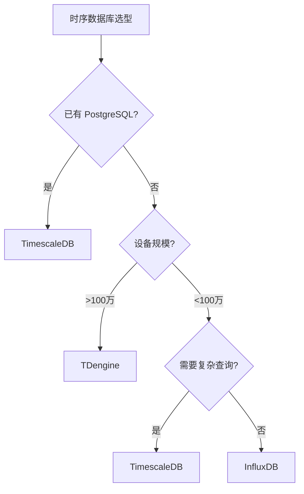

# 时序数据库

> 时序数据库（Time Series Database, TSDB）是专门为处理带有时间标签的数据（即按时间顺序变化的数据）而优化的数据库系统，在物联网、运维监控、金融等领域广泛应用。

## 目录

- [概述](#概述)
- [数据模型](#数据模型)
- [InfluxDB](#influxdb)
- [TimescaleDB](#timescaledb)
- [TDengine](#tdengine)
- [对比与选型](#对比与选型)
- [与 MQTT 集成](#与-mqtt-集成)
- [最佳实践](#最佳实践)
- [相关页面](#相关页面)

---

## 概述

### 为什么需要时序数据库？

传统关系型数据库在处理海量时间序列数据时面临诸多瓶颈：

| 挑战 | 关系型DB | 时序DB |
|------|---------|--------|
| 写入吞吐量 | 数千 TPS | 数十万~百万 TPS |
| 时间范围查询 | 全表扫描慢 | 内置时间索引 |
| 数据压缩率 | ~1:1 | ~1:10~1:50 |
| 自动降采样 | 手动实现 | 内置支持 |
| 数据过期策略 | 手动清理 | 自动 TTL |

### 典型应用场景

```
传感器 ──→ MQTT/HTTP ──→ 时序DB ──→ 可视化/分析
                                    │
                    ┌───────────────┤
                    │               │
              实时监控面板      历史数据分析
             (Grafana)         (数据挖掘/ML)
```

---

## 数据模型

### 核心概念

```
时间点 (Point)
├── 时间戳 (Timestamp)  ── 必须字段
├── 标签/维度 (Tags)    ── 索引字段，如 device_id, location
├── 字段/度量 (Fields)  ── 实际数值，如 temperature=25.3
└── 度量名称 (Measurement) ── 表名，如 "sensor_data"
```

### 示例数据

```
Measurement: temperature
─────────────────────────────────────────────────────────────
timestamp              | device_id | location | value
─────────────────────────────────────────────────────────────
2026-06-28T10:00:00Z   | TH001     | room_a   | 25.3
2026-06-28T10:00:05Z   | TH001     | room_a   | 25.5
2026-06-28T10:00:00Z   | TH002     | room_b   | 22.1
2026-06-28T10:00:05Z   | TH002     | room_b   | 22.0
```

### 降采样与聚合

```
原始数据 (5s 间隔)          降采样 (1分钟聚合)
  10:00:05 → 25.3              10:00 → min=25.3, max=25.5, avg=25.4
  10:00:10 → 25.4              10:01 → min=25.6, max=25.8, avg=25.7
  10:00:15 → 25.5
  ...
```

---

## InfluxDB

> InfluxDB 是 InfluxData 公司开发的高性能时序数据库，使用自研的数据查询语言 Flux（2.x）或 InfluxQL（1.x）。

### Docker 部署

```bash
docker run -d \
  --name influxdb \
  -p 8086:8086 \
  -v influxdb_data:/var/lib/influxdb2 \
  influxdb:2.7
```

### Python SDK 示例

```python
"""
InfluxDB 2.x Python 写入与查询
pip install influxdb-client
"""
from influxdb_client import InfluxDBClient, Point, WriteOptions
from influxdb_client.client.write_api import SYNCHRONOUS
from datetime import datetime, timezone
import random

# ─── 连接配置 ───
URL = "http://localhost:8086"
TOKEN = "your-api-token"
ORG = "my-org"
BUCKET = "iot_data"

client = InfluxDBClient(url=URL, token=TOKEN, org=ORG)

# ─── 写入数据 ───
write_api = client.write_api(write_options=SYNCHRONOUS)

# 方式1: Point 对象
point = (
    Point("temperature")
    .tag("device_id", "TH001")
    .tag("location", "room_a")
    .field("value", 25.3)
    .field("battery", 87)
    .time(datetime.now(timezone.utc))
)
write_api.write(bucket=BUCKET, record=point)

# 方式2: Line Protocol（高性能批量写入）
lines = []
for i in range(100):
    line = f"temperature,device_id=TH{i:03d},location=room_a value={random.uniform(20,30):.2f} {int(datetime.now(timezone.utc).timestamp() * 1e9)}"
    lines.append(line)

write_api.write(bucket=BUCKET, record=lines)

# 方式3: 字典格式
data = {
    "measurement": "humidity",
    "tags": {"device_id": "HUM001", "location": "room_b"},
    "fields": {"value": 65.2},
    "time": datetime.now(timezone.utc)
}
write_api.write(bucket=BUCKET, record=data)

# ─── 查询数据 (Flux) ───
query_api = client.query_api()

# 查询最近1小时的温度数据
flux_query = f'''
from(bucket: "{BUCKET}")
  |> range(start: -1h)
  |> filter(fn: (r) => r._measurement == "temperature")
  |> filter(fn: (r) => r.device_id == "TH001")
  |> aggregateWindow(every: 1m, fn: mean)
  |> sort(limit: 10)
'''

result = query_api.query(flux_query)
for table in result:
    for record in table.records:
        print(f"Time: {record.get_time()}, Value: {record.get_value()}")

# ─── 关闭连接 ───
write_api.close()
client.close()
```

### InfluxDB 关键特性

| 特性 | 说明 |
|------|------|
| **Line Protocol** | 高性能文本写入格式 |
| **Flux 查询语言** | 支持跨数据源、数据变换、降采样 |
| **Task** | 定时任务，自动降采样 |
| **连续查询（CQ）** | 1.x 版本自动聚合 |
| **TTL** | Bucket 可设置数据保留时间 |

### 自动降采样 Task

```python
# 创建降采样任务：每5分钟将5s粒度的原始数据聚合为1分钟均值
task_api = client.tasks_api()

task_flux = f'''
option task = {{
  name: "downsample_temperature",
  every: 5m,
}}

from(bucket: "{BUCKET}")
  |> range(start: -task.every)
  |> filter(fn: (r) => r._measurement == "temperature")
  |> aggregateWindow(every: 1m, fn: mean)
  |> to(bucket: "iot_data_downsampled", org: "{ORG}")
'''

task_api.create_task(
    name="downsample_temperature",
    flux=task_flux,
    every="5m",
    organization=ORG
)
```

---

## TimescaleDB

> TimescaleDB 是基于 PostgreSQL 的时序数据库扩展，继承了 PG 的完整生态，支持 SQL 查询，适合已有 PostgreSQL 经验的团队。

### Docker 部署

```bash
docker run -d \
  --name timescaledb \
  -p 5432:5432 \
  -e POSTGRES_PASSWORD=timescale \
  -e POSTGRES_DB=iot \
  timescale/timescaledb:latest-pg15
```

### Python 示例

```python
"""
TimescaleDB Python 操作
pip install psycopg2-binary
"""
import psycopg2
from psycopg2.extras import execute_values
from datetime import datetime, timezone

# ─── 连接 ───
conn = psycopg2.connect(
    host="localhost", port=5432,
    database="iot", user="postgres", password="timescale"
)
cur = conn.cursor()

# ─── 创建 Hypertable ───
cur.execute("""
    CREATE TABLE IF NOT EXISTS sensor_data (
        time        TIMESTAMPTZ    NOT NULL,
        device_id   TEXT           NOT NULL,
        location    TEXT,
        temperature DOUBLE PRECISION,
        humidity    DOUBLE PRECISION,
        battery     INTEGER
    );
""")

# 转为 Hypertable（按 time 列分区）
cur.execute("""
    SELECT create_hypertable('sensor_data', 'time',
        chunk_time_interval => INTERVAL '1 day'
    );
""")

# 创建索引加速查询
cur.execute("""
    CREATE INDEX idx_sensor_device_time
    ON sensor_data (device_id, time DESC);
""")

conn.commit()

# ─── 批量写入 ───
now = datetime.now(timezone.utc)
rows = [
    (now, "TH001", "room_a", 25.3, 60.2, 87),
    (now, "TH002", "room_b", 22.1, 55.0, 92),
    (now, "TH003", "room_c", 28.7, 70.5, 65),
]

execute_values(cur, """
    INSERT INTO sensor_data (time, device_id, location, temperature, humidity, battery)
    VALUES %s
""", rows)
conn.commit()

# ─── 查询 ───

# 时间范围查询
cur.execute("""
    SELECT * FROM sensor_data
    WHERE time > NOW() - INTERVAL '1 hour'
    AND device_id = 'TH001'
    ORDER BY time DESC;
""")
for row in cur.fetchall():
    print(row)

# ─── 连续聚合（Continuous Aggregate） ───
cur.execute("""
    CREATE MATERIALIZED VIEW sensor_data_1min
    WITH (timescaledb.continuous) AS
    SELECT
        time_bucket('1 minute', time) AS bucket,
        device_id,
        AVG(temperature) AS avg_temp,
        MAX(temperature) AS max_temp,
        MIN(temperature) AS min_temp,
        COUNT(*) AS sample_count
    FROM sensor_data
    GROUP BY bucket, device_id;
""")

# 设置自动刷新策略
cur.execute("""
    SELECT add_continuous_aggregate_policy(
        'sensor_data_1min',
        start_offset => INTERVAL '1 hour',
        end_offset   => INTERVAL '1 minute',
        schedule_interval => INTERVAL '5 minutes'
    );
""")
conn.commit()

# 查询聚合数据
cur.execute("SELECT * FROM sensor_data_1min ORDER BY bucket DESC LIMIT 10;")
for row in cur.fetchall():
    print(row)

# ─── 数据保留策略（自动过期） ───
cur.execute("""
    SELECT add_retention_policy('sensor_data', INTERVAL '30 days');
""")
conn.commit()

cur.close()
conn.close()
```

### TimescaleDB 优势

- ✅ 完整 SQL 支持（JOIN、子查询、窗口函数）
- ✅ 与 PostgreSQL 生态兼容（备份、复制、扩展）
- ✅ 空间+时间维度索引
- ✅ 连续聚合自动维护

---

## TDengine

> TDengine 是涛思数据开源的高性能时序数据库，专为物联网场景优化，采用"一个数据采集点一张表"的数据模型。

### Docker 部署

```bash
docker run -d \
  --name tdengine \
  -p 6030:6030 \
  -p 6041:6041 \
  -p 6043-6049:6043-6049 \
  -p 6043-6049:6043-6049/udp \
  tdengine/tdengine:3.3.0.0
```

### Python 示例

```python
"""
TDengine 3.x Python 连接器
pip install taospy
"""
import taos

# ─── 连接 ───
conn = taos.connect(host="localhost", user="root", password="taosdata", database="iot")
cur = conn.cursor()

# ─── 创建超级表（STable）───
cur.execute("""
    CREATE STABLE IF NOT EXISTS sensor_data (
        ts          TIMESTAMP,
        temperature FLOAT,
        humidity    FLOAT,
        battery     INT
    )
    TAGS (
        device_id   BINARY(32),
        location    BINARY(32),
        device_type BINARY(16)
    );
""")

# ─── 自动建子表并写入数据 ───
cur.execute("""
    INSERT INTO d_th001 USING sensor_data
    TAGS ('TH001', 'room_a', 'temperature_sensor')
    VALUES (NOW, 25.3, 60.2, 87);
""")

# 批量写入多个设备
cur.execute("""
    INSERT INTO d_th002 USING sensor_data
    TAGS ('TH002', 'room_b', 'temperature_sensor')
    VALUES (NOW-10s, 22.0, 55.0, 92)
           (NOW, 22.1, 55.1, 92);
""")

# ─── 查询 ───

# 查询单设备
cur.execute("""
    SELECT * FROM sensor_data
    WHERE device_id = 'TH001'
    AND ts > NOW - 1h
    ORDER BY ts DESC
    LIMIT 10;
""")
for row in cur.fetchall():
    print(row)

# 跨设备聚合查询
cur.execute("""
    SELECT device_id, AVG(temperature) as avg_temp, COUNT(*) as cnt
    FROM sensor_data
    WHERE ts > NOW - 1h
    GROUP BY device_id;
""")
for row in cur.fetchall():
    print(row)

# ─── 降采样查询（Interval） ───
cur.execute("""
    SELECT AVG(temperature) as avg_temp, MAX(temperature) as max_temp
    FROM sensor_data
    WHERE device_id = 'TH001' AND ts > NOW - 1d
    INTERVAL(1m);
""")
for row in cur.fetchall():
    print(row)

cur.close()
conn.close()
```

### TDengine 数据模型

```
超级表 (STable)
├── 标签 (Tags): device_id, location, type   ← 用于过滤和分组
├── 子表 (Sub Table): d_th001, d_th002, ...  ← 每个设备一张表
│   ├── ts (时间戳)
│   ├── temperature (数据列)
│   └── humidity (数据列)
└── 优势: 写入性能极高，查询自动路由到子表
```

### TDengine 关键特性

| 特性 | 说明 |
|------|------|
| **超级表 + 子表** | 每个设备独立表，写入无锁竞争 |
| **SQL 接口** | 类 SQL 语法，学习成本低 |
| **内置缓存** | 每个设备的最新数据自动缓存 |
| **列式存储** | 高压缩比，减少 I/O |
| **集群** | 原生分布式架构 |

---

## 对比与选型

| 维度 | InfluxDB | TimescaleDB | TDengine |
|------|----------|-------------|----------|
| **语言** | Go | C (PG扩展) | C |
| **查询语言** | Flux / InfluxQL | SQL (PostgreSQL) | SQL-like |
| **写入性能** | ⭐⭐⭐⭐ | ⭐⭐⭐ | ⭐⭐⭐⭐⭐ |
| **查询性能** | ⭐⭐⭐⭐ | ⭐⭐⭐⭐⭐ | ⭐⭐⭐⭐⭐ |
| **压缩率** | ⭐⭐⭐⭐ | ⭐⭐⭐ | ⭐⭐⭐⭐⭐ |
| **集群** | 企业版付费 | 原生支持 | 开源支持 |
| **生态** | Telegraf, Grafana | PG 全生态 | taosTools, Grafana |
| **学习成本** | 中（Flux语言） | 低（标准SQL） | 低（类SQL） |
| **最佳场景** | DevOps 监控 | 已有PG基础 | 大规模IoT |

### 选型建议



---

## 与 MQTT 集成

### 方案1: Telegraf 桥接（推荐）

```toml
# telegraf.conf — MQTT → InfluxDB
[[inputs.mqtt_consumer]]
  servers = ["tcp://localhost:1883"]
  topics = ["iot/sensor/+/telemetry"]
  data_format = "json"
  json_string_fields = ["temperature", "humidity"]

[[outputs.influxdb_v2]]
  urls = ["http://localhost:8086"]
  token = "your-token"
  organization = "my-org"
  bucket = "iot_data"
```

### 方案2: Python 消费者直接写入

```python
"""
MQTT 消费者 → TimescaleDB 写入器
"""
import json
import threading
from queue import Queue
import paho.mqtt.client as mqtt
import psycopg2
from psycopg2.extras import execute_values
from datetime import datetime, timezone

class MQTTToTimescale:
    def __init__(self):
        self.buffer = Queue(maxsize=10000)
        self.batch_size = 100
        self.flush_interval = 5.0  # 秒

        # DB 连接
        self.db = psycopg2.connect(
            host="localhost", database="iot",
            user="postgres", password="timescale"
        )
        self.cur = self.db.cursor()

        # MQTT 客户端
        self.mqtt = mqtt.Client()
        self.mqtt.on_connect = self._on_connect
        self.mqtt.on_message = self._on_message

    def _on_connect(self, client, userdata, flags, rc):
        print(f"MQTT connected: {rc}")
        client.subscribe("iot/sensor/+/telemetry")

    def _on_message(self, client, userdata, msg):
        try:
            data = json.loads(msg.payload.decode())
            device_id = msg.topic.split("/")[2]
            record = (
                datetime.now(timezone.utc),
                device_id,
                data.get("location", "unknown"),
                data.get("temperature"),
                data.get("humidity"),
                data.get("battery")
            )
            self.buffer.put(record)
        except Exception as e:
            print(f"Error processing message: {e}")

    def flush_worker(self):
        """定期将缓冲数据批量写入数据库"""
        import time
        batch = []
        last_flush = time.time()

        while True:
            try:
                record = self.buffer.get(timeout=1.0)
                batch.append(record)
            except:
                pass

            now = time.time()
            if len(batch) >= self.batch_size or \
               (batch and now - last_flush > self.flush_interval):
                self._flush(batch)
                batch = []
                last_flush = now

    def _flush(self, batch):
        try:
            execute_values(self.cur, """
                INSERT INTO sensor_data
                (time, device_id, location, temperature, humidity, battery)
                VALUES %s
            """, batch)
            self.db.commit()
            print(f"Flushed {len(batch)} records")
        except Exception as e:
            print(f"Flush error: {e}")
            self.db.rollback()

    def run(self):
        self.mqtt.connect("localhost", 1883, 60)

        # 启动 flush 线程
        t = threading.Thread(target=self.flush_worker, daemon=True)
        t.start()

        self.mqtt.loop_forever()

if __name__ == "__main__":
    bridge = MQTTToTimescale()
    bridge.run()
```

---

## 最佳实践

### 1. 写入优化
- **批量写入**：聚合 100~1000 条一起提交，减少网络往返
- **使用 UDP/批量接口**：减少连接开销
- **避免逐条写入**：低效且增加数据库负载

### 2. 数据生命周期管理
```
原始数据 (1s粒度, 保留7天)
    ↓ 自动降采样
分钟聚合 (1m粒度, 保留30天)
    ↓
小时聚合 (1h粒度, 保留1年)
    ↓
天聚合 (1d粒度, 永久保留)
```

### 3. Tag 与 Field 的正确使用
```
# ✅ 正确：device_id 作为 Tag（用于过滤）
temperature,device_id=TH001 value=25.3

# ❌ 错误：device_id 作为 Field（无法高效过滤）
temperature, value=25.3,device_id="TH001"
```

### 4. 分区策略
- 按时间分区（天/周）利于数据过期和查询裁剪
- 避免分区过小（<1GB）或过大（>100GB）

### 5. 监控指标
- 写入速率（points/sec）
- 查询延迟（P50/P95/P99）
- 磁盘使用量与压缩比
- 连接数与活跃查询

---

## 相关页面

- [[MQTT协议指南]] — IoT 数据采集的传输协议
- [[设备管理平台]] — 设备数据的产生来源
- [[工业网关开发]] — 网关数据采集与存储
- [[LoRaWAN开发]] — 低功耗设备的数据后端
