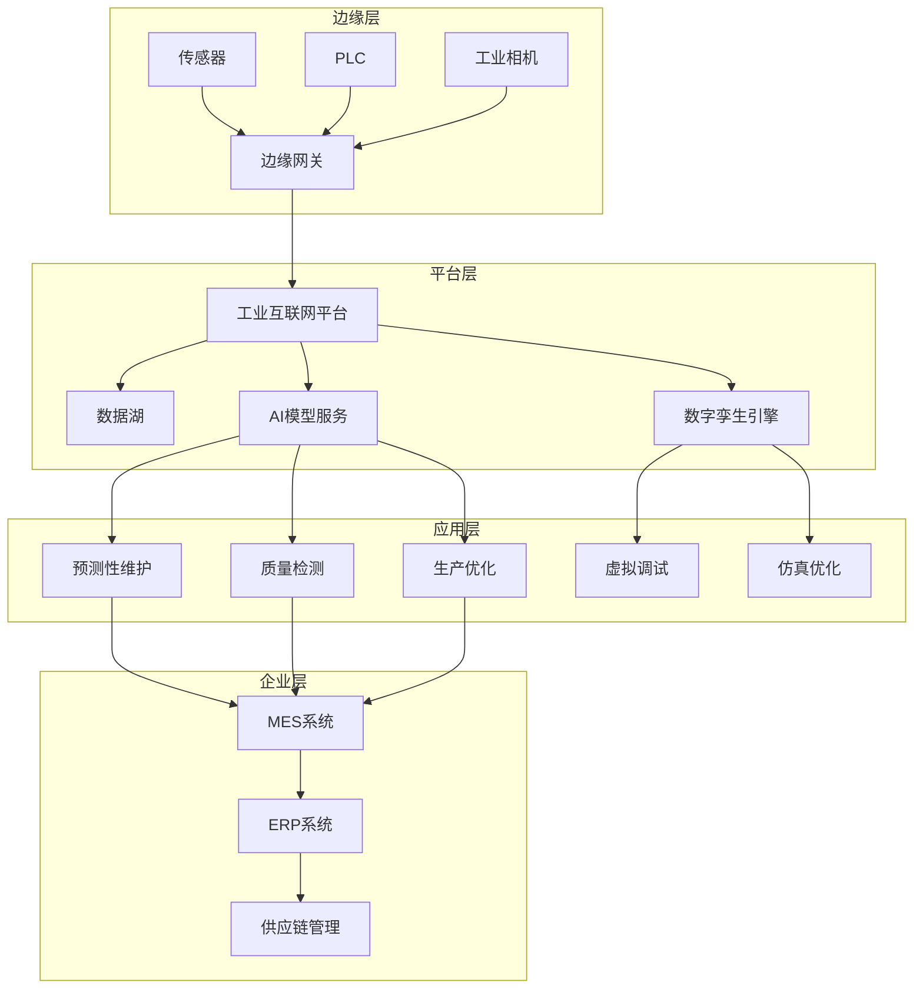

# 制造业数字化转型

## 概述

制造业数字化转型是利用AI、物联网、大数据等技术，实现生产过程的智能化、自动化和数字化，提升生产效率、降低成本、提高产品质量。

## 核心架构设计

### 1. 智能制造架构



### 2. 关键技术组件

| 组件 | 功能 | 技术选型 |
|------|------|----------|
| 数据采集 | 设备数据实时采集 | OPC UA, MQTT, Modbus |
| 边缘计算 | 本地数据处理和推理 | NVIDIA Jetson, Intel OpenVINO |
| 数据存储 | 时序数据存储 | InfluxDB, TimescaleDB, TDengine |
| AI平台 | 模型训练和部署 | TensorFlow, PyTorch, ONNX Runtime |
| 数字孪生 | 物理实体虚拟映射 | Unity, Unreal Engine, Siemens MindSphere |
| 可视化 | 生产监控大屏 | Grafana, ECharts, WebGL |

## 详细解决方案

### 1. 预测性维护

**问题**: 设备突发故障导致生产中断，维护成本高

**解决方案**:
- **数据采集**: 振动、温度、电流、压力等传感器数据
- **特征工程**: 时域/频域特征提取，小波变换
- **模型选择**: LSTM时序预测、异常检测（Isolation Forest）
- **预警机制**: 多级预警阈值，自动生成维护工单

**案例**: 某汽车零部件工厂部署预测性维护后：
- 设备故障率降低45%
- 维护成本减少30%
- 非计划停机时间减少60%

### 2. 视觉质量检测

**问题**: 人工检测效率低、一致性差、漏检率高

**解决方案**:
- **图像采集**: 高分辨率工业相机+环形光源
- **缺陷检测**: YOLOv8目标检测，U-Net语义分割
- **分类模型**: ResNet/EfficientNet缺陷分类
- **边缘部署**: TensorRT优化，实时推理<50ms

**案例**: 某电子元器件制造商部署视觉检测后：
- 检测速度提升10倍
- 漏检率从2%降至0.1%
- 人工成本降低70%

### 3. 数字孪生应用

**应用场景**:
- **产线仿真**: 虚拟调试，减少实际调试时间
- **工艺优化**: 参数优化，提高良品率
- **培训系统**: 操作人员虚拟培训
- **远程监控**: 3D可视化实时监控

**技术栈**:
```
前端: Three.js/WebGL + React
后端: Node.js/Python + WebSocket
引擎: Unity/Unreal Engine
数据: 实时数据流 + 历史数据回放
```

### 4. MES/ERP集成

**集成架构**:
```yaml
数据集成:
  - 设备层 → MES: 实时生产数据
  - MES → ERP: 生产订单、物料消耗、质量数据
  - ERP → MES: 生产计划、物料主数据

接口标准:
  - REST API
  - OPC UA
  - Web Service (SOAP)
  - 消息队列 (RabbitMQ/Kafka)

数据模型:
  - ISA-95标准
  - B2MML规范
```

## 技术选型建议

### 1. 工业互联网平台

| 平台 | 特点 | 适用场景 |
|------|------|----------|
| Siemens MindSphere | 工业级可靠性，生态丰富 | 大型制造企业 |
| PTC ThingWax | CAD/PLM集成好 | 离散制造 |
| 树根互联 | 国产化，性价比高 | 中小制造企业 |
| 华为FusionPlant | 5G+AI能力强 | 流程制造 |

### 2. AI框架选择

```python
# 推荐技术栈
技术栈 = {
    "数据处理": ["Apache Kafka", "Apache Flink", "Spark"],
    "模型训练": ["TensorFlow", "PyTorch", "PaddlePaddle"],
    "模型部署": ["TensorRT", "ONNX Runtime", "Triton"],
    "边缘计算": ["NVIDIA Jetson", "Intel OpenVINO", "华为Atlas"]
}
```

### 3. 数据治理

- **数据标准**: 建立统一的数据字典和编码规范
- **数据质量**: 数据清洗、去重、补全
- **数据安全**: 分级分类，访问控制，审计日志
- **数据生命周期**: 采集→存储→处理→应用→归档

## 实施路径

### 阶段一：基础数字化 (3-6个月)
1. 设备联网和数据采集
2. 基础MES系统部署
3. 生产看板和报表

### 阶段二：智能化应用 (6-12个月)
1. 预测性维护系统
2. 视觉质量检测
3. 生产排程优化

### 阶段三：全面智能化 (12-24个月)
1. 数字孪生平台
2. 供应链协同优化
3. 智能决策支持系统

## 成功案例

### 案例1：某家电制造企业
- **挑战**: 多品种小批量生产，排程复杂
- **方案**: AI智能排程+MES系统
- **效果**: 生产效率提升25%，交付准时率提升至98%

### 案例2：某汽车零部件工厂
- **挑战**: 质量检测依赖人工，成本高
- **方案**: 视觉检测+AI分类
- **效果**: 检测效率提升10倍，漏检率降至0.1%

### 案例3：某钢铁企业
- **挑战**: 能耗高，工艺参数优化困难
- **方案**: 数字孪生+AI优化
- **效果**: 能耗降低15%，良品率提升8%

## 挑战与对策

| 挑战 | 对策 |
|------|------|
| 数据孤岛 | 建立统一数据平台，制定数据标准 |
| 技术人才不足 | 产学研合作，内部培养 |
| 投资回报周期长 | 分阶段实施，优先高ROI场景 |
| 系统集成复杂 | 采用微服务架构，标准化接口 |
| 数据安全风险 | 建立安全体系，定期审计 |

## 相关页面链接

- [[数据中台架构设计]]
- [[物联网平台技术选型]]
- [[AI模型部署最佳实践]]
- [[企业数字化转型路线图]]
- [[工业大数据分析平台]]

## 参考资源

1. 工业互联网产业联盟 - 工业互联网平台白皮书
2. 德勤 - 制造业数字化转型报告
3. 麦肯锡 - 智能制造技术趋势
4. 中国智能制造发展路线图

---

*最后更新: 2026-06-27*
*维护团队: AI解决方案团队*