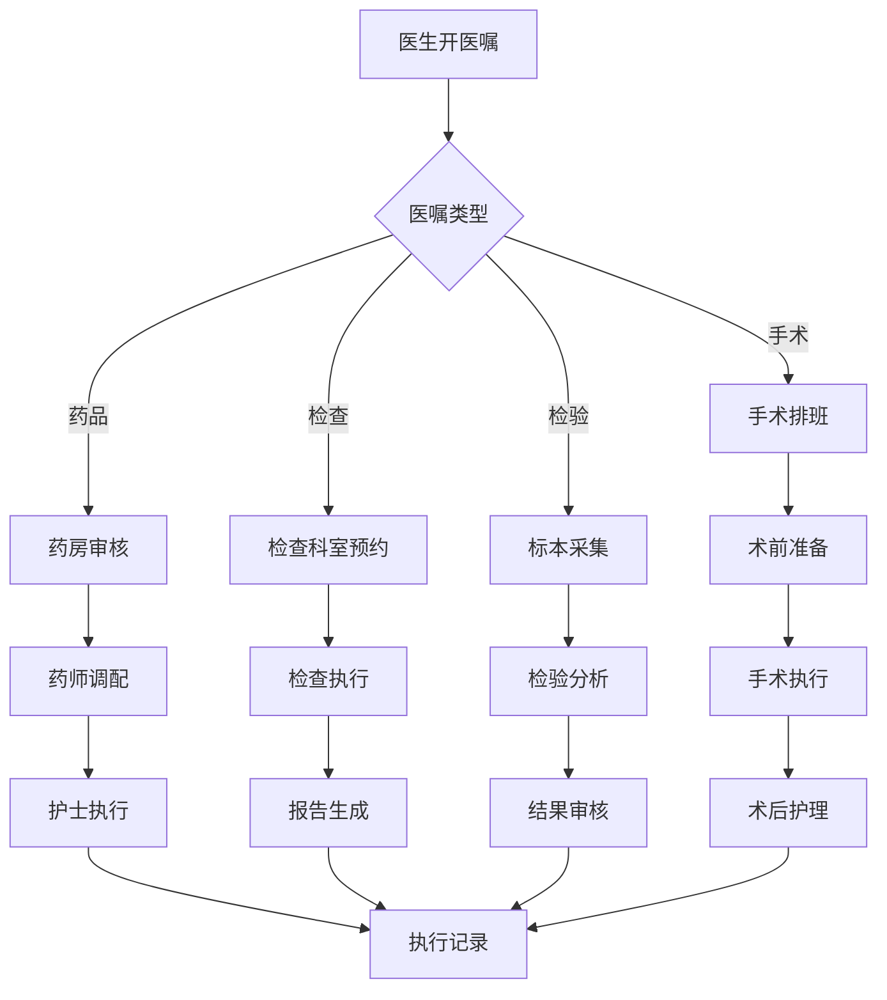

# 医疗健康信息化

## 概述

医疗健康信息化以电子病历(EMR)为核心，构建覆盖临床诊疗、医院管理、区域协同、远程医疗的综合信息系统，实现医疗数据互联互通、辅助临床决策、提升医疗服务质量。

## 核心架构设计

### 1. 医疗信息系统全景架构

```
┌──────────────────────────────────────────────────────────────────┐
│                           应用层                                  │
│  ┌──────────┐ ┌──────────┐ ┌──────────┐ ┌──────────┐            │
│  │ 门诊系统  │ │ 住院系统  │ │ 电子病历  │ │ 临床决策  │            │
│  └──────────┘ └──────────┘ └──────────┘ └──────────┘            │
│  ┌──────────┐ ┌──────────┐ ┌──────────┐ ┌──────────┐            │
│  │ LIS系统   │ │ PACS系统  │ │ 手术麻醉  │ │ 护理系统  │            │
│  └──────────┘ └──────────┘ └──────────┘ └──────────┘            │
│  ┌──────────┐ ┌──────────┐ ┌──────────┐ ┌──────────┐            │
│  │ 药房管理  │ │ 财务管理  │ │ 远程医疗  │ │ 健康管理  │            │
│  └──────────┘ └──────────┘ └──────────┘ └──────────┘            │
├──────────────────────────────────────────────────────────────────┤
│                         集成平台层                                │
│    ESB企业服务总线 │ 主数据管理 │ 消息路由 │ 数据标准化             │
├──────────────────────────────────────────────────────────────────┤
│                         数据中台                                  │
│  ┌──────────┐ ┌──────────┐ ┌──────────┐ ┌──────────┐            │
│  │ 数据仓库  │ │ 数据湖    │ │ 知识图谱  │ │ AI平台    │            │
│  └──────────┘ └──────────┘ └──────────┘ └──────────┘            │
├──────────────────────────────────────────────────────────────────┤
│                         基础设施层                                │
│    混合云 │ 容器化 │ 安全防护 │ 运维监控 │ 灾备系统               │
└──────────────────────────────────────────────────────────────────┘
```

### 2. 技术选型

| 层级 | 技术选型 | 说明 |
|------|----------|------|
| 前端 | Vue3 + Element Plus | 医疗UI组件库 |
| 后端 | Spring Cloud + .NET | 多语言混合架构 |
| 集成平台 | Mirth Connect, Rhapsody | HL7/FHIR消息集成 |
| 数据库 | PostgreSQL + MongoDB | 关系型+文档型 |
| 影像存储 | DICOM服务器 + MinIO | 医学影像存储 |
| 搜索引擎 | Elasticsearch | 电子病历检索 |
| AI框架 | MONAI, PyTorch | 医学影像AI |
| 消息队列 | RabbitMQ | 可靠消息传递 |

---

## 一、HIS系统

### 1. HIS系统模块

```
HIS (医院信息系统)
├── 门诊管理
│   ├── 预约挂号
│   ├── 分诊叫号
│   ├── 门诊收费
│   └── 门诊药房
├── 住院管理
│   ├── 入院登记
│   ├── 医嘱管理
│   ├── 护理记录
│   └── 出院结算
├── 药品管理
│   ├── 药库管理
│   ├── 药房管理
│   ├── 处方审核
│   └── 用药监控
├── 财务管理
│   ├── 收费管理
│   ├── 成本核算
│   └── 财务报表
└── 运营管理
    ├── 绩效考核
    ├── 质量管理
    └── 决策支持
```

### 2. 医嘱处理流程



---

## 二、电子病历(EMR)

### 1. EMR系统架构

```
┌─────────────────────────────────────────────────────────┐
│                    电子病历浏览器                          │
│  ┌──────────┐ ┌──────────┐ ┌──────────┐ ┌──────────┐   │
│  │ 病历编辑  │ │ 模板管理  │ │ 病历质控  │ │ 病历检索  │   │
│  └──────────┘ └──────────┘ └──────────┘ └──────────┘   │
├─────────────────────────────────────────────────────────┤
│                    病历数据服务                           │
│  ┌──────────┐ ┌──────────┐ ┌──────────┐ ┌──────────┐   │
│  │ 结构化存储│ │ 非结构化  │ │ 版本管理  │ │ 签名验证  │   │
│  └──────────┘ └──────────┘ └──────────┘ └──────────┘   │
├─────────────────────────────────────────────────────────┤
│                    标准与规范                             │
│    CDA │ FHIR │ HL7 │ ICD-10 │ SNOMED CT               │
└─────────────────────────────────────────────────────────┘
```

### 2. 电子病历等级标准

| 等级 | 要求 | 能力 |
|------|------|------|
| 一级 | 基础数据采集 | 部门内数据共享 |
| 二级 | 部门间数据交换 | 跨科室数据共享 |
| 三级 | 全院信息共享 | 闭环医嘱管理 |
| 四级 | 全院数据标准化 | 知识库支持 |
| 五级 | 统一数据管理 | 初级决策支持 |
| 六级 | 医疗决策支持 | 中级决策支持 |
| 七级 | 区域医疗信息共享 | 高级决策支持 |
| 八级 | 健康信息整合 | 完整决策支持 |

### 3. 临床决策支持系统(CDSS)

```python
# CDSS功能模块
class CDSS:
    def __init__(self):
        self.drug_interaction = DrugInteractionChecker()
        self.clinical_guideline = ClinicalGuidelineEngine()
        self.diagnosis_assist = DiagnosisAssistant()
        self.quality_control = QualityControlEngine()
    
    def check_prescription(self, prescription):
        """处方审核"""
        # 药物相互作用检查
        interactions = self.drug_interaction.check(prescription.medications)
        # 适应症检查
        indications = self.check_indications(prescription)
        # 剂量合理性检查
        dosage = self.check_dosage(prescription)
        # 过敏史检查
        allergy = self.check_allergy(prescription.patient, prescription.medications)
        
        return PrescriptionReview(interactions, indications, dosage, allergy)
    
    def suggest_diagnosis(self, symptoms, lab_results, imaging):
        """辅助诊断"""
        # 基于症状的疾病推理
        candidates = self.diagnosis_assist.infer(symptoms)
        # 结合检验结果排除
        candidates = self.filter_by_lab(candidates, lab_results)
        # 结合影像学结果
        candidates = self.filter_by_imaging(candidates, imaging)
        return candidates
```

---

## 三、数据隐私与安全

### 1. 医疗数据安全架构

```
┌─────────────────────────────────────────────────────────┐
│                    安全管理层                            │
│    安全策略 │ 人员管理 │ 制度规范 │ 安全审计              │
├─────────────────────────────────────────────────────────┤
│                    安全技术层                            │
│  ┌─────────────────────────────────────────────────────┐│
│  │ 身份认证: 多因子认证 │ 单点登录 │ 权限管理            ││
│  ├─────────────────────────────────────────────────────┤│
│  │ 数据加密: 传输加密TLS │ 存储加密AES │ 密钥管理       ││
│  ├─────────────────────────────────────────────────────┤│
│  │ 数据脱敏: 动态脱敏 │ 静态脱敏 │ 去标识化             ││
│  ├─────────────────────────────────────────────────────┤│
│  │ 访问控制: RBAC │ ABAC │ 最小权限原则                 ││
│  ├─────────────────────────────────────────────────────┤│
│  │ 审计日志: 操作审计 │ 访问审计 │ 异常检测             ││
│  └─────────────────────────────────────────────────────┘│
├─────────────────────────────────────────────────────────┤
│                    合规层                                │
│    等保三级 │ HIPAA │ 个人信息保护法 │ 数据安全法         │
└─────────────────────────────────────────────────────────┘
```

### 2. 隐私计算技术

| 技术 | 应用场景 | 说明 |
|------|----------|------|
| 联邦学习 | 多院区联合建模 | 数据不出院，模型共享 |
| 安全多方计算 | 科研数据分析 | 多方数据联合分析 |
| 差分隐私 | 统计数据发布 | 保护个体隐私 |
| 同态加密 | 密文数据计算 | 数据加密状态下计算 |
| 可信执行环境 | 敏感数据处理 | 硬件级安全保护 |

### 3. 数据分级分类

```yaml
数据分级:
  L1 (公开级):
    - 医院基本信息
    - 公开的健康科普
  L2 (内部级):
    - 统计分析数据
    - 运营管理数据
  L3 (敏感级):
    - 患者基本信息
    - 就诊记录
    - 处方信息
  L4 (高敏感级):
    - 基因数据
    - 精神疾病记录
    - HIV检测结果

保护措施:
  L1: 基本访问控制
  L2: 访问控制 + 审计日志
  L3: 加密 + 脱敏 + 访问控制 + 审计
  L4: 严格加密 + 强脱敏 + 审批流程 + 专人管理
```

---

## 四、互联互通

### 1. 医疗信息集成标准

| 标准 | 用途 | 说明 |
|------|------|------|
| HL7 v2.x | 消息交换 | 传统医疗消息标准 |
| HL7 FHIR | RESTful API | 现代医疗数据交换标准 |
| DICOM | 影像数据 | 医学影像传输标准 |
| IHE | 集成规范 | 医疗系统互操作框架 |
| CDA | 临床文档 | 临床文档架构标准 |

### 2. 集成平台架构

```
┌─────────────────────────────────────────────────────────┐
│                    集成引擎                               │
│  ┌──────────┐ ┌──────────┐ ┌──────────┐ ┌──────────┐   │
│  │ 消息路由  │ │ 协议转换  │ │ 数据映射  │ │ 消息队列  │   │
│  └──────────┘ └──────────┘ └──────────┘ └──────────┘   │
├─────────────────────────────────────────────────────────┤
│                    适配器层                               │
│  ┌──────┐ ┌──────┐ ┌──────┐ ┌──────┐ ┌──────┐         │
│  │ HIS  │ │ LIS  │ │ PACS │ │ EMR  │ │ 其他  │         │
│  └──────┘ └──────┘ └──────┘ └──────┘ └──────┘         │
├─────────────────────────────────────────────────────────┤
│                    主数据管理                             │
│    患者主索引(EMPI) │ 术语字典 │ 编码映射                  │
└─────────────────────────────────────────────────────────┘
```

### 3. 患者主索引(EMPI)

```python
# EMPI患者匹配算法
class EMPIMatcher:
    def match(self, patient1, patient2):
        """患者身份匹配"""
        scores = {
            'name': self.name_similarity(patient1.name, patient2.name),
            'id_card': self.exact_match(patient1.id_card, patient2.id_card),
            'phone': self.exact_match(patient1.phone, patient2.phone),
            'birth_date': self.exact_match(patient1.birth_date, patient2.birth_date),
            'gender': self.exact_match(patient1.gender, patient2.gender),
        }
        
        # 加权计算匹配分数
        weights = {'name': 0.3, 'id_card': 0.4, 'phone': 0.15, 
                   'birth_date': 0.1, 'gender': 0.05}
        
        total_score = sum(scores[k] * weights[k] for k in scores)
        
        if total_score > 0.85:
            return MatchResult.MATCH
        elif total_score > 0.6:
            return MatchResult.POSSIBLE_MATCH
        else:
            return MatchResult.NO_MATCH
```

---

## 五、远程医疗

### 1. 远程医疗系统架构

```
┌─────────────────────────────────────────────────────────┐
│                    远程医疗平台                           │
│  ┌──────────┐ ┌──────────┐ ┌──────────┐ ┌──────────┐   │
│  │ 远程会诊  │ │ 远程影像  │ │ 远程心电  │ │ 远程病理  │   │
│  └──────────┘ └──────────┘ └──────────┘ └──────────┘   │
│  ┌──────────┐ ┌──────────┐ ┌──────────┐ ┌──────────┐   │
│  │ 远程监护  │ │ 在线问诊  │ │ 远程教育  │ │ 双向转诊  │   │
│  └──────────┘ └──────────┘ └──────────┘ └──────────┘   │
├─────────────────────────────────────────────────────────┤
│                    通信基础                               │
│    视频会议 │ 实时音视频 │ 数据协作 │ 消息通知            │
├─────────────────────────────────────────────────────────┤
│                    IoT设备接入                            │
│    可穿戴设备 │ 家用医疗设备 │ 生命体征监测               │
└─────────────────────────────────────────────────────────┘
```

### 2. 远程医疗应用场景

| 场景 | 技术方案 | 价值 |
|------|----------|------|
| 远程会诊 | 4K视频 + DICOM共享 | 优质医疗资源下沉 |
| 远程影像 | 影像云 + AI辅助诊断 | 基层诊断能力提升 |
| 远程监护 | IoT + 实时数据传输 | 慢病管理 |
| 在线问诊 | 音视频 + 电子处方 | 便捷就医 |
| 远程手术 | 5G + 机器人 | 精准远程手术 |

### 3. 医疗AI应用

```python
# 医疗AI应用场景
class MedicalAI:
    # 影像AI
    def chest_ct_analysis(self, ct_image):
        """肺结节检测"""
        # 使用3D CNN检测肺结节
        nodules = self.lung_nodule_detector.detect(ct_image)
        # 结节良恶性分类
        for nodule in nodules:
            nodule.malignancy = self.malignancy_classifier.predict(nodule)
        return nodules
    
    # 病理AI
    def pathological_analysis(self, slide_image):
        """病理切片分析"""
        # 细胞检测与分类
        cells = self.cell_detector.detect(slide_image)
        # 组织分割
        tissues = self.tissue_segmenter.segment(slide_image)
        return PathologyReport(cells, tissues)
    
    # NLP应用
    def clinical_nlp(self, medical_text):
        """临床NLP"""
        # 实体识别
        entities = self.ner_model.extract(medical_text)
        # 关系抽取
        relations = self.relation_extractor.extract(medical_text)
        # 病历结构化
        structured = self.structurizer.convert(medical_text)
        return ClinicalNLPResult(entities, relations, structured)
```

---

## 典型案例

### 案例1：某三甲医院智慧医院建设
- **业务挑战**: 信息孤岛严重，患者体验差
- **解决方案**: 集成平台 + 电子病历 + 智慧服务
- **实施效果**:
  - 互联互通四级甲等
  - 电子病历六级
  - 患者满意度提升20%

### 案例2：某区域医联体平台
- **业务挑战**: 基层医疗能力不足，转诊困难
- **解决方案**: 区域健康信息平台 + 远程医疗
- **实施效果**:
  - 覆盖200+医疗机构
  - 远程会诊10万+例
  - 基层就诊率提升30%

### 案例3：某AI辅助诊断系统
- **业务挑战**: 影像诊断效率低，漏诊风险
- **解决方案**: 影像AI + 辅助诊断系统
- **实施效果**:
  - 肺结节检出率提升15%
  - 诊断时间缩短50%
  - 漏诊率降低60%

---

## 实施建议

### 1. 实施路径
```
Phase 1 (3-6月): 基础系统建设
  → HIS/EMR基础功能上线

Phase 2 (6-12月): 系统集成与数据治理
  → 集成平台上线，数据标准化

Phase 3 (12-18月): 智能化应用
  → CDSS、AI辅助诊断

Phase 4 (18-24月): 区域协同
  → 远程医疗、医联体平台
```

### 2. 成功要素

| 要素 | 关键措施 |
|------|----------|
| 领导支持 | 一把手工程，全院推进 |
| 标准先行 | 统一数据标准和接口规范 |
| 分步实施 | 先易后难，逐步深入 |
| 持续优化 | 建立运维团队，持续迭代 |
| 培训推广 | 全员培训，改变工作习惯 |

---

## 相关页面链接

- [[数据中台架构设计]] - 医疗数据中台
- [[AI模型部署最佳实践]] - 医疗AI部署
- [[智慧城市解决方案]] - 区域卫生信息化
- [[安全合规体系建设]] - 医疗数据安全
- [[物联网平台技术选型]] - 医疗IoT

---

*最后更新: 2026-06-27*
*维护团队: 医疗信息化团队*