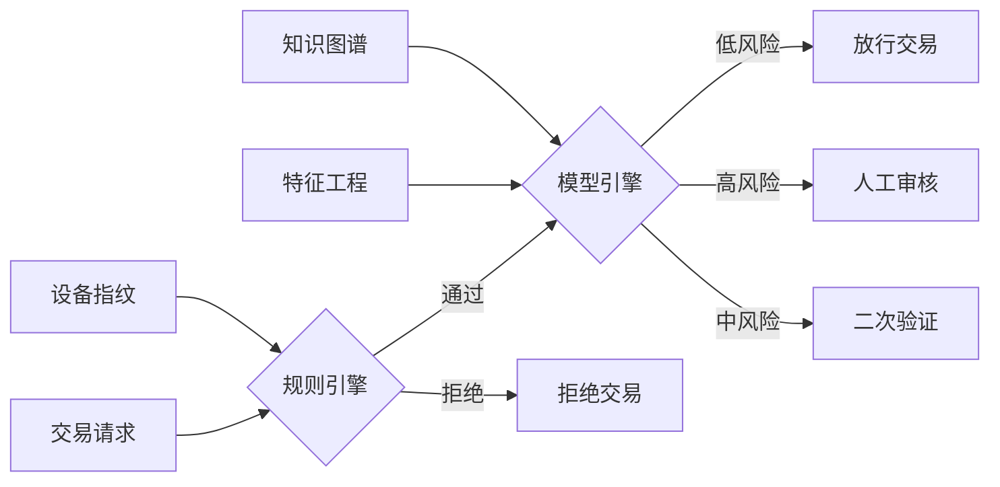

# 金融行业解决方案

## 概述

金融行业解决方案围绕风控、支付、合规、数据安全四大核心领域，利用AI技术构建智能化金融基础设施，提升风险管理能力、优化用户体验、确保合规运营。

## 核心架构设计

### 1. 金融系统总体架构

```
┌──────────────────────────────────────────────────────────────────┐
│                         接入层 (API Gateway)                       │
│         负载均衡 │ 限流熔断 │ 鉴权认证 │ 协议转换                   │
├──────────────────────────────────────────────────────────────────┤
│                         业务服务层                                 │
│  ┌──────────┐ ┌──────────┐ ┌──────────┐ ┌──────────┐            │
│  │ 账户服务  │ │ 交易服务  │ │ 风控服务  │ │ 支付服务  │            │
│  └──────────┘ └──────────┘ └──────────┘ └──────────┘            │
│  ┌──────────┐ ┌──────────┐ ┌──────────┐ ┌──────────┐            │
│  │ 贷款服务  │ │ 理财服务  │ │ 合规服务  │ │ 清算服务  │            │
│  └──────────┘ └──────────┘ └──────────┘ └──────────┘            │
├──────────────────────────────────────────────────────────────────┤
│                         AI能力层                                   │
│  ┌──────────┐ ┌──────────┐ ┌──────────┐ ┌──────────┐            │
│  │ 反欺诈引擎│ │ 信用评估  │ │ 智能客服  │ │ 智能投顾  │            │
│  └──────────┘ └──────────┘ └──────────┘ └──────────┘            │
├──────────────────────────────────────────────────────────────────┤
│                         数据层                                     │
│  关系型DB │ 分布式缓存 │ 消息队列 │ 数据湖 │ 搜索引擎              │
└──────────────────────────────────────────────────────────────────┘
```

### 2. 技术选型矩阵

| 领域 | 技术选型 | 说明 |
|------|----------|------|
| 微服务框架 | Spring Cloud Alibaba, Dubbo | 高可用分布式架构 |
| 数据库 | OceanBase, TiDB, PostgreSQL | 分布式关系型数据库 |
| 缓存 | Redis Cluster | 高性能分布式缓存 |
| 消息队列 | Apache Kafka, RocketMQ | 高吞吐异步消息 |
| 搜索引擎 | Elasticsearch | 全文检索与日志分析 |
| 流计算 | Apache Flink | 实时风控与数据处理 |
| AI框架 | TensorFlow, XGBoost, LightGBM | 信用评分与反欺诈 |
| 区块链 | Hyperledger Fabric, FISCO BCOS | 联盟链与存证 |

---

## 一、风控系统

### 1. 实时风控架构



### 2. 风控模型体系

#### (1) 信用评分模型
```
特征维度:
├── 身份特征: 年龄、性别、学历、职业
├── 资产特征: 收入、负债、资产
├── 行为特征: 消费习惯、还款记录
├── 社交特征: 社交网络、联系人质量
└── 设备特征: 设备信息、使用习惯

模型选择:
- 传统模型: Logistic Regression, XGBoost
- 深度模型: Wide&Deep, DeepFM
- 图模型: GraphSAGE, GNN
```

#### (2) 反欺诈模型
| 技术 | 应用场景 | 精度 |
|------|----------|------|
| 设备指纹 | 识别异常设备 | 95%+ |
| 行为序列分析 | 检测异常操作 | 90%+ |
| 知识图谱 | 团伙欺诈识别 | 85%+ |
| 图神经网络 | 关联风险发现 | 88%+ |
| 实时规则引擎 | 已知模式匹配 | 99%+ |

#### (3) 实时风控流程
```python
# 实时风控决策流程
class RealTimeRiskControl:
    def evaluate(self, transaction):
        # 1. 规则过滤 (延迟 < 5ms)
        rule_result = self.rule_engine.evaluate(transaction)
        if rule_result.reject:
            return Decision.REJECT
        
        # 2. 特征提取 (延迟 < 10ms)
        features = self.feature_engine.extract(transaction)
        
        # 3. 模型评分 (延迟 < 20ms)
        score = self.model_engine.predict(features)
        
        # 4. 决策输出
        if score > self.threshold_high:
            return Decision.REJECT
        elif score > self.threshold_medium:
            return Decision.MANUAL_REVIEW
        else:
            return Decision.APPROVE
```

### 3. 风控案例

**案例：某银行信用卡反欺诈系统**
- 日均交易量: 500万笔
- 风控延迟: < 100ms
- 欺诈识别率: 92%
- 误报率: < 0.5%
- 年挽回损失: 2000万元

---

## 二、支付系统

### 1. 支付系统架构

```
                    ┌─────────────────────────────────┐
                    │          收银台 (Checkout)        │
                    └───────────────┬─────────────────┘
                                    │
                    ┌───────────────▼─────────────────┐
                    │         支付网关 (Gateway)        │
                    │  路由选择 │ 协议转换 │ 签名验签     │
                    └───────────────┬─────────────────┘
                                    │
        ┌───────────┬───────────────┼───────────────┬───────────┐
        │           │               │               │           │
   ┌────▼────┐ ┌────▼────┐ ┌───────▼───────┐ ┌────▼────┐ ┌───▼───┐
   │ 银联    │ │ 微信    │ │   支付宝      │ │ 网银    │ │ 跨境  │
   └─────────┘ └─────────┘ └───────────────┘ └─────────┘ └───────┘
```

### 2. 关键设计要点

#### (1) 高可用设计
- **多活架构**: 同城双活 + 异地灾备
- **限流熔断**: Sentinel限流，Hystrix熔断
- **幂等设计**: 唯一请求ID，防止重复支付
- **补偿机制**: 异步补偿 + 人工介入

#### (2) 资金安全
```
账户体系:
├── 虚拟账户: 用户维度资金管理
├── 备付金账户: 央行监管账户
├── 清算账户: 银行间资金划转
└── 内部账户: 手续费、分润

对账机制:
├── T+1日终对账
├── 实时流水核对
├── 差异自动处理
└── 人工介入通道
```

### 3. 支付系统案例

**案例：某互联网支付平台**
- 峰值TPS: 10万+
- 支付成功率: 99.99%
- 平均延迟: 200ms
- 日交易额: 50亿元
- 资金差错率: < 0.0001%

---

## 三、合规要求

### 1. 合规体系架构

| 合规领域 | 监管要求 | 技术方案 |
|----------|----------|----------|
| 反洗钱(AML) | 大额可疑交易报告 | 规则引擎 + AI模型 |
| KYC | 客户身份识别 | OCR + 人脸比对 |
| 数据安全 | 个人信息保护 | 加密 + 脱敏 + 审计 |
| 消费者权益 | 适当性管理 | 风险评估模型 |
| 报送合规 | 监管报表 | 自动化报表系统 |

### 2. 反洗钱系统

```
交易监测流程:
1. 数据采集 → 交易流水、客户信息、外部数据
2. 规则匹配 → 大额交易、可疑交易模式
3. AI分析 → 异常行为检测、关联分析
4. 案例生成 → 自动生成可疑交易报告
5. 人工复核 → 合规人员审核确认
6. 监管报送 → 自动报送央行系统

关键指标:
- 监测覆盖率: 100%
- 可疑交易识别率: > 85%
- 误报率: < 15%
- 报送及时率: 100%
```

### 3. 数据合规

```yaml
数据分类分级:
  - C1 (公开数据): 产品信息、公告
  - C2 (内部数据): 经营数据、统计报表
  - C3 (敏感数据): 客户信息、交易记录
  - C4 (核心数据): 密钥、密码、生物特征

合规措施:
  - 数据加密: AES-256, RSA-2048
  - 数据脱敏: 动态脱敏 + 静态脱敏
  - 访问控制: RBAC + ABAC
  - 审计日志: 全链路操作审计
  - 数据生命周期: 采集→存储→使用→共享→销毁
```

---

## 四、数据安全

### 1. 安全架构

```
┌─────────────────────────────────────────────────┐
│                   安全管理层                      │
│    安全策略 │ 安全组织 │ 安全制度 │ 安全培训      │
├─────────────────────────────────────────────────┤
│                   安全技术层                      │
│  ┌─────────────────────────────────────────────┐│
│  │ 网络安全: 防火墙 │ IDS/IPS │ WAF │ DDoS防护  ││
│  ├─────────────────────────────────────────────┤│
│  │ 应用安全: 代码审计 │ 渗透测试 │ 安全编码     ││
│  ├─────────────────────────────────────────────┤│
│  │ 数据安全: 加密 │ 脱敏 │ DLP │ 数据库审计    ││
│  ├─────────────────────────────────────────────┤│
│  │ 身份安全: IAM │ MFA │ SSO │ 零信任         ││
│  └─────────────────────────────────────────────┘│
├─────────────────────────────────────────────────┤
│                   安全运营层                      │
│    SOC │ SIEM │ 威胁情报 │ 应急响应             │
└─────────────────────────────────────────────────┘
```

### 2. 关键安全技术

| 技术 | 用途 | 实现方案 |
|------|------|----------|
| 同态加密 | 密文计算 | Microsoft SEAL, TF Encrypted |
| 联邦学习 | 数据不出域 | FATE, PaddleFL |
| 差分隐私 | 统计隐私保护 | Google DP Library |
| 安全多方计算 | 联合建模 | Secret Sharing, GC |
| 区块链存证 | 数据溯源 | Hyperledger Fabric |

### 3. 数据安全案例

**案例：某银行数据安全体系建设**
- 数据资产梳理: 2000+数据表
- 敏感数据识别: AI自动识别准确率95%
- 数据脱敏覆盖率: 100%
- 安全事件: 零重大数据泄露事件
- 合规审计: 一次通过监管检查

---

## 典型案例

### 案例1：某城商行智能风控平台
- **业务背景**: 个人信贷业务快速增长，欺诈风险上升
- **解决方案**: 实时风控 + 知识图谱 + 图神经网络
- **实施效果**:
  - 欺诈损失降低60%
  - 审批效率提升3倍
  - 客户体验显著改善

### 案例2：某支付机构合规系统
- **业务背景**: 监管要求日趋严格，合规成本高
- **解决方案**: 自动化AML + 智能KYC + 监管报送
- **实施效果**:
  - 合规人力减少50%
  - 报送准确率100%
  - 顺利通过监管检查

### 案例3：某保险公司数据中台
- **业务背景**: 数据孤岛严重，数据价值未充分挖掘
- **解决方案**: 统一数据平台 + 数据治理 + AI应用
- **实施效果**:
  - 数据使用效率提升5倍
  - 精准营销转化率提升40%
  - 理赔欺诈识别率提升35%

---

## 实施建议

### 1. 实施路径
```
Phase 1 (1-3月): 基础平台建设
  → 数据平台、风控引擎、合规系统

Phase 2 (3-6月): 核心业务上线
  → 实时风控、反欺诈、KYC

Phase 3 (6-12月): 智能化升级
  → 图计算、联邦学习、智能投顾

Phase 4 (12-24月): 生态化拓展
  → 开放银行、场景金融、产业金融
```

### 2. 风险与对策

| 风险 | 对策 |
|------|------|
| 监管政策变化 | 建立合规跟踪机制，预留系统灵活性 |
| 数据质量差 | 数据治理先行，建立数据质量体系 |
| 模型解释性不足 | 采用可解释AI，满足监管审计要求 |
| 系统稳定性 | 多活架构，全链路压测，灰度发布 |

---

## 相关页面链接

- [[电商系统架构]]
- [[数据中台架构设计]]
- [[AI模型部署最佳实践]]
- [[安全合规体系建设]]
- [[实时计算平台]]

---

*最后更新: 2026-06-27*
*维护团队: 金融科技团队*