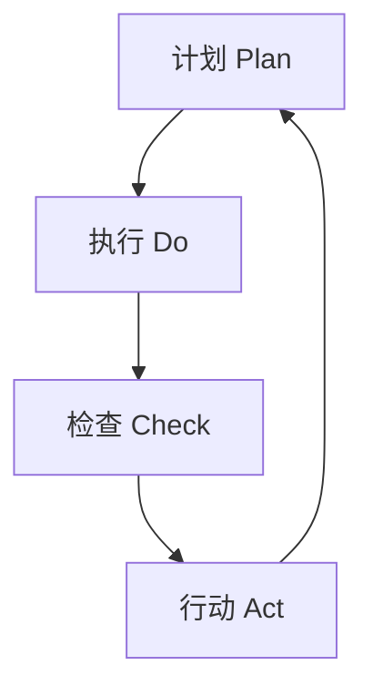

> 项目：**DAMA-DMBOK2** | 来源：《DAMA数据管理知识体系指南（原书第2版修订版）》第13章（二）

## 数据剖析（Data Profiling）

数据剖析是一种用于检查数据和评估质量的数据分析形式，使用统计技术了解数据集的真实结构、内容和质量。

### 剖析引擎生成的主要统计数据

1. **空值量**：识别存在的空值并检查是否允许空值存在
2. **最大/最小值**：识别异常值（如负数）
3. **最大/最小长度**：识别具有特定长度要求的字段的异常值或无效值
4. **各字段统计分布**：评估合理性（如交易的国家代码分布、频繁/不频繁出现的值、默认值填充率）
5. **数据类型和格式**：识别与格式要求不符的程度及异常格式（如小数位数、嵌入空格、样例值）

数据剖析还包括**关联字段（Cross-Column）分析**和**表间分析**，可识别重叠或重复的列，暴露嵌入式值的依赖关系，探索重叠值并帮助识别外键关联。大多数据剖析工具都支持对分析数据进行下钻分析，以做更深入的调查。

分析师必须评估剖析引擎结果，以确定数据是否符合规则和其他要求。一名优秀的分析师可以利用探查结果确认已知关系，并发现数据集内部和之间的隐藏特征与模式，包含业务规则和有效性约束。

> 注意：数据剖析是数据质量改进的第一步，帮助识别潜在问题，但还需要配合业务流程分析、数据血缘分析和更深入的数据分析来分离问题根因。在对大规模剖析做规划时，确保预留时间分享结论、明确问题的优先级，并确定哪些问题需要深入分析。

创建可共享、可关联和可复用的代码模块，反复执行数据质量检查和审计流程（开发人员可直接从代码仓库中获取）。如果模块需要更改，所有与该模块关联的代码都会得到更新，这样的模块简化了维护过程。设计良好的代码块可防止许多数据质量问题，并能确保流程均被一致地执行。

## 数据质量改进生命周期（PDCA）

数据质量改进的通用方法是**戴明环（Shewhart/Deming Cycle）**，即"计划—执行—检查—行动"四步问题解决模型。基于科学的方法，通过一系列定义好的步骤实现改进。根据标准衡量数据的状态，如果不符合标准，必须识别导致偏差的根因并加以修复。



### PDCA各阶段详解

| 阶段 | 职责方 | 主要活动 |
|------|--------|----------|
| **计划（Plan）** | 数据质量团队 | 评估已知问题的范围、影响和优先级，以及解决这些问题的替代方案。基于对问题根因的深入分析，通过了解问题的原因和影响，了解成本/收益，确定优先级，并制订解决问题的初步计划 |
| **执行（Do）** | 数据质量团队 + 业务运营团队 | 带头解决产生问题的根因，制订数据持续监测计划。对非技术流程根因，与流程制定方一同实施变更。涉及技术变更的根因，与技术团队合作确保需求正确实施，且技术性变更不会引发新数据差错 |
| **检查（Check）** | 业务运营团队 | 日常管理数据，主动监测数据质量及需求要求程度的核查。数据符合已定义阈值范围时无须额外措施，流程处于受控状态。一旦数据质量低于可接受阈值，必须采取额外措施将其提高到可接受水平 |
| **行动（Act）** | 业务运营团队 + 数据质量团队 | 处理和解决新出现的数据质量问题。新工作环启动条件：1. 现有度量结果低于阈值；2. 出现有待核查的新数据集；3. 对现有数据集有新的数据质量要求；4. 业务规则、标准或期望发生变化 |

### DMBOK数据质量活动映射

该映射有助于通过传统制造业思维理解数据质量：

| 制造领域类比 | 数据质量领域对应活动 |
|-------------|---------------------|
| 原材料检验 | 源系统数据剖析 |
| 过程质量控制 | 数据转换过程监控 |
| 成品检验 | 数据输出质量检查 |
| 持续改进 | PDCA循环迭代 |

## 数据质量度量与DQI指标体系

数据质量度量是数据质量管理的核心环节。驱动开展数据质量度量有两个同等重要的原因：1. 告知数据消费者有关数据质量的等级；2. 管理因改变业务或技术流程可能会引发的新风险。

### 有效度量指标的特性

| 特性 | 说明 |
|------|------|
| **可度量性** | 度量指标是可计量的，结果应在离散范围内为量化值 |
| **业务相关性** | 每个度量指标应与数据对关键业务期望的影响相关 |
| **可接受性** | 根据指定的可接受阈值判断数据是否符合业务期望 |
| **责任制/管理制** | 度量指标应得到关键干系人理解和批准，不符合预期时应通知利益相关方 |
| **可控性** | 度量标准超出范围时应触发改进行动 |
| **趋势** | 度量指标应能展示数据质量随时间的改进情况，可应用统计过程控制技术监测结果的可预测性 |

### 数据质量指标的高阶分类

1. **投资回报**：说明数据改进工作的成本与提高数据质量的收益
2. **质量水平**：度量数据错误数量和差错率，或不符合要求的违规行为数量
3. **数据质量趋势**：阈值、目标或每个周期质量事件统计情况的改进趋势

### 数据问题管理指标

- 各维度的数据质量问题统计
- 每个业务功能的问题数量及其状态（已解决、未解决、升级）
- 按优先级和严重程度的问题分类
- 解决问题所需的时间
- 数据质量计划进展：推进状态、下一阶段和持续的优先排序过程

### 度量公式

指标度量结果可从两个层面表述：与执行单个规则相关的细节及从规则聚合的整体效果。每个规则都应有一个用于比较的标准、目标或阈值索引：

```
有效数据质量 = (总测试次数 - 异常次数) / 总测试次数 × 100%
无效数据质量 = 异常次数 / 总测试次数 × 100%
```

> 示例：对一个业务规则（r）进行了10000次测试，发现了560个异常。有效数据质量结果为9440/10000=94.4%，无效数据质量结果为560/10000=5.6%。

### 数据质量度量指标示例

**完备性指标示例：**

| 度量ID | 数据元素 | 业务规则 | 度量方法 | 阈值 | 当前值 | 状态 |
|--------|----------|----------|----------|------|--------|------|
| DQ-C01 | 客户邮箱 | 必填字段不得为空 | 非空值计数/总记录数 | ≥98% | 95.2% | 不达标 |
| DQ-C02 | 订单收货地址 | 订单必须包含完整地址 | 地址字段完整性检查 | ≥99% | 99.5% | 达标 |

**唯一性指标示例：**

| 度量ID | 数据实体 | 业务规则 | 度量方法 | 阈值 | 当前值 | 状态 |
|--------|----------|----------|----------|------|--------|------|
| DQ-U01 | 客户记录 | 每个客户有且仅有一条记录 | 去重后记录数/总记录数 | ≥99.5% | 98.8% | 不达标 |
| DQ-U02 | 产品编码 | 产品编码全局唯一 | 唯一编码数/总编码数 | 100% | 99.9% | 不达标 |

**及时性指标示例：**

| 度量ID | 数据集 | 业务规则 | 度量方法 | 阈值 | 当前值 | 状态 |
|--------|--------|----------|----------|------|--------|------|
| DQ-T01 | 日销售报表 | T+1日内可获取 | 实际生成时间-要求时间 | ≤24小时 | 18小时 | 达标 |
| DQ-T02 | 客户信息更新 | 变更后24小时内同步 | 同步延迟时间 | ≤24小时 | 48小时 | 不达标 |

**有效性指标示例：**

| 度量ID | 数据元素 | 业务规则 | 度量方法 | 阈值 | 当前值 | 状态 |
|--------|----------|----------|----------|------|--------|------|
| DQ-V01 | 电话号码 | 符合标准格式 | 正则表达式匹配 | ≥95% | 92.3% | 不达标 |
| DQ-V02 | 州/省代码 | 必须在参考值列表中 | 值域成员检查 | 100% | 99.8% | 不达标 |

### 数据质量监测技术

| 监测类型 | 说明 | 适用场景 |
|----------|------|----------|
| **批量监测** | 定期对数据集执行规则检查 | 日常运营报告、定期数据质量评估 |
| **实时监测** | 在数据创建或变更时即时检查 | 数据录入控制、流式数据处理 |
| **抽样监测** | 对数据集进行抽样检查 | 大规模数据集的初步评估 |
| **阈值告警** | 当指标低于预设阈值时触发告警 | 关键业务数据的持续监控 |
| **趋势分析** | 跟踪指标随时间的变化趋势 | 识别渐进性质量下降 |
| **统计过程控制** | 使用控制图监测数据质量的可预测性 | 稳定过程的质量监控 |

### 数据缺陷趋势分析

数据质量团队应跟进各类演变趋势，包括：
- **持续存在的问题**：团队监测进展，使其恢复到阈值以下
- **当下问题**：团队正在调动力量，识别并抑制演变趋势
- **观察列表**：团队对此表示关注，但尚未采取行动予以化解
- **长期顽固问题**：团队尝试了多种方案，但仍在寻找永久解决方案
- **正常状态**：团队对这些趋势感到满意

## 根因分析（Root Cause Analysis）

数据质量问题应系统性地在其根因处加以解决，将纠正措施的成本和风险降到最低。"源地解决"是数据质量管理的最佳实践。问题的根因是一个核心诱因，如果消除它，就会彻底消除问题。

> 示例：一个每月运行的数据处理流程，在4月、7月、10月和1月数据质量呈现下降趋势。进一步分析发现，负责提交文件的团队还负责关闭季度财务流程，这些流程优先于其他工作，文件提交延迟影响了质量。根因实际上是由于优先权竞争（Competing Priority）导致的流程延迟。

### 根因分析常见技术

| 技术 | 说明 |
|------|------|
| **帕累托分析（Pareto Analysis）** | 80/20法则，识别少数关键问题 |
| **鱼骨图分析（Fishbone Diagram）** | 系统性梳理潜在原因 |
| **5个为什么（5 Whys）** | 由丰田创始人丰田章一首创，连续追问直至找到根本原因 |
| **追踪溯源** | 沿数据链追溯问题起源 |
| **流程分析** | 分析流程各节点识别偏差 |

### 根因分析步骤

1. **诊断问题**：审查数据质量事件症状，追溯问题数据血缘，识别问题起源及隐性根因
   - 在适当的信息处理流背景下审查数据问题，屏蔽引发缺陷数据的流程节点
   - 评估可能导致错误进入系统的任何环境变化
   - 评估是否存在导致数据质量事件的其他流程
   - 确定是否存在外部数据已经影响数据质量的相关问题
2. **制定补救方案**：评估备选措施，包括解决非技术性根因、修改系统、开发控制、引入额外检查、直接修正缺陷数据
3. **解决问题**：评估各种措施的相对成本和优势，推荐最优方案并实施

> 根因分析工作需要技术和业务领域专家的参与。尽管数据质量团队可能会主导和协调此类工作，但只有跨职能的协作才能确保成功。

## 常见数据质量问题原因

数据质量问题可能出现在数据生命周期（从创建到销毁）的任何节点。在调查根因时，分析人员应寻找隐性元凶，如数据录入问题、数据处理问题、系统设计问题及对自动化流程的人工干预。

### （1）缺乏监督导致的问题

许多数据质量问题源于组织在数据质量方面缺乏管理和治理方面的承诺。

**有效管理数据质量的障碍：**
1. 领导和员工缺乏意识
2. 缺乏优先级
3. 缺乏业务治理
4. 领导和管理缺失
5. 难以说明改进理由
6. 衡量价值的工具不当或无效

### （2）数据录入流程导致的问题

在数据生命周期的最初阶段（数据获取阶段），存在许多可能导致数据质量不佳的因素：

| 问题因素 | 说明 |
|----------|------|
| **用户参与度不高** | 录入人员认为数据录入没有价值，可能不严谨甚至故意提供不准确信息 |
| **培训问题** | 流程认知匮乏导致录入错误数据；更在意"速度"而非"准确" |
| **糟糕的可用性** | 界面混乱、不一致、缺乏明确说明、使用非常规方法 |
| **没有数据录入编辑检查** | 录入界面没有编辑功能或控制，数据处理人员可能走捷径 |
| **列表位置不当** | 下拉列表中值的顺序不当导致录入错误 |
| **字段重载** | 重复使用相同字段满足不同业务需求导致不一致和混乱 |

用以管理数据录入的关键质量维度包括有效性、完备性、一致性、完整性和合理性。

### （3）数据处理功能导致的问题

随着数据在价值链中的流转，可能会引入新的数据质量问题：

| 问题因素 | 说明 |
|----------|------|
| **未考虑"下游"流程** | 各自动化流程和用户在独立环境中工作，不了解数据的来源和去向 |
| **业务流程执行不一致** | 不同用户群体以不同方式使用数据和执行业务流程 |
| **业务流程变更** | 新业务规则和数据质量要求未在整个系统中及时纳入 |
| **过时的业务规则** | 业务规则未定期审查和更新，可能导致无法识别问题或产生误报 |
| **数据结构变更** | 源系统在通知下游消费者前改变数据结构，导致无效值或数据传输问题 |

### （4）系统设计引发的问题

| 问题因素 | 说明 |
|----------|------|
| **未贯彻参照完整性** | 产生重复数据、孤立行、无法升级更新的数据、数据不准确 |
| **未贯彻唯一性约束** | 期望唯一的数据表中出现多个副本，夸大数据汇总结果 |
| **数据处理错误和偏差** | 数据映射或分布不正确，处理规则不准确 |
| **时间错误** | 不管理数据处理依赖关系，无视报错，导致数据不匹配和丢失 |
| **数据溢出与数据类型问题** | 数据模型假设与现实不符，导致数据丢失或分配给不正确的ID |
| **参考数据和主数据管理不当** | 共享数据缺陷对许多业务操作产生影响 |

### （5）修复引发的问题

在紧急情况下，可能匆忙使用脚本或人工手动敲命令方式直接修改数据库数据。与任何未经测试的代码一样，手动数据补丁存在很高的风险：

- 变更了不必要的数据量
- 未能覆盖受原始问题影响的所有历史数据
- 直接修改现有数据而非保留之前状态并添加更正后记录
- 通常无法撤销（除非进行完整的备份恢复）

**人工打补丁的动因：**
1. 缺乏数据恢复功能
2. 频繁变更参考数据且缺少针对实际数据的参考数据更新功能

> 强烈不建议走捷径——它们可能带来安全漏洞和比正常修复时间更长的业务中断。所有更改都应在受控的变更管理流程下进行。

## 数据清洗（Data Cleaning）

数据清洗是将数据转换为符合数据标准和领域规则的过程，包括对数据错误的检测和纠正，使数据质量达到可接受水平。

### 三种数据清洗方式

| 方式 | 说明 | 适用场景 |
|------|------|----------|
| **自动化纠正** | 基于规则的标准化、规范化和纠正，无须人工干预 | 具有明确定义的标准、普遍接受的规则和已知错误模式的环境 |
| **人工介入** | 自动纠正后经人工审查再提交，可设置置信水平阈值 | 敏感数据集环境（如主数据管理） |
| **手动纠正** | 通过带有控制和编辑的界面进行手动更改 | 没有工具或无法实现自动化的情况 |

> 原则：持续清洗数据会增加成本与风险。理想情况下，伴随根因的解决，对数据清洗的需求会逐步减少。但在有些情况下，持续进行纠正可能是必要的，因为在中游系统中重新处理数据比其他任何选择的代价都要更低。

## 数据质量框架与评估

### 数据质量框架定义

数据质量的优先级必须与业务战略保持一致。采纳或开发一个数据质量框架和方法论，将有助于指导数据质量改进的战略和战术。该框架应包含：

1. 理解和优先考虑业务需求
2. 识别满足业务需求的关键数据
3. 基于业务需求，定义业务规则和数据质量标准
4. 对照预期进行数据评估
5. 向利益相关方分享评估结果并获取反馈
6. 管理问题并确定优先级
7. 识别并排序改进机会
8. 度量、监测和报告数据质量
9. 管理数据质量流程生成的元数据
10. 将数据质量控制整合至相关业务和技术流程
11. 考虑如何组织数据质量工作
12. 应该利用数据质量工具

### 定义高质量数据

为全面了解组织数据质量的现状，需要从不同角度考虑问题：
1. 了解业务战略和目标
2. 与利益相关方进行访谈，确定痛点、风险和业务驱动因素
3. 通过数据剖析和其他形式的分析评估数据
4. 记录业务流程中的数据依赖关系
5. 记录支撑业务流程的技术架构和系统

### 数据质量评估流程

#### 初始数据质量评估步骤

1. **明确评估目标**：目标将推动工作进展
2. **识别待评估数据范围**：聚焦小数据集，甚至单个数据元素或特定问题
3. **识别数据用法和数据消费者**
4. **识别待评估数据的已知风险**：包括数据问题对组织流程的潜在影响
5. **根据已知和拟议的规则检查数据**
6. **记录不一致的程度和问题类型**
7. **进行额外深入分析**：量化结果、根据业务影响排定优先级、就根因提出假设
8. **与数据管理专员、主题领域专家和数据消费者沟通确认**
9. **使用评估结果作为规划基础**：解决问题、控制和流程改进、持续控制与汇报

#### 全面数据质量评估

更大范围的数据剖析步骤与小规模评估基本一致，但需要跨团队分析师协同，聚焦最关键数据。可能遇到技术障碍，需要确保结论得到总结和理解。

### 数据质量规则体系

数据质量规则和标准是元数据的一种关键形态，应作为元数据进行管理。

#### 规则建档原则

| 原则 | 说明 |
|------|------|
| **建档一致性** | 建立记录规则的标准和模板，统一格式和含义 |
| **基于维度定义** | 质量维度有助于理解度量内容，维度的一致应用有益于度量和问题管理 |
| **与业务影响挂钩** | 规则直接关联到对组织成功的影响，不采取与业务流程无关的度量 |
| **基于数据分析** | 通过实际数据测试获得规则，而非猜测 |
| **领域专家确认** | 规则目标需经领域专家确认是否正确描述了数据 |
| **数据消费者可访问** | 所有数据消费者都应能访问已建档的数据质量规则 |

### 数据质量服务水平协议（SLA）

SLA规定了组织对于关键边界数据质量问题的响应和改进期望。关键边界包括：
- **组织进入和退出**：供应商提供数据时，合同包含数据质量要求
- **组织内关键分界点**：跨部门数据交换

#### SLA包含的内容

- 协议涵盖的数据元素
- 与数据缺陷相关的业务影响
- 每个数据元素关联的数据质量维度和业务规则
- 度量期望的方法
- 每项度量的可接受阈值
- 一旦结果未达阈值要求，通知数据管理专员
- 预期解决或修正问题的日程和期限
- 升级策略及可能的奖励和惩罚

SLA还定义了与执行数据质量程序相关的角色和责任。如果未在指定时间内解决问题，必须通过问题升级流程将服务水平违约上传给管理和治理管理链。

### 数据质量报告体系

| 报告类型 | 说明 |
|----------|------|
| **数据质量评分卡** | 提供高阶视图，将各项指标分值报给组织不同层级 |
| **数据质量趋势** | 显示数据质量随时间的变化趋势，是上升还是下降 |
| **SLA指标** | 数据质量运营人员是否及时诊断和响应事件 |
| **数据质量问题管理** | 监控问题和解决方案状态 |
| **治理制度遵守程度** | 数据质量团队和IT/业务团队的合规程度 |
| **改进项目正面效果** | 使用业务术语阐述改进效果，持续提醒组织数据对客户的直接影响 |

### 数据质量问题管理程序

| 关键要素 | 说明 |
|----------|------|
| **标准化** | 统一描述数据问题的术语，简化分类和汇报。标准化有助于度量问题和活动量，识别模式和相互依赖关系 |
| **分配流程** | 运营程序指导分析人员将数据质量事件分配给特定人员诊断，推荐具有特定领域专业知识的人员 |
| **升级过程** | 基于问题影响、持续时间或紧迫性建立明确定义的升级系统，在SLA中约定问题升级顺序 |
| **解决方案工作流** | SLA规定监测、控制和解决方案的目标，事件跟踪系统支持工作流管理 |

#### 问题诊断详细步骤

1. **诊断问题**
   - 在适当的信息处理流背景下审查数据问题
   - 评估可能导致错误进入系统的任何环境变化
   - 评估是否存在导致数据质量事件的其他流程
   - 确定是否存在外部数据已经影响数据质量的相关问题
2. **制定补救方案**
   - 解决非技术性根因（如缺乏培训、缺乏领导支持、责权不清晰）
   - 修改系统消除技术性根因
   - 开发防止问题的相关控制
   - 引入额外的检查和监测
   - 直接修正缺陷数据
3. **解决问题**
   - 评估各种措施的相对成本和优势
   - 推荐最优计划方案
   - 提供制定和实施解决方案的计划
   - 实施解决方案

## 统计过程控制（SPC）

SPC是一种管理过程的方法，通过分析过程的输入、输出及步骤的变化实施。该技术在20世纪20年代发展起来并应用于制造业，后来被应用到其他行业及改进方法论（如六西格玛和数据质量管理）。

基本原理：具有一致输入的过程被一致执行时会产生一致输出。SPC利用集中趋势度量（均值、中位数、众数）和离散性度量（范围、方差、标准差）确定过程内离散的偏离程度。主要工具是**控制图**，包含中心线（平均值）和上下控制限。

过程内的变化有两种类型：固有于过程中的**常见原因**，以及不可预测或间歇性的**特殊原因**。当唯一的变化源是常见原因时，系统被认为处于（统计）控制状态，并且可以建立正常变化的范围。

将SPC应用于数据质量度量的假设：数据是过程的产物。如果过程具有一致的输入并被一致地执行，每次运行都将产生一致的结果。但如果输入或执行发生变化，输出也会发生变化。

SPC的三步应用：**控制**（识别和消除异常原因，建立过程控制状态）→ **检测**（尽快检测意外变化）→ **改进**（减少常见原因变化的不良影响，提升效率）。

## 相关页面

- [[子主题/13a-数据质量概念与维度]]
- [[子主题/13c-数据质量工具与实践]]
- [[DAMA-DMBOK2/13-数据质量管理]]
