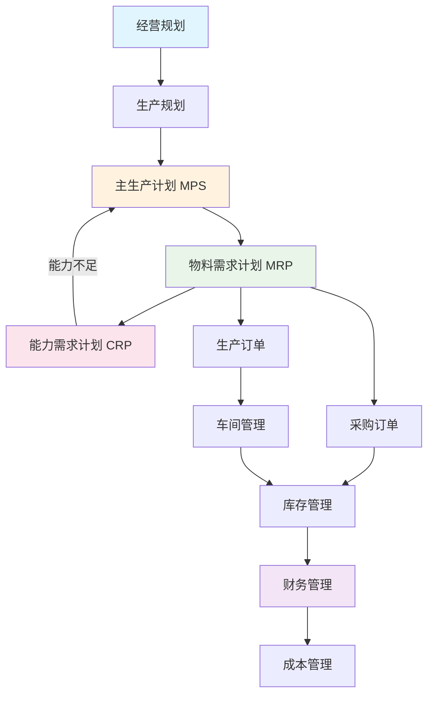
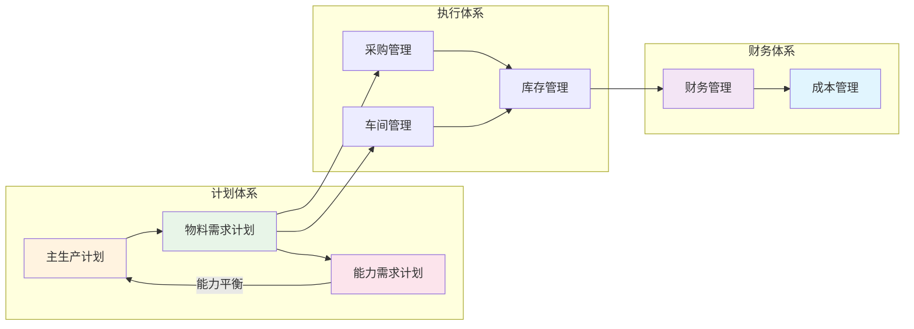
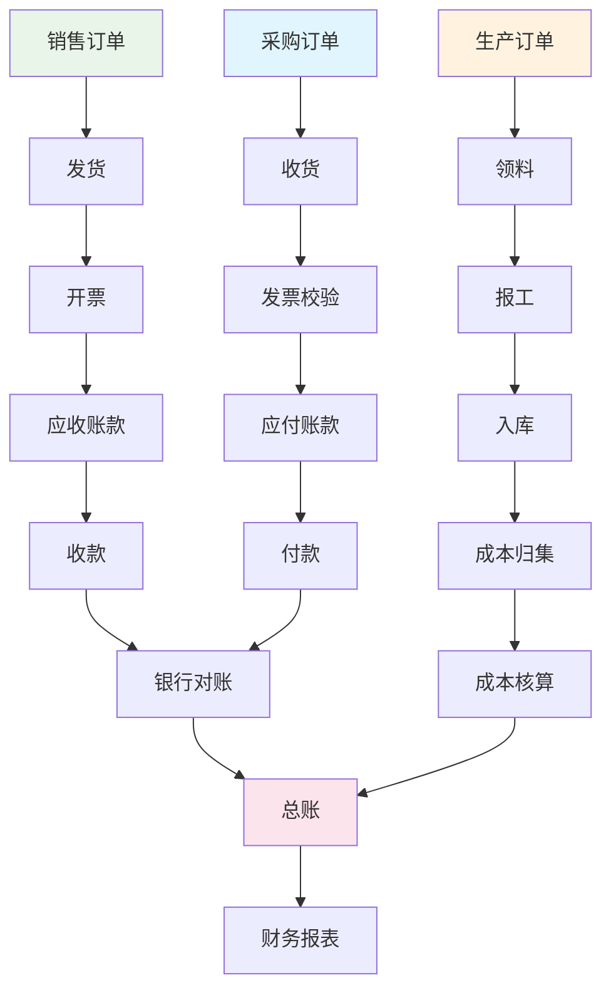
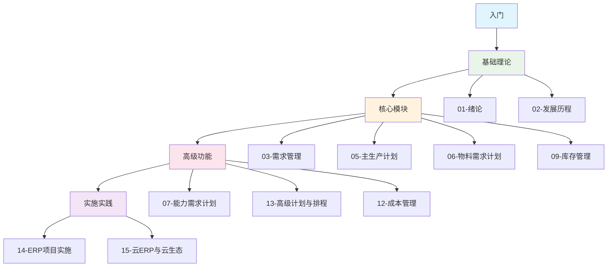

---
tags:
  - ERP
  - 知识框架
  - 思维导图
  - 制造业
aliases:
  - ERP知识结构图
  - ERP体系架构
  - ERP学习路线图
created: 2026-06-27
updated: 2026-06-27
source: Wiki
difficulty: 入门
---

# ERP知识框架图

> 项目：**ERP知识库**
> 编订日期：2026-06-27

## ERP体系全景图

```
┌─────────────────────────────────────────────────────────────────────┐
│                        企业资源计划 (ERP)                            │
├─────────────────────────────────────────────────────────────────────┤
│                                                                     │
│  ┌─────────────┐  ┌─────────────┐  ┌─────────────┐  ┌─────────────┐  │
│  │  经营规划    │→│  生产规划    │→│  主生产计划  │→│  物料需求    │  │
│  │  (战略层)   │  │  (战术层)   │  │  (战术层)   │  │  计划MRP    │  │
│  └─────────────┘  └─────────────┘  └─────────────┘  └─────────────┘  │
│         │               │               │               │           │
│         ↓               ↓               ↓               ↓           │
│  ┌─────────────┐  ┌─────────────┐  ┌─────────────┐  ┌─────────────┐  │
│  │  财务管理    │  │  能力需求    │  │  粗能力计划  │  │  能力需求    │  │
│  │  (资金流)   │  │  计划CRP    │  │  RCCP       │  │  计划CRP    │  │
│  └─────────────┘  └─────────────┘  └─────────────┘  └─────────────┘  │
│         │               │               │               │           │
│         ↓               ↓               ↓               ↓           │
│  ┌─────────────┐  ┌─────────────┐  ┌─────────────┐  ┌─────────────┐  │
│  │  成本管理    │  │  采购管理    │  │  库存管理    │  │  车间管理    │  │
│  │  (成本流)   │  │  (供应流)   │  │  (物流)     │  │  (执行流)   │  │
│  └─────────────┘  └─────────────┘  └─────────────┘  └─────────────┘  │
│                                                                     │
└─────────────────────────────────────────────────────────────────────┘
```

## MRP逻辑流程图



## 计划层次体系

| 层次 | 计划类型 | 计划对象 | 计划周期 | 相关页面 |
|------|----------|----------|----------|----------|
| L1 | 经营规划 | 企业整体 | 2-7年 | [[04-生产规划]] |
| L2 | 生产规划 | 产品族 | 1-3年 | [[04-生产规划]] |
| L3 | 主生产计划 | 最终产品 | 3-18月 | [[05-主生产计划]] |
| L4 | 物料需求计划 | 零部件/原材料 | 日/周 | [[06-物料需求计划]] |
| L5 | 车间作业计划 | 工序 | 小时/日 | [[10-车间管理]] |

## 核心模块关系图



## 物料清单(BOM)结构示例

```
产品A
├── 部件B (×1)
│   ├── 零件D (×2)
│   └── 零件E (×3)
├── 部件C (×1)
│   ├── 零件D (×1)
│   ├── 零件F (×2)
│   └── 零件G (×1)
└── 原材料H (×5)
```

## MRP计算逻辑

```
净需求 = 毛需求 - 预计到货量 - 现有库存量 + 安全库存

计划订单下达日期 = 计划订单交货日期 - 提前期

毛需求 = 父项计划订单量 × BOM中子项用量
```

## 库存管理ABC分类

| 类别 | 品种占比 | 资金占比 | 管理策略 |
|------|----------|----------|----------|
| A类 | 10-20% | 70-80% | 重点管理，精确控制 |
| B类 | 20-30% | 15-20% | 常规管理，定期检查 |
| C类 | 50-70% | 5-10% | 简单管理，批量采购 |

## 生产类型矩阵

| 生产类型 | 特点 | 适用行业 | 相关页面 |
|----------|------|----------|----------|
| MTS (按库存生产) | 标准化产品，快速交付 | 消费品、食品 | [[03-需求管理]] |
| MTO (按订单生产) | 定制化，交期长 | 重型设备、船舶 | [[03-需求管理]] |
| ATO (按订单装配) | 模块化配置 | 电脑、汽车 | [[03-需求管理]] |
| ETO (按订单设计) | 完全定制 | 航空航天、工程 | [[03-需求管理]] |

## 能力需求计划(CRP)流程

```
MRP计划订单
    ↓
工艺路线查询
    ↓
工时计算 (标准工时 × 订单数量)
    ↓
工作中心负荷汇总
    ↓
负荷与能力对比
    ↓
┌─────────────────┐
│  负荷 ≤ 能力?   │
├────────┬────────┤
│   是   │   否   │
│   ↓    │   ↓    │
│ 通过   │ 调整   │
└────────┴────────┘
```

## 财务业务一体化



## 实施方法论

```
项目准备 → 蓝图设计 → 系统实现 → 最终准备 → 上线支持
   │           │           │           │           │
   ↓           ↓           ↓           ↓           ↓
 组建团队    业务调研    系统配置    数据准备    并行运行
 制定计划    流程设计    开发定制    用户培训    问题处理
 需求分析    方案确认    单元测试    模拟演练    持续优化
```

## 云ERP架构

```
┌─────────────────────────────────────────┐
│              应用层 (SaaS)              │
│  ┌─────┐  ┌─────┐  ┌─────┐  ┌─────┐   │
│  │ ERP │  │ CRM │  │ SCM │  │ HRM │   │
│  └─────┘  └─────┘  └─────┘  └─────┘   │
├─────────────────────────────────────────┤
│              平台层 (PaaS)              │
│  ┌─────────┐  ┌─────────┐  ┌─────────┐ │
│  │ 数据库  │  │ 中间件  │  │ 开发平台│ │
│  └─────────┘  └─────────┘  └─────────┘ │
├─────────────────────────────────────────┤
│           基础设施层 (IaaS)             │
│  ┌─────────┐  ┌─────────┐  ┌─────────┐ │
│  │ 计算    │  │ 存储    │  │ 网络    │ │
│  └─────────┘  └─────────┘  └─────────┘ │
└─────────────────────────────────────────┘
```

## 学习路径图



## 相关页面

- [[index]] - ERP知识体系总览
- [[ERP术语表]] - 专业术语速查
- [[通威农发项目知识备忘]] - 实际项目应用案例
