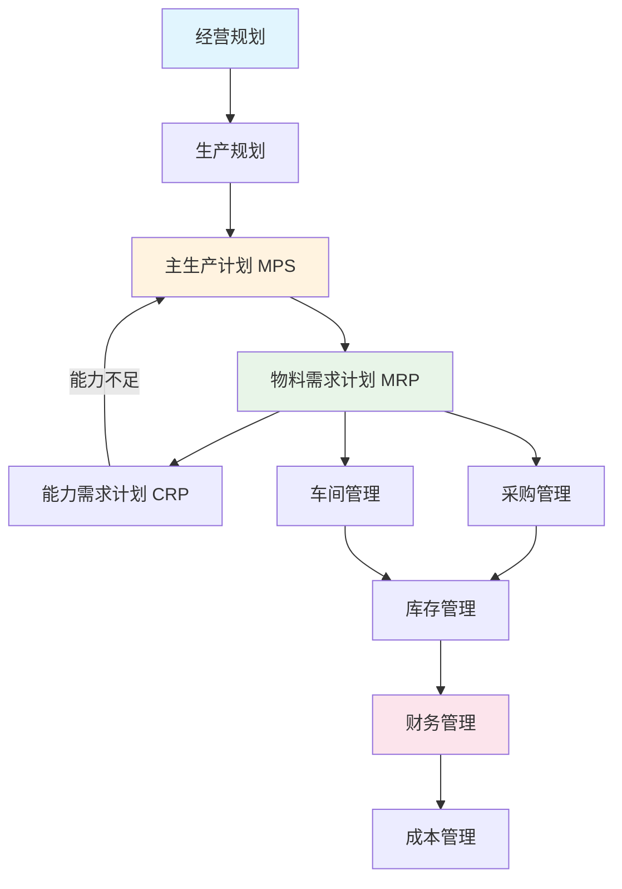

---
tags:
  - ERP
  - 企业信息化
  - 制造业
  - 管理系统
aliases:
  - ERP知识体系
  - 企业资源计划
  - ERP教程
created: 2026-06-27
updated: 2026-06-27
---

# ERP原理与实践 知识体系

> 项目：**ERP知识库**
> 来源：《企业资源计划(ERP)原理与实践》第4版（2025年）
> 编订日期：2026-06-27
> 最后更新：2026-06-27（全面优化标签体系、拆分大页面、增加元数据）

## 概述

本知识库系统整理了ERP（Enterprise Resource Planning，企业资源计划）的核心理论、方法论和实践指南。ERP是一种集成化的企业管理信息系统，将企业的物流、资金流和信息流统一管理，实现资源的最优配置。

## 知识架构

```
ERP原理与实践
├── 基础理论（第1-2章）
│   ├── 绪论与发展背景
│   └── ERP思想发展历程
├── 核心模块（第3-13章）
│   ├── 计划体系
│   │   ├── 需求管理
│   │   │   └── 销售与订单管理
│   │   ├── 生产规划
│   │   ├── 主生产计划(MPS)
│   │   │   ├── BOM物料清单
│   │   │   └── MPS编制方法
│   │   ├── 物料需求计划(MRP)
│   │   └── 能力需求计划(CRP)
│   ├── 执行体系
│   │   ├── 采购管理
│   │   ├── 库存管理
│   │   └── 车间管理
│   │       └── 作业排序与调度
│   ├── 财务体系
│   │   ├── 财务管理
│   │   └── 成本管理
│   │       └── 成本核算与分析
│   └── 高级功能
│       └── 高级计划与排程(APS)
├── 实施方法（第14章）
│   └── ERP项目实施
└── 发展趋势（第15章）
    └── 云ERP与云生态
```

## 章节索引

### 基础理论

| 章节 | 主题 | 核心内容 | 难度 |
|------|------|----------|------|
| [[01-绪论]] | ERP概述 | 定义、发展背景、国内外现状 | 入门 |
| [[02-ERP思想发展历程]] | 演进路径 | MRP→闭环MRP→MRPⅡ→ERP→云ERP | 入门 |

### 计划体系

| 章节 | 主题 | 核心内容 | 难度 |
|------|------|----------|------|
| [[03-需求管理]] | 需求源头 | 预测方法、需求处理逻辑 | 中级 |
| [[03a-销售与订单管理]] | 销售流程 | 订单管理、信用管理、销售分析 | 中级 |
| [[04-生产规划]] | 战略计划 | 生产计划大纲、资源需求计划 | 中级 |
| [[05-主生产计划]] | 核心计划 | MPS概念、计划策略、粗能力计划 | 中级 |
| [[05a-BOM物料清单]] | 产品结构 | BOM类型、BOM编制、层次关系 | 中级 |
| [[05b-MPS编制方法]] | 编制流程 | 时区时界、MPS计算、案例分析 | 中级 |
| [[06-物料需求计划]] | 物料控制 | MRP逻辑、批量规则、计划订单 | 中级 |
| [[07-能力需求计划]] | 能力平衡 | CRP计算、负荷分析、能力调整 | 中级 |

### 执行体系

| 章节 | 主题 | 核心内容 | 难度 |
|------|------|----------|------|
| [[08-采购管理]] | 采购流程 | 供应商管理、采购订单、进货检验 | 中级 |
| [[09-库存管理]] | 库存控制 | ABC分类、库存策略、盘点管理 | 中级 |
| [[10-车间管理]] | 生产执行 | 车间任务、生产报告、工时管理 | 中级 |
| [[10a-作业排序与调度]] | 调度方法 | 排序规则(FCFS/SPT/EDD)、派工单 | 中级 |

### 财务体系

| 章节 | 主题 | 核心内容 | 难度 |
|------|------|----------|------|
| [[11-财务管理]] | 财务集成 | 总账、应收应付、固定资产、财务报表 | 中级 |
| [[12-成本管理]] | 成本控制 | 成本类型、成本构成、成本管理 | 中级 |
| [[12a-成本核算与分析]] | 核算方法 | 品种法/分批法/分步法、作业成本法、差异分析 | 高级 |

### 高级功能

| 章节 | 主题 | 核心内容 | 难度 |
|------|------|----------|------|
| [[13-高级计划与排程]] | APS系统 | 约束理论、有限排程、优化算法 | 高级 |

### 实施与趋势

| 章节 | 主题 | 核心内容 | 难度 |
|------|------|----------|------|
| [[14-ERP项目实施]] | 实施方法 | 选型、实施流程、变革管理、风险管理 | 高级 |
| [[15-云ERP与云生态]] | 未来趋势 | 云架构、SaaS模式、数字化转型 | 中级 |

### 工具页面

| 页面 | 用途 |
|------|------|
| [[ERP术语表]] | 专业术语速查（80+术语） |
| [[ERP知识框架图]] | 可视化知识结构、流程图 |
| [[ERP案例集]] | 全书案例汇编（21个案例） |

## 核心概念图



## 学习路径

### 入门路径
1. [[01-绪论]] → 了解ERP是什么
2. [[02-ERP思想发展历程]] → 理解ERP演进逻辑
3. [[05-主生产计划]] → 掌握核心计划方法

### 深入路径
4. [[06-物料需求计划]] → MRP核心算法
5. [[09-库存管理]] → 库存控制策略
6. [[12-成本管理]] → 成本核算方法

### 实践路径
7. [[14-ERP项目实施]] → 实施方法论
8. [[15-云ERP与云生态]] → 了解最新趋势
9. [[ERP案例集]] → 学习实际案例

## 相关页面

- [[ERP术语表]] — 专业术语速查
- [[ERP知识框架图]] — 可视化知识结构
- [[ERP案例集]] — 全书案例汇编（21个案例）
- [[通威农发项目知识备忘]] — 实际项目应用案例
