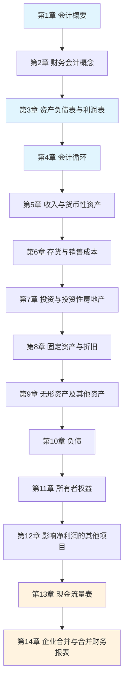

# 会计学学习指南

> 项目：**通用知识**

## 概述

本指南为《会计学》第五版的配套学习路径，针对不同背景的学习者提供个性化学习建议，帮助高效掌握会计学核心知识。

## 学习者画像

### 画像A：零基础MBA学员

**特征**：非财务背景，首次接触会计学
**目标**：理解财务报表，具备基本的财务分析能力
**时间**：建议80-100小时

### 画像B：有财务基础的管理者

**特征**：有一定财务知识，需要系统梳理
**目标**：深化理解，提升财务决策能力
**时间**：建议50-60小时

### 画像C：财务专业人士

**特征**：会计/财务专业背景，需要更新知识
**目标**：掌握新准则变化，提升实务能力
**时间**：建议30-40小时

## 推荐学习路径

### 路径一：系统学习（适合零基础）



**时间分配**：
| 阶段 | 章节 | 建议时长 | 重点 |
|------|------|----------|------|
| 基础入门 | 第1-2章 | 12小时 | 会计概念框架 |
| 报表理解 | 第3-4章 | 16小时 | 报表结构与会计循环 |
| 资产业务 | 第5-9章 | 30小时 | 各类资产核算 |
| 负债权益 | 第10-11章 | 12小时 | 负债与权益核算 |
| 高级专题 | 第12-14章 | 20小时 | 特殊项目与合并 |

### 路径二：报表导向（适合管理者）


**核心目标**：
- 理解三张主表的结构和勾稽关系
- 掌握关键财务指标的计算和分析
- 了解企业合并的会计处理

### 路径三：专题深入（适合财务人士）

按需选读，重点章节：
- **新收入准则**：第5章（收入确认五步法）
- **新租赁准则**：第10章（租赁负债与使用权资产）
- **金融工具**：第7章（金融资产三分类）
- **合并报表**：第14章（合并范围与抵销分录）

## 各章学习要点

### 第一阶段：会计基础

| 章节 | 核心考点 | 学习建议 |
|------|----------|----------|
| 第1章 | 会计目标、会计规范、会计信息质量要求 | 理解会计的本质和作用 |
| 第2章 | 会计假设、会计基础、会计要素、会计等式 | 掌握概念框架，这是后续学习的基础 |

### 第二阶段：财务报表

| 章节 | 核心考点 | 学习建议 |
|------|----------|----------|
| 第3章 | 资产负债表结构、利润表结构、财务分析指标 | 动手编制简单报表，理解勾稽关系 |
| 第4章 | 会计循环、调整分录、结账 | 大量练习会计分录，熟练掌握循环流程 |

### 第三阶段：资产核算

| 章节 | 核心考点 | 学习建议 |
|------|----------|----------|
| 第5章 | 收入确认五步法、应收账款减值 | 结合新准则理解收入确认时点 |
| 第6章 | 存货计价方法、存货减值 | 比较不同计价方法的影响 |
| 第7章 | 金融资产分类、长期股权投资 | 理解业务模式测试和现金流量特征测试 |
| 第8章 | 折旧方法、资产减值 | 掌握各种折旧方法的计算 |
| 第9章 | 研发支出资本化条件、无形资产摊销 | 区分研究阶段和开发阶段 |

### 第四阶段：负债与权益

| 章节 | 核心考点 | 学习建议 |
|------|----------|----------|
| 第10章 | 应付职工薪酬、预计负债、借款费用 | 理解负债的确认条件 |
| 第11章 | 实收资本、资本公积、留存收益 | 掌握权益的构成和变动 |

### 第五阶段：高级专题

| 章节 | 核心考点 | 学习建议 |
|------|----------|----------|
| 第12章 | 所得税会计、会计政策变更、差错更正 | 理解暂时性差异和递延所得税 |
| 第13章 | 现金流量表编制（直接法/间接法） | 大量练习编制现金流量表 |
| 第14章 | 企业合并类型、合并日会计、合并报表编制 | 这是全书难点，需要反复练习 |

## 学习方法建议

### 1. 概念理解法

**步骤**：
1. 阅读章节概述，了解主题
2. 学习核心概念和定义
3. 理解概念之间的逻辑关系
4. 用自己的话复述概念

**示例**：
```
收入确认五步法：
1. 识别合同 → 2. 识别履约义务 → 3. 确定交易价格 → 
4. 分摊交易价格 → 5. 确认收入
```

### 2. 分录练习法

**步骤**：
1. 理解经济业务的实质
2. 确定涉及的会计要素
3. 判断借贷方向
4. 编制会计分录
5. 验证借贷平衡

**示例**：
```
业务：企业购入原材料100万元，增值税13万元，款项已付

借：原材料                    1,000,000
    应交税费—应交增值税（进项税额）130,000
贷：银行存款                  1,130,000
```

### 3. 报表分析法

**步骤**：
1. 阅读财务报表
2. 计算关键财务指标
3. 分析指标含义
4. 与行业平均水平比较
5. 得出分析结论

**关键指标**：
| 指标 | 公式 | 含义 |
|------|------|------|
| 流动比率 | 流动资产÷流动负债 | 短期偿债能力 |
| 资产负债率 | 负债总额÷资产总额 | 长期偿债能力 |
| 净资产收益率 | 净利润÷平均净资产 | 盈利能力 |
| 总资产周转率 | 营业收入÷平均总资产 | 运营效率 |

### 4. 案例分析法

**步骤**：
1. 阅读案例背景
2. 识别关键信息
3. 运用所学知识分析
4. 提出解决方案
5. 总结经验教训

## 常见错误与陷阱

### 1. 概念混淆

| 错误 | 正确理解 |
|------|----------|
| 收入=现金流入 | 收入按权责发生制确认，与现金流入时点可能不同 |
| 资产=有价值的东西 | 资产必须能带来经济利益，且成本能可靠计量 |
| 负债=借款 | 负债包括借款，也包括应付账款、预计负债等 |

### 2. 计算错误

| 错误类型 | 正确做法 |
|----------|----------|
| 折旧计算遗漏残值 | 折旧基数=原值-残值-减值准备 |
| 存货计价方法混用 | 同一类存货应采用相同的计价方法 |
| 所得税计算遗漏暂时性差异 | 区分永久性差异和暂时性差异 |

### 3. 报表编制错误

| 错误类型 | 正确做法 |
|----------|----------|
| 抵销分录不完整 | 内部交易需全额抵销 |
| 现金流量分类错误 | 区分经营、投资、筹资活动 |
| 合并范围遗漏 | 控制的子公司均应纳入合并范围 |

## 复习策略

### 短期复习（考前1-2周）

1. **重点章节**：第3、4、5、10、13、14章
2. **复习方法**：
   - 快速浏览章节笔记
   - 重做错题
   - 模拟考试练习

### 长期巩固（学习后1-3个月）

1. **定期回顾**：每月复习1-2章
2. **实务应用**：尝试分析真实公司财报
3. **知识更新**：关注会计准则最新变化

## 参考资源

### 官方资源
- [[index|会计学（第五版）主索引]]
- [[术语表|会计学核心术语表]]

### 外部资源
- 中国财政部会计准则：http://kjs.mof.gov.cn/
- 国际会计准则理事会：https://www.ifrs.org/
- 中国注册会计师协会：http://www.cicpa.org.cn/

### 学习工具
- 会计分录练习软件
- 财务报表分析模板
- 案例分析框架
