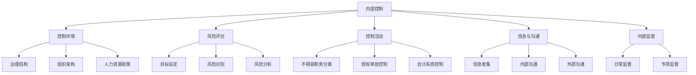

# 内部控制实务

> 项目：**通用知识**

## 内部控制实务

### 内部控制五要素

### 关键控制点

| 业务循环 | 关键控制点 | 控制措施 |
|----------|------------|----------|
| **销售与收款** | 客户信用审批、发货、收款 | 信用审批、发货单核对、收款记录 |
| **采购与付款** | 供应商选择、验收、付款 | 招标比价、验收单、付款审批 |
| **存货管理** | 采购、领用、盘点 | 请购审批、领用记录、定期盘点 |
| **固定资产管理** | 购建、折旧、处置 | 预算审批、折旧计提、处置审批 |
| **资金管理** | 收款、付款、资金调度 | 银行对账、付款审批、资金计划 |

