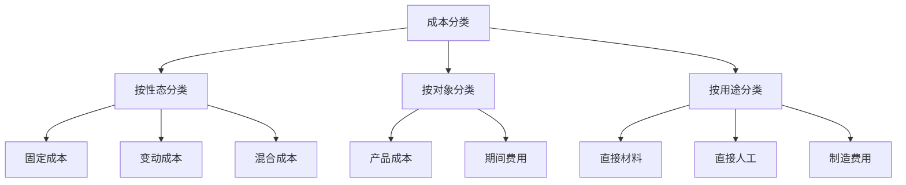

# 成本管理实务

> 项目：**通用知识**

## 成本管理实务

### 成本分类



### 本量利分析（CVP分析）

#### 基本公式

```
利润 = 单价×销量 - 单位变动成本×销量 - 固定成本
     = (单价-单位变动成本)×销量 - 固定成本
     = 单位边际贡献×销量 - 固定成本
```

#### 盈亏平衡点

```
盈亏平衡点销量 = 固定成本 ÷ 单位边际贡献
盈亏平衡点销售额 = 固定成本 ÷ 边际贡献率
```

**案例：某产品盈亏平衡分析**

```
已知：
- 单价：100元
- 单位变动成本：60元
- 固定成本：200,000元

计算：
- 单位边际贡献 = 100 - 60 = 40元
- 边际贡献率 = 40 ÷ 100 = 40%
- 盈亏平衡点销量 = 200,000 ÷ 40 = 5,000件
- 盈亏平衡点销售额 = 200,000 ÷ 40% = 500,000元
```


