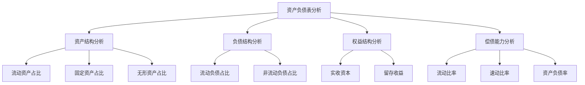
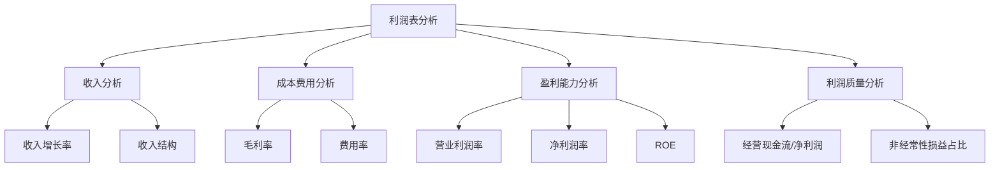

# 财务报表分析实务

> 项目：**通用知识**

## 财务报表分析实务

### 资产负债表分析

#### 分析框架



#### 关键指标解读

| 指标 | 计算公式 | 健康范围 | 分析要点 |
|------|----------|----------|----------|
| **流动比率** | 流动资产÷流动负债 | 1.5-2.0 | 过高可能资产闲置，过低可能偿债困难 |
| **速动比率** | (流动资产-存货)÷流动负债 | 0.8-1.0 | 剔除存货后的短期偿债能力 |
| **资产负债率** | 负债总额÷资产总额 | 40%-60% | 过高财务风险大，过低未充分利用杠杆 |
| **权益乘数** | 资产总额÷所有者权益 | 1.5-2.5 | 反映财务杠杆程度 |

#### 实务案例

**案例：某制造企业资产负债表分析**

```
资产结构：
- 流动资产：60%（其中存货25%，应收账款20%）
- 固定资产：30%
- 无形资产：10%

分析：
1. 存货占比偏高，需关注存货周转
2. 应收账款占比合理，但需关注账龄
3. 固定资产占比适中，符合制造业特点
```

### 利润表分析

#### 分析框架



#### 关键指标解读

| 指标 | 计算公式 | 分析要点 |
|------|----------|----------|
| **毛利率** | (营业收入-营业成本)÷营业收入 | 反映产品竞争力和定价能力 |
| **营业利润率** | 营业利润÷营业收入 | 反映主营业务盈利能力 |
| **净利润率** | 净利润÷营业收入 | 反映综合盈利能力 |
| **净资产收益率(ROE)** | 净利润÷平均净资产 | 反映股东回报水平 |

#### 杜邦分析法

```
ROE = 净利润率 × 总资产周转率 × 权益乘数

分解：
- 净利润率：盈利能力
- 总资产周转率：运营效率
- 权益乘数：财务杠杆
```

**案例：ROE分解分析**

| 公司 | ROE | 净利润率 | 资产周转率 | 权益乘数 |
|------|-----|----------|------------|----------|
| A公司 | 15% | 10% | 1.0 | 1.5 |
| B公司 | 15% | 5% | 1.5 | 2.0 |
| C公司 | 15% | 15% | 0.8 | 1.25 |

**分析**：
- A公司：盈利、效率、杠杆均衡型
- B公司：薄利多销+高杠杆型
- C公司：高盈利+低杠杆保守型

### 现金流量表分析

#### 三类现金流组合判断

| 经营现金流 | 投资现金流 | 筹资现金流 | 企业状态 |
|------------|------------|------------|----------|
| + | - | + | 成长期：经营赚钱，投资扩张，融资支持 |
| + | - | - | 成熟期：经营赚钱，投资扩张，偿还债务 |
| + | + | - | 衰退期：经营赚钱，处置资产，偿还债务 |
| - | + | + | 危机期：经营亏损，处置资产，借新还旧 |

#### 关键指标

| 指标 | 计算公式 | 含义 |
|------|----------|------|
| **经营现金流/流动负债** | 经营现金流÷流动负债 | 现金偿债能力 |
| **经营现金流/净利润** | 经营现金流÷净利润 | 利润质量 |
| **资本支出/经营现金流** | 资本支出÷经营现金流 | 再投资能力 |


