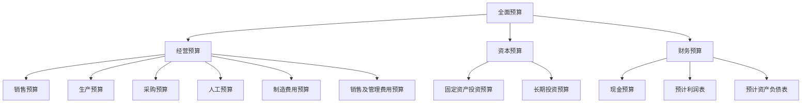

# 预算管理实务

> 项目：**通用知识**

## 预算管理实务

### 全面预算体系

### 预算编制流程

| 阶段 | 工作内容 | 交付物 |
|------|----------|--------|
| **目标设定** | 确定年度经营目标 | 预算目标分解表 |
| **编制上报** | 各部门编制预算 | 部门预算草案 |
| **审查平衡** | 财务部汇总审查 | 预算调整建议 |
| **审议批准** | 预算委员会审批 | 年度预算方案 |
| **下达执行** | 分解下达预算指标 | 预算责任书 |
| **监控分析** | 月度预算执行分析 | 预算执行报告 |
| **考核评价** | 年度预算考核 | 预算考核报告 |

